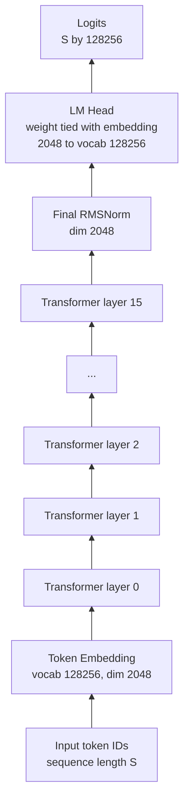
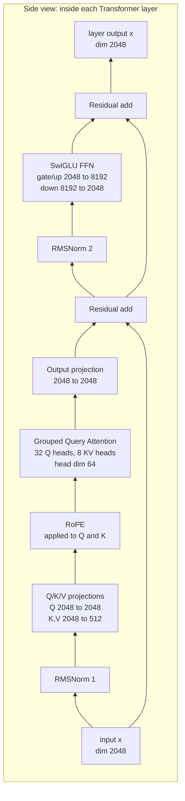
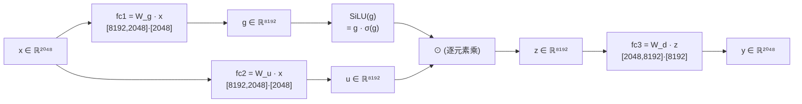
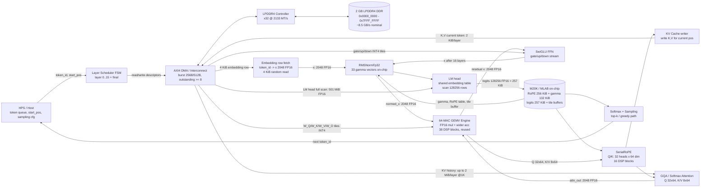

# Llama 3.2 - 1B FPGA 设计思路

## 0. Llama 3.2 1B 整体架构图

下面这张图先给出 Llama 3.2 1B 的模型主干：输入 token id 先查 embedding，随后经过 **16 层 Transformer Block**，最后通过 final RMSNorm 和共享权重的 LM head 输出 logits。每个 block 内部采用 **Pre-Norm + GQA Attention + SwiGLU FFN + Residual** 结构。



每个 Transformer layer 内部结构如下：



| 结构项 | Llama 3.2 1B 配置 | 含义 |
|:---|:---:|:---|
| vocab size | 128256 | token embedding / LM head 的行数 |
| embedding dim | 2048 | 残差流宽度，也是每层输入输出维度 |
| layers | 16 | Transformer Block 数量 |
| attention heads | 32 | Q heads 数量 |
| KV groups | 8 | GQA 中 K/V heads 数量，4 个 Q head 共享 1 组 KV |
| head dim | 64 | `2048 / 32 = 64` |
| FFN hidden dim | 8192 | SwiGLU 的 gate/up 中间维度 |
| weight tying | tok_emb == out_head | 输入 embedding 与输出 LM head 共享同一份权重 |

---

## 0.1 FPGA 模块对外 AXI-Stream 约定

Transformer 内部计算模块的对外数据接口统一使用 AXI-Stream。GEMV、RMSNorm、RoPE、Softmax、Residual Add、FFN 后处理和采样前 logits 流都遵循同一套 `valid/ready/tdata/tkeep/tlast/tuser` 语义，便于通过 stream router、FIFO 和 scheduler command 组合。

SpinalHDL 中建议统一配置为：

```scala
import spinal.lib.bus.amba4.axistream._

val axisCfg = Axi4StreamConfig(
    dataWidth = 16,

    useKeep  = true,
    useStrb  = false,
    useLast  = true,

    useId    = false,
    useDest  = false,

    useUser  = true,
    userWidth = 16
)
```

字段约定：

| 字段 | 说明 |
|:---|:---|
| `tdata` | 1 个 FP16 元素，16 bit |
| `tkeep` | 启用，固定表示当前 16-bit beat 有效 |
| `tstrb` | 不启用 |
| `tlast` | 一个逻辑 packet 的最后一个 beat，例如 2048 维 activation 向量末尾、64 维 head 向量末尾、一个 gamma stage 末尾 |
| `tuser[15:0]` | 全 Transformer 的紧凑上下文标签 |

`tuser` 可以携带当前 token、当前 head、当前 layer、sequence position、KV cache index 等上下文。由于 16 bit 无法在所有流里同时容纳这些字段的完整范围，建议按流类型定义 overlay，而不是要求所有字段在所有 packet 中同时有效：

| 流类型 | `tuser[15:0]` 建议解释 | 说明 |
|:---|:---|:---|
| layer-wide vector | `layerId + vectorKind + tokenSlot/seqLow` | 用于 RMSNorm、Residual、FFN 输入输出等无 head 维度的数据 |
| attention head stream | `layerId + headId + seqOrKvIndexLow` | 用于 Q/K/V、RoPE、QK、AV 等 head 相关数据 |
| KV cache stream | `layerId + kvCacheIndex + head/group hint` | 面向 KV cache 读写；不足字段由 scheduler command 补充 |
| control/config stream | `cmdType + stageId + context` | 用于 RMSNorm gamma stage、GEMV descriptor、表加载等控制信息 |

当某个模块需要超过 16 bit 的完整上下文时，优先使用 command stream 或本地 scheduler 状态补充，不扩散到所有数据流。这样 `userWidth = 16` 可以保持全链路简单，同时保留 token/head/layer/position/cache 的调试与路由能力。

---

## 1. 第一步：模型初始化与权重加载

### 1.1 配置参数（LLAMA32_CONFIG）

模型的所有超参数都放在一个 Python 字典里：

```python
LLAMA32_CONFIG = {
    "vocab_size": 128_256,       # 词表大小（普通词 + 特殊 token）
    "context_length": 131_072,   # 训练时的最大上下文长度（128K tokens）
    "emb_dim": 2048,             # Embedding 维度（1B 版本）
    "n_heads": 32,               # 注意力头数量
    "n_layers": 16,              # Transformer 层数
    "hidden_dim": 8192,          # FeedForward 中间层维度（SwiGLU）
    "n_kv_groups": 8,            # GQA 中 KV 组数（32 heads / 8 groups = 每组 4 heads 共享 KV）
    "rope_base": 500_000.0,      # RoPE 位置编码的 theta 基数
    "dtype": torch.bfloat16,     # 使用 bfloat16 减少显存占用
    "rope_freq": { ... }         # RoPE 频率缩放参数（支持长上下文）
}
```

**范围说明：** 上面的 `context_length = 131072` 描述的是 **Llama 3.2 1B 模型原生支持的最大上下文**。从第 4 步开始的 FPGA 资源与吞吐分析里，本文的**Agilex 5E 主线部署口径统一按 1K token** 进行；8K / 32K 只保留为旁支容量与带宽估算，用来说明扩展趋势，不作为本文最终落地配置。

---

### 1.2 模型初始化（随机权重）

```python
model = Llama3Model(LLAMA32_CONFIG)
```

这一步只是根据配置**创建模型结构**，权重是随机初始化的，还不能用于推理。

`Llama3Model` 的内部结构：
- `tok_emb`：词嵌入层，weight 形状 `[vocab_size, emb_dim]` = `[128256, 2048]`
- `trf_blocks`：16 个 `TransformerBlock`，每个包含：
  - `GroupedQueryAttention`（GQA，KV 头数少于 Q 头数，节省显存）
  - `FeedForward`（SwiGLU 激活函数）
  - 两个 `RMSNorm`（替代 LayerNorm，没有均值计算，更快）
- `final_norm`：最后一个 RMSNorm
- `out_head`：输出投影层，weight 形状 `[vocab_size, emb_dim]` = `[128256, 2048]`，与 `tok_emb` 权重共享（weight tying），safetensors 文件中没有单独存储

**1B 模型参数量**：约 1.24B，纯推理（无梯度）bfloat16 约 **2.30 GB**；含梯度约 **4.64 GB**（见 1.5 节详细计算）。

---

### 1.3 加载预训练权重（safetensors）

Hugging Face 上下载的权重文件是 `.safetensors` 格式（比 pickle 更安全）。

```python
from safetensors.torch import load_file

combined_weights = load_file("Llama-3.2-1B-Instruct/model.safetensors")
```

`combined_weights` 是一个字典，key 是 HuggingFace 格式的权重名，例如：
- `"model.embed_tokens.weight"` → 对应 `model.tok_emb.weight`
- `"model.layers.0.self_attn.q_proj.weight"` → 对应 `model.trf_blocks[0].att.W_query.weight`

---

### 1.4 权重映射（load_weights_into_llama）

HuggingFace 的权重命名与代码里的命名不同，需要手动一一对应：

```python
load_weights_into_llama(model, LLAMA32_CONFIG, combined_weights)
model.to(device)
del combined_weights  # 加载完后立即释放，节省内存
```

`assign()` 函数负责把右边的 tensor 值复制到左边的参数里，同时检查 shape 是否匹配：

```python
def assign(left, right, tensor_name="unknown"):
    if left.shape != right.shape:
        raise ValueError(f"Shape mismatch in tensor '{tensor_name}'...")
    with torch.no_grad():
        left.copy_(right)
    return left
```

加载完成后，模型就拥有了 Meta 训练好的权重，可以用于推理。

---

### 1.5 权重分布与显存计算（1B 模型）

#### 前置推导

| 配置参数 | 值 | 说明 |
|----------|----|------|
| `emb_dim` | 2048 | 每个 token 的表示维度 |
| `n_heads` | 32 | Q 的注意力头数 |
| `head_dim` | 2048 ÷ 32 = **64** | 每个 head 的维度 |
| `n_kv_groups` | 8 | K/V 的 head 组数（GQA） |
| `kv_dim` | 8 × 64 = **512** | K/V 投影的总维度 |
| `hidden_dim` | 8192 | FFN 中间层维度（SwiGLU） |
| `n_layers` | 16 | Transformer 层数 |
| `vocab_size` | 128,256 | 词表大小 |

#### 每个 TransformerBlock 的参数（共 16 层）

> **形状说明**：PyTorch `nn.Linear` 的 weight 存储为 `[out_features, in_features]`，
> 计算时做 `y = x @ W.T`。下表形状均与 safetensors 文件中一致。

**注意力（GroupedQueryAttention）：**

| 权重矩阵 | 文件 key 后缀 | 形状 [out, in] | 参数量 |
|----------|--------------|----------------|--------|
| `W_query` | `q_proj.weight` | [2048, 2048] | 4,194,304 |
| `W_key` | `k_proj.weight` | [512, 2048] | 1,048,576 |
| `W_value` | `v_proj.weight` | [512, 2048] | 1,048,576 |
| `out_proj` | `o_proj.weight` | [2048, 2048] | 4,194,304 |
| 小计 | | | **10,485,760** |

W_key 和 W_value 输出维度是 512（= 8 组 × 64 head_dim），比 W_query 的 2048 小 4 倍，这正是 GQA 节省参数的地方。

**前馈网络（FeedForward / SwiGLU）：**

| 权重矩阵 | 文件 key 后缀 | 形状 [out, in] | 参数量 |
|----------|--------------|----------------|--------|
| `fc1` | `gate_proj.weight` | [8192, 2048] | 16,777,216 |
| `fc2` | `up_proj.weight` | [8192, 2048] | 16,777,216 |
| `fc3` | `down_proj.weight` | [2048, 8192] | 16,777,216 |
| 小计 | | | **50,331,648** |

SwiGLU 用了 3 个线性层（比普通 FFN 的 2 个多一个），计算 `silu(fc1(x)) * fc2(x)` 后再过 `fc3`。

**RMSNorm（每层 2 个）：**

| 权重 | 形状 | 参数量 |
|------|------|--------|
| `norm1.weight` | 2048 | 2,048 |
| `norm2.weight` | 2048 | 2,048 |
| 小计 | | **4,096** |

**每层合计：** 10,485,760 + 50,331,648 + 4,096 = **60,821,504**

#### 全模型参数汇总

| 模块 | 参数量 | 占比 |
|------|--------|------|
| `tok_emb.weight`（词嵌入） | 262,668,288 | 21.3% |
| 16 × TransformerBlock | 973,144,064 | 78.7% |
| `final_norm.weight` | 2,048 | <0.01% |
| `out_head.weight` | 与 tok_emb 共享（weight tying） | — |
| **总计（唯一参数）** | **1,235,814,400 ≈ 1.24B** | 100% |

16 层的细分：
- 注意力总参数：10,485,760 × 16 = 167,772,160（占 16 层的 17%）
- FFN 总参数：50,331,648 × 16 = 805,306,368（占 16 层的 83%）

**FFN 占了绝大多数参数**，这是 Transformer 的普遍规律（hidden_dim = 4× emb_dim 以上时）。

#### Weight Tying（权重共享）

`out_head.weight` 和 `tok_emb.weight` 指向同一个 tensor：

```python
# load_weights_into_llama 中：
model.out_head.weight = model.tok_emb.weight  # 同一个 Parameter 对象
```

- `out_head.weight`：形状 [128256, 2048]（out=vocab_size, in=emb_dim），将最后一层的隐状态投影成词汇分数
- `tok_emb.weight`：形状 [128256, 2048]（Embedding 的 weight 等价于查找表，行=vocab_size，列=emb_dim），将 token ID 变成向量

两者共享同一份参数；在线性层计算时使用的是这份权重的转置乘法形式，因此无需再单独存一份 LM head 权重，可减少 ~262.7M 个参数。

#### 显存计算公式

```python
def calc_model_memory_size(model, input_dtype=torch.float32):
    total_params = sum(p.numel() for p in model.parameters())
    total_grads  = sum(p.numel() for p in model.parameters() if p.requires_grad)
    total_buffers = sum(buf.numel() for buf in model.buffers())
    element_size = torch.tensor(0, dtype=input_dtype).element_size()
    total_bytes = (total_params + total_grads + total_buffers) * element_size
    return total_bytes / (1024**3)
```

函数统计了三部分：参数本身 + 梯度（同等大小）+ 缓冲区（RoPE 的 cos/sin）。

**各部分元素量（1B 模型）：**

| 部分 | 元素数量 | 说明 |
|------|----------|------|
| 参数（`total_params`） | 1,235,814,400 | weight tying 去重后 |
| 梯度（`total_grads`） | 1,235,814,400 | 默认 `requires_grad=True` |
| 缓冲区（`total_buffers`） | 16,777,216 | cos + sin，各 131072 × 64 |
| **合计** | **2,488,405,632** | |

**实际结果验证：**

| dtype | element_size | 计算结果 | 实测输出 |
|-------|-------------|----------|----------|
| float32 | 4 bytes | 2,488,405,632 × 4 ÷ 1024³ = **9.27 GB** | ✓ 9.27 GB |
| bfloat16 | 2 bytes | 2,488,405,632 × 2 ÷ 1024³ = **4.64 GB** | ✓ 4.64 GB |

> **注意**：这是"理论最大显存"（含梯度）。纯推理模式（`torch.no_grad()`）不需要存梯度，实际显存约为一半：bfloat16 下约 **2.30 GB**（仅参数 + 缓冲区）。

---

### 1.6 safetensors 文件格式与权重布局

#### 文件格式结构

```
┌──────────────────────────────────────────────────────┐
│  8 bytes   │ header_size (uint64, little-endian)     │  偏移 0
├──────────────────────────────────────────────────────┤
│ 16800 bytes│ JSON header（所有张量的元数据）           │  偏移 8
├──────────────────────────────────────────────────────┤
│            │ 原始张量数据区（紧密排列，无间距）        │  偏移 16808
│  2.30 GB   │ tensor 0, tensor 1, tensor 2, ...       │
└──────────────────────────────────────────────────────┘
```

`data_base = 8 + 16800 = 16808`，JSON header 里的 `data_offsets` 是相对 data_base 的偏移量。

#### JSON header 结构（每个张量的元数据）

```json
"model.layers.0.self_attn.q_proj.weight": {
    "dtype": "BF16",
    "shape": [2048, 2048],
    "data_offsets": [636493824, 644882432]
}
```

- `dtype`：存储精度（全部 BF16，2 bytes/element）
- `shape`：张量形状，注意是 `[out_features, in_features]`（PyTorch Linear 权重的惯例）
- `data_offsets`：`[start, end)`，相对于 data_base 的字节偏移

#### 146 个张量的布局（按文件偏移排序）

| 位置 | 张量名 | 形状 | 大小 |
|------|--------|------|------|
| ① | `model.embed_tokens.weight` | [128256, 2048] | **500 MB** |
| ② | `model.layers.0.input_layernorm.weight` | [2048] | 4 KB |
| ③ | `model.layers.0.mlp.down_proj.weight` | [2048, 8192] | 32 MB |
| ④ | `model.layers.0.mlp.gate_proj.weight` | [8192, 2048] | 32 MB |
| ⑤ | `model.layers.0.mlp.up_proj.weight` | [8192, 2048] | 32 MB |
| ⑥ | `model.layers.0.post_attention_layernorm.weight` | [2048] | 4 KB |
| ⑦ | `model.layers.0.self_attn.k_proj.weight` | [512, 2048] | 2 MB |
| ⑧ | `model.layers.0.self_attn.o_proj.weight` | [2048, 2048] | 8 MB |
| ⑨ | `model.layers.0.self_attn.q_proj.weight` | [2048, 2048] | 8 MB |
| ⑩ | `model.layers.0.self_attn.v_proj.weight` | [512, 2048] | 2 MB |
| ··· | （layer 1–15，每层 9 个张量，结构相同）| | |
| 最后 | `model.norm.weight` | [2048] | 4 KB |

- 每层 9 个张量：2 × norm + 4 × attention + 3 × FFN
- 16 层 × 9 = 144 + embed_tokens + model.norm = **146 个张量**
- **没有 lm_head**：因为使用 weight tying，`out_head.weight` 直接用 `embed_tokens.weight`

#### 形状与参数量对照

| HuggingFace 名称 | 形状 | 参数量 | 代码中对应 |
|-----------------|------|--------|-----------|
| `embed_tokens.weight` | [128256, 2048] | 262,668,288 | `tok_emb.weight` |
| `self_attn.q_proj.weight` | [2048, 2048] | 4,194,304 | `att.W_query.weight` |
| `self_attn.k_proj.weight` | [512, 2048] | 1,048,576 | `att.W_key.weight` |
| `self_attn.v_proj.weight` | [512, 2048] | 1,048,576 | `att.W_value.weight` |
| `self_attn.o_proj.weight` | [2048, 2048] | 4,194,304 | `att.out_proj.weight` |
| `mlp.gate_proj.weight` | [8192, 2048] | 16,777,216 | `ff.fc1.weight` |
| `mlp.up_proj.weight` | [8192, 2048] | 16,777,216 | `ff.fc2.weight` |
| `mlp.down_proj.weight` | [2048, 8192] | 16,777,216 | `ff.fc3.weight` |
| `input_layernorm.weight` | [2048] | 2,048 | `norm1.weight` |
| `post_attention_layernorm.weight` | [2048] | 2,048 | `norm2.weight` |
| `model.norm.weight` | [2048] | 2,048 | `final_norm.weight` |

注意形状是 `[out_features, in_features]`，PyTorch `nn.Linear` 计算时做 `x @ W.T`，
所以 `k_proj` 的形状是 `[512, 2048]` 而不是 `[2048, 512]`。

#### 文件大小验证

```
总字节数 = data_base + 最后一个张量的 relative_end
         = 16808 + 2,471,628,800
         = 2,471,645,608 bytes
         ≈ 2.30 GB
```

正好等于 1,235,814,400 个参数 × 2 bytes（BF16） = 2,471,628,800 bytes，加上 16808 字节的文件头。
这也验证了 safetensors 只存权重数据本身，不含梯度，磁盘占用最小。

---

## 2. 第二步：文本如何被转换成 Token ID

### 背景

LLM 不能直接处理文字，需要先把文字切成"词片（token）"，再映射成整数 ID，才能输入模型。
Llama 3.2 使用的是 **BPE（Byte Pair Encoding）** 分词算法，基于 OpenAI 的 tiktoken 实现。

---

### 两种编码方式

#### 1. 普通编码（`Tokenizer.encode()`）

```python
token_ids = tokenizer.encode("What do llamas eat?")
# → [3923, 656, 9507, 29189, 8343, 30]
```

| Token ID | 对应文本 | 备注 |
|----------|----------|------|
| `3923`   | `What`   | 完整单词 |
| `656`    | ` do`    | 空格 + "do" |
| `9507`   | ` ll`    | 空格 + "ll"（llamas 被拆开） |
| `29189`  | `amas`   | "amas"（llamas 后半段） |
| `8343`   | ` eat`   | 空格 + "eat" |
| `30`     | `?`      | 标点符号 |

**为什么 "llamas" 被拆成两个 token？**

BPE 根据训练语料中的词频构建词表。"llamas" 不够常见，词表中没有完整的 " llamas"，
所以 tiktoken 把它拆成更常见的片段 " ll" + "amas"。越常见的词/词组越可能是单个 token。

**关于 `bos` 参数：**

```python
def encode(self, text, bos=False, eos=False):
    ids = ([self.special["<|begin_of_text|>"]] if bos else []) \
          + self.model.encode(text)
```

默认 `bos=False`，不加开始符。如果调用 `tokenizer.encode(text, bos=True)`，
会在最前面加上 `128000`（即 `<|begin_of_text|>`）。

---

#### 2. Chat 格式编码（`ChatFormat.encode()`）

专为 Llama 3.2 **Instruct** 版本设计，在用户消息前后包裹完整的对话结构模板。

```python
chat_ids = chat_tokenizer.encode("What do llamas eat?")
# → [128000, 128006, 9125, 128007, 271,
#    2675, 527, 264, 11190, 18328, 13,
#    128009,
#    128006, 882, 128007, 271,
#    3923, 656, 9507, 29189, 8343, 30,
#    128009,
#    128006, 78191, 128007, 271]
```

解码后对应的文本结构：

```
<|begin_of_text|>
<|start_header_id|>system<|end_header_id|>

You are a helpful assistant.<|eot_id|>
<|start_header_id|>user<|end_header_id|>

What do llamas eat?<|eot_id|>
<|start_header_id|>assistant<|end_header_id|>

```

逐段解析：

| Token IDs | 对应内容 | 说明 |
|-----------|----------|------|
| `128000` | `<\|begin_of_text\|>` | 整段对话的开始 |
| `128006, 9125, 128007, 271` | `<\|start_header_id\|>system<\|end_header_id\|>\n\n` | system 角色 header |
| `2675, 527, 264, 11190, 18328, 13` | `You are a helpful assistant.` | 默认系统提示语 |
| `128009` | `<\|eot_id\|>` | 当前角色发言结束 |
| `128006, 882, 128007, 271` | `<\|start_header_id\|>user<\|end_header_id\|>\n\n` | user 角色 header |
| `3923, 656, 9507, 29189, 8343, 30` | `What do llamas eat?` | 用户的问题（与普通编码一致） |
| `128009` | `<\|eot_id\|>` | user 发言结束 |
| `128006, 78191, 128007, 271` | `<\|start_header_id\|>assistant<\|end_header_id\|>\n\n` | assistant 角色 header，模型从这里开始续写 |

**为什么需要 Chat 格式？**

- **Base 模型**：只做"续写"，直接输入文本即可
- **Instruct 模型**：通过指令微调训练，期望输入符合对话模板格式
  - 如果不用 ChatFormat，直接把纯文本输入给 Instruct 模型，模型会把它当成待续写的文本，回答质量很差
  - 有了对话模板，模型看到最后的 `assistant` header 后，知道"该我回答了"

**注意**：`ChatFormat.encode()` 内部直接手动加了 `128000`，没有使用 `tokenizer.encode(bos=True)`：

```python
def encode(self, user_message, ...):
    ids = [self.tok.special["<|begin_of_text|>"]]  # 手动加 BOS
    ids += self._header("system")
    ...
```

---

### 特殊 Token ID 一览

| Token ID | 含义 |
|----------|------|
| `128000` | `<\|begin_of_text\|>` — 对话开始 |
| `128001` | `<\|end_of_text\|>` — 文本结束 |
| `128006` | `<\|start_header_id\|>` — 角色 header 开始 |
| `128007` | `<\|end_header_id\|>` — 角色 header 结束 |
| `128009` | `<\|eot_id\|>` — 当前角色发言结束 |

这些 ID 都在普通词汇（0–127999）之外，属于 Llama 3 新增的特殊 token（合法 ID 范围可写作 **128000–128255**，或半开区间 **[128000, 128256)**）。

---

## 3. 第三步：Token Embedding — 整数 ID 变成向量

### 在推理流水线中的位置

```
原始字符串
    ↓  第二步（Tokenizer）
token ID 序列：[128000, 128006, 9125, ..., 9540, 374, 81288]
    ↓  第三步（tok_emb）  ← 本节内容
embedding 矩阵：shape [seq_len, 2048]，bfloat16
    ↓  第四步（16 × TransformerBlock）
...
```

Token Embedding 是**模型内部的第一步计算**，将离散的整数 ID 转换成模型可以做数学运算的连续向量。

---

### 代码实现

在 `Llama3Model.__init__` 中定义：

```python
self.tok_emb = nn.Embedding(
    cfg["vocab_size"],  # 128256 行
    cfg["emb_dim"],     # 2048 列
    dtype=cfg["dtype"]  # bfloat16
)
```

在 `Llama3Model.forward` 中调用：

```python
def forward(self, in_idx):
    tok_embeds = self.tok_emb(in_idx)   # in_idx: [batch, seq_len]
    x = tok_embeds                       # x: [batch, seq_len, 2048]
    ...
```

`nn.Embedding` 的实质是一个**查找表（lookup table）**：给定 token ID `i`，
直接返回权重矩阵的第 `i` 行，无任何乘加运算。

---

### 权重矩阵规格

| 属性 | 值 |
|------|-----|
| 形状 | `[128256, 2048]` = `[vocab_size, emb_dim]` |
| dtype | bfloat16 |
| 参数量 | 128,256 × 2,048 = **262,668,288**（约 2.6 亿）|
| 内存 | 262,668,288 × 2 bytes = **~500 MB** |
| 占全模型参数比 | 262.7M / 1235.8M = **21.3%** |

这 500 MB 的查找表是 safetensors 文件中**体积最大的单个张量**（第一个存储的张量），
见 1.6 节布局分析。

---

### Weight Tying：tok_emb 与 out_head 共享同一矩阵

Llama 3.2 1B 使用了 **weight tying**，即输入嵌入矩阵和输出投影矩阵是**同一个 `Parameter` 对象**：

```python
# load_weights_into_llama() 中，当 safetensors 没有 lm_head.weight 时：
model.out_head.weight = model.tok_emb.weight   # 直接赋值，共享内存地址
```

验证：

```python
torch.equal(model.tok_emb.weight, model.out_head.weight)         # True（值相同）
model.tok_emb.weight.data_ptr() == model.out_head.weight.data_ptr()  # True（同一内存）
```

**为什么可以共享？**

- `tok_emb.weight`：形状 `[128256, 2048]`，行 = token ID，列 = embedding 向量
- `out_head.weight`：形状 `[128256, 2048]`（Linear 的 weight 是 `[out, in]`），
  计算 `logits = x @ out_head.weight.T`，相当于把隐状态 `x`（shape `[..., 2048]`）
  投影到 128,256 维的词汇空间

两者形状相同，语义上也对称：embedding 矩阵的每一行是「token 的表示向量」，
output projection 的每一行是「预测该 token 的权重向量」。共享可以节省约 500 MB 参数。

---

### 从 FPGA 角度看 Token Embedding

| 维度 | 描述 |
|------|------|
| **操作类型** | 随机内存访问（Random Access）/ 查表 |
| **无乘加运算** | 直接读取第 `id` 行，无 MAC（乘累加）|
| **内存大小** | ~500 MB（bfloat16），适合放 HBM 或 DDR，不适合片上 M20K |
| **访问模式** | 每个 token 访问一行（2048 × 2 = 4 KB），seq_len 次随机跳转 |
| **带宽需求** | 本文 FPGA 口径下 prefill 也是逐 token 送入：每步 1 行 4 KB，整个 prompt 累计 seq_len × 4 KB；decode 每步同样 1 行 4 KB |
| **与 out_head 共享** | FPGA 上 tok_emb 和 out_head 可以共用同一块内存，节省资源 |

主要挑战是 **随机访问延迟**：token ID 分布不均，缓存命中率低，需要足够大的内存带宽。
注意这里不要把 GPU 式 prefill 的 batch 访问套到本文硬件口径上：**本文 prefill 也是一个 token 一个 token 查表**。Embedding 行地址由 token id 决定，prompt 中相邻 token 的 embedding 行通常不连续，因此不能假设能把 `seq_len` 行 embedding 合成连续 burst；只能说整个 prompt 累计读取 `seq_len × 4 KB`。

---

### 推理时 tok_emb 的数值特征

为后续分析量化做参考，以实际权重为例：

- 权重值域：bfloat16，范围大约在 `[-0.05, 0.05]`（经过训练初始化 + 微调）
- 不同 token 的嵌入向量之间，语义相近的 token 余弦相似度较高
- 特殊 token（128000–128255）的嵌入向量训练时单独学习，与普通 token 分布可能有差异

4bit 量化时需要注意：embedding 查找的输出就是第四步（TransformerBlock）的输入，
量化误差会直接累积传播。**本文主线口径保持 tok_emb / out_head 为 BF16 共享权重，不做 embedding INT4 化**；若后续必须尝试 embedding 量化，更合理的是**按行（per-token）量化**而非全局量化。

**对 Llama 3.2 1B 在 Agilex 5E FPGA 上的部署参考：**
- tok_emb 放 PL 侧 DDR：embedding 表 ~500 MB（bfloat16），via M_AXI burst 读取
- Tokenizer 留 PS：tiktoken BPE 词表 128,256 条
- AXI 接口：PS 传 17-bit token ID，PL 返回 17-bit argmax

---

## 4. 第四步：RMSNorm 1 — Pre-Attention 归一化

### 在 TransformerBlock 中的位置

每个 `TransformerBlock` 的 `forward()` 按以下顺序执行：

```
x (来自上一步 tok_emb，或上一层 block 的输出)
    ↓ ─────────────────────────── 子层 1：Self-Attention ───────────────────────────
    shortcut = x                      # 保存残差
    x = norm1(x)          ← 第四步：Pre-Attention RMSNorm
    x = att(x, mask, cos, sin)        # 第五步：Grouped Query Attention
    x = x + shortcut                  # 残差相加
    ↓ ─────────────────────────── 子层 2：FeedForward ────────────────────────────
    shortcut = x
    x = norm2(x)                      # Pre-FFN RMSNorm（结构同 norm1）
    x = ff(x)                         # SwiGLU FeedForward
    x = x + shortcut
```

即：**先归一化，再做注意力/FFN**（Pre-Norm 架构）。原始 Transformer 是 Post-Norm（先计算再归一化），Llama 改用 Pre-Norm 使梯度更稳定，可以在不需要 warmup 的情况下训练更深的模型。

---

### 数学公式

**RMSNorm（Root Mean Square Layer Normalization）：**

$$\text{RMSNorm}(x) = \frac{x}{\text{RMS}(x)} \cdot \gamma$$

其中：

$$\text{RMS}(x) = \sqrt{\dfrac{1}{d} \sum_{i=1}^{d} x_i^2 + \epsilon}$$

| 符号 | 含义 | 值 |
|------|------|-----|
| $x$ | 输入向量 | shape `[batch, seq_len, 2048]` |
| $d$ | 向量维度（`emb_dim`）| **2048** |
| $\epsilon$ | 数值稳定性修正 | **1e-5** |
| $\gamma$ | 可学习的逐元素缩放系数（weight）| shape `[2048]`，初始化为全 1 |

与 LayerNorm 对比：

$$\text{LayerNorm}(x) = \frac{x - \mu}{\sqrt{\sigma^2 + \epsilon}} \cdot \gamma + \beta$$

| 差异点 | LayerNorm | RMSNorm |
|--------|-----------|---------|
| 均值 $\mu$ 中心化 | ✅ 做 | ❌ **不做** |
| 方差 $\sigma^2$ 计算 | ✅ 做 | ❌ 用 RMS 代替 |
| 偏置 $\beta$ | ✅ 有 | ❌ **无** |
| 可学习参数 | $\gamma, \beta$（各 `d` 个）| 仅 $\gamma$（`d` 个）|
| 计算量 | 需均值 + 方差（2 遍扫描）| 仅平方和（1 遍扫描）|

RMSNorm 的合理性：在训练过程中，经过 Adam/AdaGrad 优化后，$\mu \approx 0$（激活值中心接近 0），
因此均值中心化的作用很小，去掉后不影响训练效果，但能节约约 7–40% 的归一化计算开销。

---

### 代码实现（PyTorch）

```python
# 在 TransformerBlock.__init__ 中定义（1B 模型有 16 对）
self.norm1 = nn.RMSNorm(cfg["emb_dim"], eps=1e-5, dtype=cfg["dtype"])
#                         ↑ d=2048            ↑ ε       ↑ bfloat16

# 在 TransformerBlock.forward 中调用
x = self.norm1(x)   # x: [batch, seq_len, 2048] → [batch, seq_len, 2048]（形状不变）
```

`nn.RMSNorm` 等价于：

```python
# 手动实现（便于理解和 FPGA 移植）
def rms_norm(x, weight, eps=1e-5):
    # x: [..., d]
    rms = (x.pow(2).mean(dim=-1, keepdim=True) + eps).sqrt()  # [..., 1]
    return (x / rms) * weight   # weight: [d]，逐元素乘
```

---

### 参数量与内存

**每个 RMSNorm 的参数：**

| 参数 | 形状 | 参数量 | 内存（bfloat16）|
|------|------|--------|----------------|
| `norm1.weight`（$\gamma_1$）| `[2048]` | 2,048 | 4 KB |
| `norm2.weight`（$\gamma_2$）| `[2048]` | 2,048 | 4 KB |
| 每层小计 | | **4,096** | **8 KB** |

**全模型 RMSNorm 参数：**

| 模块 | 数量 | 参数量 |
|------|------|--------|
| 每个 TransformerBlock 的 norm1 + norm2 | 16 层 × 2 = 32 个 | 32 × 2048 = **65,536** |
| `final_norm`（最后一个 RMSNorm，在 out_head 之前）| 1 个 | **2,048** |
| **合计** | 33 个 | **67,584** |

虽然数量少（67,584 / 1,235,814,400 = **0.0055%**），但每次 forward 都要执行，
计算开销不可忽视（每 token 需要 2048 次平方 + 1 次 sqrt + 2048 次除法 + 2048 次乘法）。

---

### 计算复杂度（每个 RMSNorm，处理 1 个 token）

| 操作 | 次数 | 说明 |
|------|------|------|
| 平方 $x_i^2$ | $d = 2048$ | 逐元素 |
| 累加 $\sum x_i^2$ | $d - 1 = 2047$ | 归约加法 |
| 除以 $d$，加 $\epsilon$，开方 | 3 次 | 1 个 sqrt |
| 除法 $x_i / \text{RMS}$ | $d = 2048$ | 逐元素 |
| 乘以 $\gamma_i$ | $d = 2048$ | 逐元素 |
| **合计** | **~8200 次操作** | 每个 RMSNorm 实例 |

对于 16 层、每层 2 个 RMSNorm，加上 final_norm：
- **每 token：~8200 × 33 = ~270,600 次操作**（可忽略，相比 attention 的 $O(n^2)$）

---

### FPGA 实现要点

#### 全模型 RMSNorm γ 权重总量

| 实例 | 数量 | 每个大小 | 合计 |
|------|------|----------|------|
| 每层 norm1（Pre-Attention）| 16 | 2048 × 2 = 4 KB | 64 KB |
| 每层 norm2（Pre-FFN）| 16 | 2048 × 2 = 4 KB | 64 KB |
| final_norm | 1 | 2048 × 2 = 4 KB | 4 KB |
| **合计（33 个实例）** | **33** | | **132 KB** |

计算验证：$67584 \times 2\,\text{bytes} = 135168\,\text{bytes} \approx \mathbf{132\,\text{KB}}$

**132 KB 完全可以放入片上 SRAM：**
- RMSNorm γ 的权威副本仍然放在 DDR，随模型权重一起管理
- 在 Agilex 5E 主线配置里，推理启动、换模型或切换权重版本时，从 DDR 把这 132 KB γ 权重一次性加载到 M20K / MLAB
- decode 热路径从片上 SRAM 读取 RMSNorm γ，不在每个 token 内重复访问 DDR；因此性能估算中可把 RMSNorm γ 视为 **启动加载有 DDR、运行热路径 0 DDR**

对比其他权重的 DDR 访问压力：

| 权重 | 大小 | 存放与访问方式 |
|------|------|------------------|
| 所有 RMSNorm γ | **132 KB** | DDR 保存权威副本，启动加载到片上 M20K / MLAB，热路径片上读取 |
| 单层 W_query | 8 MB | 运行时从 DDR 流式读取 |
| 全模型 attention 权重 | ~160 MB | 运行时从 DDR 流式读取 |
| tok_emb / out_head | ~500 MB | 运行时从 DDR 读取 |

#### 计算相关

| 维度 | 说明 |
|------|------|
| **数据依赖** | 必须先得到完整的 2048 维向量才能形成最终 RMS 缩放因子；**平方归约与输出乘法都可流水**，但输出阶段需要缓存输入向量或二次读取 |
| **关键路径** | 归约加法树（2048 → 1）+ 1 次 `sqrt` + 1 次 `reciprocal` |
| **`sqrt` 实现** | 可用 Newton-Raphson 迭代或 Intel / Altera FP32 sqrt / rsqrt IP |
| **精度路径（关键）** | **内部 FP32，输入输出 FP16**——对齐参考实现 `llama-fpga/scala/.../RMSNormFp32.scala`（[RMSNormFp32.md](../../llama-fpga/docs/scala/norm/RMSNormFp32.md)）。原因：① $x_i^2$ 在 FP16 下可能下溢到次正规数（FP16 最小正规 ~6e-5）；② 2048 项累加 FP16 mantissa 仅 10 bit 会严重"小数被吃掉"；③ rsqrt 后 ×γ 也需要 FP32 才能避免误差放大。所有 33 个 RMSNorm 实例**统一 FP32 内核 + FP16 接口**。|
| **量化策略** | RMSNorm γ 权重**保留 FP16**（参数极少 132 KB，量化无收益且伤精度）；γ 从 DDR 加载到片上 SRAM；激活路径输入 FP16 → 反量化到 FP32 → 计算 → 量化回 FP16 输出 |
| **对外接口** | 使用本文 §0.1 的 AXI-Stream 配置：`dataWidth=16`、`useKeep=true`、`useLast=true`、`useUser=true`、`userWidth=16` |
| **与 tok_emb 接口** | 输入：2048 维 FP16 AXI-Stream packet；输出：同形状 FP16 packet，已归一化 |

**典型 FPGA 实现策略（对齐 llama-fpga 的 RMSNormFp32）：**
1. 推理启动、换模型或切换权重版本时，把全部 33 个 γ（132 KB FP16）从 DDR 通过 AXI-Stream loader 预加载到片上 M20K / MLAB；decode 热路径不重复读 DDR
2. 输入流 FP16 → FP16→FP32 转换 → 平方（FP32 mul）→ 加法树（11 级流水，FP32 acc）
3. 除以 $d$ 用 exponent shift（FP32 `(exp - log2 d)` 操作，1 拍完成；llama-fpga `RMSNormFp32.scala` 实现）
4. `rsqrt` 用 Intel / Altera FP32 reciprocal-sqrt IP（1 个 DSP block + 几拍延迟）
5. 输出：`x * rsqrt * γ`（FP32 ×3 mul）→ FP32→FP16 转换 → 下游
6. **DSP 增量**：相比 §7.10.2 估算的 64-MAC GEMV 引擎 38 block，RMSNorm 独占 ≤ 2 个 FP32 DSP block（rsqrt + 1 个跨拍 acc），或与 GEMV 引擎复用 FP32 累加器进一步省

---

## 5. 第五步：RoPE 位置编码 — 让模型感知 Token 位置

### 5.1 为什么需要 RoPE？

Transformer 的注意力计算本身是**置换不变**（permutation-invariant）的——如果把序列顺序打乱，得到的 attention 结果相同。但语言有顺序，"我打他" 和 "他打我" 意思完全不同。

**旋转位置编码（RoPE, Rotary Position Embedding）** 的核心思想：

> 把位置信息编码进 **Q 和 K 向量**（而不是加到输入），通过旋转操作，使得 Q·K 的内积自然包含相对位置信息。

---

### 5.2 数学公式

对 head_dim=64 的向量 $\mathbf{x} \in \mathbb{R}^{64}$，在位置 $p$ 处的旋转变换：

把 $\mathbf{x}$ 分成前半和后半：

$$
\mathbf{x}_1 = x[0..31], \quad \mathbf{x}_2 = x[32..63]
$$

每个维度 $i \in [0, 31]$ 对应一个频率 $\theta_i$：

$$
\theta_i = \frac{1}{\text{rope\_base}^{2i/\text{head\_dim}}} = \frac{1}{500000^{2i/64}}
$$

> **为何 Llama 3.2 取 rope_base = 500,000？**
>
> 要求最低频维度在上下文 $L$ 内不绕回的下限：$\text{base} > \!\left(\dfrac{L}{2\pi}\right)^{d/(d-2)}$。对当前模型的 $L=128K$、$\text{head\_dim}=64$，下限仍只有约 $2.9 \times 10^4$；取 500,000 依然保留了很大余量，可支持 128K 上下文外推并为 YaRN 微调留足空间。

位置 $p$ 处的旋转角度：$\alpha_{p,i} = p \cdot \theta_i$

> $p$ 是 token 在输入序列中的序号（第0个 token 的 $p=0$，第1个 $p=1$，……），与 head 编号和维度索引无关；同一个 token 的所有 head 使用相同的 $p$。

旋转后的向量（GPT-NeoX 半分割风格）：

$$
x_\text{rotated}[i] = \begin{cases}
x[i] \cdot \cos(\alpha_{p,i}) - x[32+i] \cdot \sin(\alpha_{p,i}) & i \in [0, 32) \\
x[i] \cdot \cos(\alpha_{p, i-32}) + x[i-32] \cdot \sin(\alpha_{p, i-32}) & i \in [32, 64)
\end{cases}
$$

#### 公式与代码的对齐推导

用 head_dim=4 的最小示例（方便追每个元素），推广到 head_dim=64 完全一样：

```
向量 x = [x[0], x[1],   x[2], x[3]]
              ^^^前半^^^  ^^^后半^^^
x1 = [x[0], x[1]]      (前半)
x2 = [x[2], x[3]]      (后半)

rotated = [-x2 | x1] = [-x[2], -x[3], x[0], x[1]]
```

> **为什么 rotated 是 `[-x2, -x3, x0, x1]`？——来自 2D 旋转公式的拆解**
>
> 对一对数 $(a, b)$ 做角度 $\theta$ 的旋转：
>
> $$\begin{bmatrix}\cos\theta & -\sin\theta \\ \sin\theta & \cos\theta\end{bmatrix}\begin{bmatrix}a \\ b\end{bmatrix} = \begin{bmatrix}a\cos\theta - b\sin\theta \\ b\cos\theta + a\sin\theta\end{bmatrix} = \cos\theta\begin{bmatrix}a\\b\end{bmatrix} + \sin\theta\underbrace{\begin{bmatrix}-b\\a\end{bmatrix}}_{\text{旋转辅助向量}}$$
>
> 对 $(a,b)$ 旋转只需用它的"旋转辅助向量" $(-b, a)$。  
> 在 head\_dim=4 中，配对方式是前半与后半：
>
> | 维度对 | 原始 $(a,\ b)$ | 辅助向量 $(-b,\ a)$ |
> |:---:|:---:|:---:|
> | 对 0 | $(x_0,\ x_2)$ | $(-x_2,\ x_0)$ |
> | 对 1 | $(x_1,\ x_3)$ | $(-x_3,\ x_1)$ |
>
> 拼回原长度得 `rotated = [-x2, -x3, x0, x1]`。  
> **拼回原长度的目的**：让 `x * cos + rotated * sin` 能做 element-wise 相乘——两个操作数形状必须相同，从而把所有维度对的旋转**并行**完成，无需显式循环。

频率 θ₀, θ₁（两个频率，对应 head_dim//2=2 个维度对）：

```
cos = [cos(p·θ₀), cos(p·θ₁),   cos(p·θ₀), cos(p·θ₁)]
       ^^^前半^^^^^^^^^^^          ^^^后半（与前半完全相同）^^^
       （因为 compute_rope_params 做了 torch.cat([angles, angles])）

sin = [sin(p·θ₀), sin(p·θ₁),   sin(p·θ₀), sin(p·θ₁)]
```

逐元素展开 `x * cos + rotated * sin`：

| 索引 | x * cos | rotated * sin | 结果 |
|---|---|---|---|
| **[0]** | x[0] · cos(p·θ₀) | (-x[2]) · sin(p·θ₀) | `x[0]·cos(α₀) - x[2]·sin(α₀)` |
| **[1]** | x[1] · cos(p·θ₁) | (-x[3]) · sin(p·θ₁) | `x[1]·cos(α₁) - x[3]·sin(α₁)` |
| **[2]** | x[2] · cos(p·θ₀) | x[0] · sin(p·θ₀) | `x[2]·cos(α₀) + x[0]·sin(α₀)` |
| **[3]** | x[3] · cos(p·θ₁) | x[1] · sin(p·θ₁) | `x[3]·cos(α₁) + x[1]·sin(α₁)` |

可以看到，**维度对 (0, 2) 和 维度对 (1, 3) 各自独立地做了一次 2D 旋转**：

$$
\begin{bmatrix} x_\text{out}[0] \\ x_\text{out}[2] \end{bmatrix}
= \underbrace{\begin{bmatrix} \cos\alpha_0 & -\sin\alpha_0 \\ \sin\alpha_0 & \cos\alpha_0 \end{bmatrix}}_{\text{2D 旋转矩阵}}
\begin{bmatrix} x[0] \\ x[2] \end{bmatrix}
$$

对于 head_dim=64，规律完全相同：**维度对 (i, 32+i)** 一起旋转角度 $\alpha_{p,i} = p \cdot \theta_i$，共 32 对。

#### 等价矩阵形式

上述向量化操作等价于一次稀疏矩阵乘法（以 head\_dim=4 为例）：

$$\mathbf{x}_\text{out} = \underbrace{\begin{bmatrix} \cos\alpha_0 & 0 & -\sin\alpha_0 & 0 \\ 0 & \cos\alpha_1 & 0 & -\sin\alpha_1 \\ \sin\alpha_0 & 0 & \cos\alpha_0 & 0 \\ 0 & \sin\alpha_1 & 0 & \cos\alpha_1 \end{bmatrix}}_{\mathbf{R}} \begin{bmatrix} x_0 \\ x_1 \\ x_2 \\ x_3 \end{bmatrix}$$

矩阵 $\mathbf{R}$ 是两个 2D 旋转矩阵**交错**嵌入的结果（每行只有两个非零元），可以用 element-wise 乘法代替 $O(d^2)$ 的矩阵乘法，计算量降为 $O(d)$。

对应两种等价写法：

```python
# 写法 A：显式循环（直觉清晰，较慢）
for i in range(half):
    out[i]      = x[i]*cos[i]      - x[i+half]*sin[i]
    out[i+half] = x[i+half]*cos[i] + x[i]*sin[i]

# 写法 B：向量化（实际代码，GPU 并行）
rotated = torch.cat([-x[..., half:], x[..., :half]], dim=-1)
out = x * cos + rotated * sin
```

代码之所以比显式循环快：整个向量的所有维度对可以**并行地** element-wise 完成，无需显式 for 循环。

**关键性质**：对于两个位置 $p, q$ 的向量 $\mathbf{q}_p, \mathbf{k}_q$，RoPE 引入的位置关系只依赖相对位置 $(p-q)$；内积本身仍同时受内容向量影响：

$$
\langle \mathbf{q}_p, \mathbf{k}_q \rangle = g(\mathbf{q}, \mathbf{k}, p-q)
$$

#### RoPE 三个核心直觉

**① 维度越高，$\theta_i$ 越小——频率分层**

$$\theta_i = \frac{1}{\text{rope\_base}^{2i/d}}, \quad i=0,1,\dots,d/2-1$$

- $i$ 越大 → $\theta_i$ 越小 → 每步位置使旋转角度变化越慢 → **低频维度**  
- $i$ 越小 → $\theta_i$ 越大 → 每步旋转角度变化越快 → **高频维度**

含义：高频维度对**近距离位置**的差异敏感（旋转快，相邻两位置夹角就已经明显）；低频维度对**长距离位置**的差异敏感（旋转慢，只有相隔很远时夹角才明显）。这与傅里叶分析中"不同频率捕获不同尺度信息"完全类比。

**② 位置 $p$ 越大，旋转角度越大——位置被编码为旋转量**

对同一维度 $i$，旋转角 $= p \cdot \theta_i$ 随 $p$ 线性增大，相当于把"位置信息"写入向量的旋转状态。

超过 360°（$2\pi$）会怎样？余弦/正弦是周期函数，旋转会"绕回"。对高频维度，小 $p$ 就能绕回，导致该维度无法区分远端位置；低频维度绕回需要很大的 $p$，因此可以编码更长的位置范围。这正是 RoPE 长上下文外推（如 YaRN）需要针对**低频维度**调整频率的根本原因——防止模型在训练长度内未见过的 $p$ 处发生混淆。

**③ 相对距离小 → 旋转矩阵 $R$ 接近单位矩阵 → 相关性大**

内积的推导：

$$\langle \mathbf{q}_p, \mathbf{k}_q \rangle = \mathbf{q}^\top R\bigl(-(p-q)\theta_i\bigr)\,\mathbf{k}$$

- 相对距离 $|p-q|=0$（同一位置）：$R(0) = \mathbf{I}$，内积最大，相关性最强  
- 相对距离小：$R$ 接近单位矩阵，内积接近未旋转时的值，相关性强  
- 相对距离大：旋转角度大，$R$ 将向量旋转更多，内积倾向于减小，相关性弱  

这给 RoPE 带来了一个**自然的局部偏置**：邻近 token 之间的 attention 天然更强，无需额外设计 mask 或偏置项。

---

### 5.3 代码实现

**第一阶段：预计算 cos/sin 表**（模型初始化时调用一次）

```python
def compute_rope_params(head_dim, theta_base=10_000, context_length=4096,
                        freq_config=None, dtype=torch.float32):
    # 1. 计算每个频率维度的逆频率
    inv_freq = 1.0 / (theta_base ** (torch.arange(0, head_dim, 2) / head_dim))
    #  shape: (head_dim//2,)  = (32,) for head_dim=64

    # 2. Llama 3.2 的 YaRN 频率调整（支持 128K 长上下文）
    if freq_config is not None:
        # 短波长维度（原频率已经够高）：直接除以 factor=32，降低频率
        # 长波长维度（低频维度）：保持原频率
        # 中间：平滑插值
        ...  # 见 compute_rope_params 完整实现

    # 3. 生成位置索引和角度矩阵
    positions = torch.arange(context_length)                    # (131072,)
    angles = positions.unsqueeze(1) * inv_freq.unsqueeze(0)     # (131072, 32)
    angles = torch.cat([angles, angles], dim=1)                 # (131072, 64)
                                                                # 前32列 = 后32列（重复）

    # 4. 预计算 cos 和 sin
    cos = torch.cos(angles)  # shape: (131072, 64)
    sin = torch.sin(angles)  # shape: (131072, 64)
    return cos, sin
```

存储为模型 buffer（不参与梯度，不算参数）：
```python
self.register_buffer("cos", cos, persistent=False)
self.register_buffer("sin", sin, persistent=False)
```

**第二阶段：推理时应用**（每次 forward 调用）

```python
def apply_rope(x, cos, sin):
    # x: (batch, num_heads, seq_len, head_dim)
    seq_len = x.size(-2)
    head_dim = x.size(-1)
    x1 = x[..., :head_dim//2]   # 前半段
    x2 = x[..., head_dim//2:]   # 后半段
    cos = cos[:seq_len].unsqueeze(0).unsqueeze(0)   # (1, 1, seq_len, head_dim)
    sin = sin[:seq_len].unsqueeze(0).unsqueeze(0)
    rotated = torch.cat((-x2, x1), dim=-1)
    return (x * cos + rotated * sin).to(x.dtype)
```

---

### 5.4 Llama 3.2 的 YaRN 长上下文扩展

标准 RoPE 训练时只见过 `original_context_length = 8192` 个位置。要推广到 131,072（16×），需要调整低频维度的旋转速度：

```python
rope_freq = {
    "factor": 32.0,               # 低频维度降速 32 倍
    "low_freq_factor": 1.0,       # 波长 > 8192/1 = 8192：完全缩放
    "high_freq_factor": 4.0,      # 波长 < 8192/4 = 2048：不缩放
    "original_context_length": 8192
}
```

| 维度类型 | 波长范围 | 处理方式 | 直觉 |
|---|---|---|---|
| 高频维度（短波长 < 2048）| 快速变化 | 保持原 θ | 本身位置分辨率已够 |
| 低频维度（长波长 > 8192）| 缓慢变化 | θ ÷ 32 | 旋转速度降低，适应更长位置 |
| 中间维度 | 2048–8192 | 平滑插值 | 避免突变 |

---

### 5.5 Prefill vs Decode 的差异

这是用户重点关心的部分：**本文 FPGA prefill 不是一次性把整个 prompt 作为 `[N, d]` 序列送入 Transformer，而是和 decode 一样逐 token 复用同一条硬件流水线**。因此下面的对比按本文硬件口径书写；GPU 式全序列并行 prefill 只作为 §6.5 的方式 A 对照，不作为主线。

| 对比维度 | **Prefill（本文 FPGA：逐 token 建 KV）** | **Decode（逐步生成）** |
|---|---|---|
| 每步输入 token 数量 | 1（prompt 中第 $i$ 个已知 token）| 1（上一步 sampling 得到的新 token）|
| token 来源 | prompt 已知，因此下一个 prompt token 可以提前知道 | 自回归生成，必须等当前 token sampling 完成 |
| 使用的 cos/sin 行 | `cos[i:i+1]`, `sin[i:i+1]` | `cos[start_pos:start_pos+1]`, `sin[start_pos:start_pos+1]` |
| start_pos | 当前 prompt 位置 $i$，从 0 递增到 $N-1$ | KV 缓存中已有 token 数，通常从 $N$ 开始继续递增 |
| apply_rope 内 `seq_len` | 1 | 1 |
| 因果掩码 | ❌ 本文逐 token prefill 不需要；只读 `0..i` 的 KV | ❌ 不需要；只有 1 个 Q，只读历史 + 当前 |
| KV Cache 行为 | 每步写入当前 prompt token 的 K/V；attention 读取 `0..i` | 每步追加生成 token 的 K/V；attention 读取历史 + 当前 |
| LM head / sampling | 中间 prompt token 通常跳过；只在最后一个 prompt token 后算 logits 以产生第一个生成 token | 每个生成步都必须算 LM head + sampling |
| 内存访问模式 | cos/sin 位置按 $i$ 顺序递增，但每步仍只读 1 行 | 每步按 `start_pos` 读 1 行 |

**KV 版本中的切片代码**（来自 `Llama3ModelKV.forward`）：
```python
start_pos = past_kvs[0][0].shape[2] if past_kvs is not None else 0
cos = self.cos[start_pos: start_pos + num_tokens]  # 切出当前需要的行
sin = self.sin[start_pos: start_pos + num_tokens]
# 传入 apply_rope，内部再做 cos[:seq_len] 切片（此时相当于 no-op）
```

---

### 5.6 参数量与内存

cos/sin 表是**非参数 buffer**（不计入模型参数），仅在推理时存在：

| 项目 | 计算 | 数值 |
|---|---|---|
| cos 表大小 | 131,072 × 64 × 4 bytes (fp32) | **32 MB** |
| sin 表大小 | 131,072 × 64 × 4 bytes (fp32) | **32 MB** |
| **合计（fp32）** | | **64 MB** |
| 若降为 fp16/bf16 | | **32 MB** |
| 实际使用 | 本文 FPGA 口径下 prefill / decode 都是每步切 1 行；GPU 式 batch prefill 才会一次切 N 行 | — |

---

### 5.7 FPGA 实现笔记

| 问题 | 分析 | 结论 |
|---|---|---|
| **cos/sin 表放哪里？** | 若保留模型原生 128K 上下文，完整 fp16 表共 **32 MB**，无法放入片上 SRAM | 完整版必须放 DDR |
| **Decode 时访问模式** | 每步读 1 行（start_pos × 128 字节）| DDR 随机访问，1 次小 burst |
| **Prefill 时访问模式（本文 FPGA）** | 每步读 1 行；位置 $i$ 随 prompt 顺序递增，可做小步预取，但不是一次性把 N 行送进 Transformer | 与 decode 同一硬件口径 |
| **计算量** | 每个 Q/K 向量：64 次乘法 + 64 次 FMA（`x*cos + rot*sin`）| 可与线性层计算流水 |
| **主线如何落地？** | 本文主线只部署到 **1K token**，因此可把 cos/sin 表裁剪到前 1024 行 | 主线使用 **128 KB × 2 = 256 KB 的片上裁剪表** |
| **精度** | cos/sin 通常用 fp16/bf16 即可（角度的三角函数精度足够）| fp16 节省一半带宽 |

#### RoPE 硬件单元（SerialRoPE）DSP 资源分析

**目标场景：Agilex 5E 013B + LLaMA3.2-1B**

模型参数：`head_dim = 64`，Q 头数 = 32（共 2048 维），KV 头数 = 8（GQA，共 512 维），layers = 16。

**Agilex 5E Variable Precision DSP 特点**（与 Xilinx DSP48E2 对比）：

| 特性 | Xilinx DSP48E2 | Intel Variable Precision DSP |
|:---:|:---:|:---:|
| 乘法器结构 | 1× 18×27 | **2× 18×18** |
| FP16/BF16 原生支持 | ❌（需 LUT 辅助）| ✅（每块可做 **2× FP16 MAC**）|
| 每块 FP16 吞吐 | ~0.5 FP16 MAC/周期 | **2 FP16 MAC/周期** |

**RoPE 计算的运算分解**（per element）：
```
out = x * cos + rotated * sin
    = FP16 乘法(x, cos)   ← 利用 DSP 中的乘法器 A
    + FP16 乘法(rot, sin)  ← 利用 DSP 中的乘法器 B（同一块 DSP）
    → FP16 加法             ← DSP 内部累加器
```

因为 Agilex Variable Precision DSP 每块含 **2 个 18×18 乘法器**，`x*cos` 和 `rot*sin` 的两次乘法**有机会**在同一个 DSP block 内并行完成；但最终是否能在**同一个 block**里直接完成 `2 mul + 1 add`，取决于所选 Intel FP16 IP / datapath 绑定方式。为了避免表述过强，本文后续的 **16 个 DSP** 估算应理解为**乐观口径**；若综合结果显示 dot2 需要额外加法资源，则 RoPE DSP 数需上调。

| 算子实例 | IP 类型 | 精度 | 每实例 DSP 数 | 作用 |
|:---:|:---:|:---:|:---:|:---|
| FMA 单元（2 mul + 1 add） | Variable Precision DSP / 配套 FP16 adder | FP16 | **1（乐观）** | $x\cos + x_\text{rot}\sin$ |
| 索引生成 $p \cdot \theta_i$（cos/sin 预计算表） | M20K / 外部存储查表 | FP16 | **0** | 初始化阶段离线算好，推理时按位置 $p$ 直接读取，无需在线乘法 |
| 数据重排（前后半交换） | FIFO（BRAM/MLAB） | — | **0** | 不消耗 DSP |
| **每 SerialRoPE 合计** | | | **1** | |

**全系统 RoPE DSP 总量**（LLaMA3.2-1B，串行架构）：

从上可以看出，在**乐观绑定假设**下，1 个 DSP block 可以承担 1 个 element 的 `x*cos + rot*sin`。因此维度为 64 的 token 位置编码理论上需要 64 个并行 lane；考虑后续模块还需要大量 DSP，这里采用时分复用，设计 16 个 lane，则需要 4 个 CC 才能把 64 个维度都计算完毕，同时每个 head（Q head: 32, K head: 8）串行计算，如此，则需要 4 CC × 40 head = 160 CC 才能把一个 layer 中的 RoPE 做完。总 DSP 数量按 **16 个（16/188=8.5%）** 计；若综合后发现每个 lane 还需额外 FP16 adder，则该数字要相应上修。
- DSP 数量: 16，8.5%
- Delay : 160 CC， 以 400MHz 为例，如果 1 个 CC 能完成所有的计算，那么 400M tokens/s， 延迟 160 CC 以后变成了 2.5M tokens/s。 但由于后续注意力机制的计算需要大量的延迟，所以这里的 delay 和 注意力计算中的 delay 可以重叠，我可以忽略 ROPE 中的delay。

16 layers 之间的硬件资源是复用的，所以，全系统的关于 ROPE 的 DSP 总量不变。

**全系统 cos/sin 表存储总量**（LLaMA3.2-1B，串行架构）：


| context 长度 | 单表尺寸（FP16，64列）| 存储位置 |
|:---:|:---:|:---:|
| ≤ 1024 tokens | 1024 × 64 × 2 B = **128 KB** | MLAB/M20K（片上）|
| ≤ 8K tokens（预训练窗口）| 8192 × 64 × 2 B = **1 MB** | 需要外部存储或更大片上 SRAM，不是本文主线 |
| 128K tokens（全上下文）| 131072 × 64 × 2 B = **16 MB** | 必须放 DDR |

Agilex 5E 013B 的 **M20K 容量**为 **358 个 M20K = 6.99 Mb ≈ 0.87 MB**。因此本文这里的判断应理解为：

- 若只看 **M20K 本体**，1K 主线下前 1024 行 cos / sin 裁剪表（单表 128 KB，双表 256 KB）是可行的
- 若看 **总片上 SRAM（M20K + MLAB）**，RMSNorm γ、logits buffer、ping-pong buffer 也都仍有放置空间
- 但 **8K 或 128K** 的完整 RoPE 表都不能继续沿用这个片上假设，必须回到 DDR 方案


**FPGA 流水线位置（一个 TransformerBlock 的数据流）：**

```
DDR → tok_emb[token_id] → RMSNorm_1(x) → W_Q/W_K/W_V(normed_x)
                                               ↓
                               apply_rope(Q, cos[start_pos])  ← DDR cos/sin
                               apply_rope(K, cos[start_pos])  ← DDR cos/sin
                                               ↓
                               GQA(Q, K_expanded, V_expanded)  ← KV Cache DDR
```

---

## 第六步：注意力机制（Scaled Dot-Product Attention + GQA）

### 6.1 标准多头注意力（MHA）

对 $n_h$ 个头，第 $h$ 个头的计算：

$$\text{head}_h = \text{softmax}\!\left(\frac{\mathbf{Q}_h \mathbf{K}_h^\top}{\sqrt{d_\text{head}}}\right)\mathbf{V}_h$$

其中 $\mathbf{Q}_h, \mathbf{K}_h, \mathbf{V}_h \in \mathbb{R}^{T \times d_\text{head}}$（$T$ = 当前序列长度，$d_\text{head}$ = head\_dim）。

所有头拼接后经过输出投影：

$$\text{Attn}(X) = \text{Concat}(\text{head}_0, \dots, \text{head}_{n_h-1})\,W_O$$

---

### 6.2 分组查询注意力（GQA, Grouped Query Attention）

LLaMA3.2-1B 使用 GQA：$n_h = 32$ 个 Q 头，但只有 $n_{kv} = 8$ 个 KV 头（每组 4 个 Q 头共享 1 对 K/V）。

$$G = \frac{n_h}{n_{kv}} = \frac{32}{8} = 4 \quad (\text{每组 4 个 Q 头共享同一 K/V})$$

**分组方式**（head\_dim=64，以第 0 组为例）：

```
Q 头 0, 1, 2, 3  ─┐
                   ├─→ K/V 头 0（K₀, V₀）→ 4 个独立 Attention 输出
K 头 0            ─┘
V 头 0            ─┘

Q 头 4, 5, 6, 7  ─┐
                   ├─→ K/V 头 1（K₁, V₁）→ 4 个独立 Attention 输出
...
```

计算等价于把 $\mathbf{K}_h$ 和 $\mathbf{V}_h$ **重复展开** 4 次（代码中 `repeat_kv`），然后与标准 MHA 相同：

$$\mathbf{K}_{h}^\text{expanded} = \underbrace{\text{repeat}(\mathbf{K}_{\lfloor h/G \rfloor},\ G)}_{n_h \text{ 个 KV 头}}, \quad h = 0, \dots, n_h-1$$

---

### 6.3 数学公式展开（单头 decode 步骤，当前 token = 位置 $t$）

模型参数（LLaMA3.2-1B）：$d=2048$，$d_\text{head}=64$，$n_h=32$（Q 头），$n_{kv}=8$（KV 头），$G=4$（每 4 个 Q 头共享 1 对 KV）。

Decode 阶段：每步只有 1 个新 token。设 **已有历史 KV 长度为 $t$**，则本层会先为当前 token 生成并写入新的 $K_t, V_t$，随后当前 token 的 $Q_t$ 会对 **$t+1$ 个位置（历史 $0..t-1$ + 当前 $t$）** 做注意力。为了和后文复杂度口径保持一致，若不特别说明，后续估算里的"上下文长度"都按**参与注意力的有效长度**来记。

**步骤 1：QK 点积（GEMV）**

$$\mathbf{s}_h = \frac{\mathbf{q}_h \mathbf{K}_h^\top}{\sqrt{d_\text{head}}} \in \mathbb{R}^{1 \times (t+1)}$$

| 变量 | 形状 | 说明 |
|:---:|:---:|:---|
| $\mathbf{q}_h$ | $1 \times 64$ | 当前 token 的第 $h$ 个 Q 头（行向量；存储时常见 $64 \times 1$ 列向量形式，计算上等价）|
| $\mathbf{K}_h$ | $(t+1) \times 64$ | 本层对应 KV 头的 K，包含历史 $t$ 个 K 和当前 token 新生成的 $K_t$ |
| $\mathbf{K}_h^\top$ | $64 \times (t+1)$ | K 的转置 |
| $\mathbf{s}_h$ | $1 \times (t+1)$ | 当前 token 对历史 + 当前共 $t+1$ 个位置的未归一化注意力分数 |

**步骤 2：Softmax（归一化）**

$$\mathbf{a}_h = \text{softmax}(\mathbf{s}_h) \in \mathbb{R}^{1 \times (t+1)}$$

| 变量 | 形状 | 说明 |
|:---:|:---:|:---|
| $\mathbf{a}_h$ | $1 \times (t+1)$ | 注意力权重，各元素 $\geq 0$，行和 = 1 |

（Decode 阶段无需显式 causal mask：每层只会把**历史位置 + 当前当前位置**纳入注意力，不会看到未来 token）

**步骤 3：加权求和（GEMV）**

$$\mathbf{o}_h = \mathbf{a}_h \mathbf{V}_h \in \mathbb{R}^{1 \times d_\text{head}}$$

| 变量 | 形状 | 说明 |
|:---:|:---:|:---|
| $\mathbf{V}_h$ | $(t+1) \times 64$ | 本层对应 KV 头的 V，包含历史 $t$ 个 V 和当前 token 新生成的 $V_t$ |
| $\mathbf{o}_h$ | $1 \times 64$ | 第 $h$ 个头的注意力输出 |

**步骤 4：拼接 + 输出投影（GEMV）**

$$\mathbf{o} = \underbrace{\text{Concat}(\mathbf{o}_0, \dots, \mathbf{o}_{31})}_{1 \times 2048}\,W_O \in \mathbb{R}^{1 \times d}$$

| 变量 | 形状 | 说明 |
|:---:|:---:|:---|
| $\text{Concat}(\cdot)$ | $1 \times 2048$ | 32 个头的输出拼接（$32 \times 64 = 2048$）|
| $W_O$ | $2048 \times 2048$ | 输出投影权重矩阵 |
| $\mathbf{o}$ | $1 \times 2048$ | 该层 Attention 模块的最终输出（残差连接之前）|

---

### 6.4 GQA 的 KV Cache 节省

| 方案 | KV 头数 | 每 token KV Cache 大小（head\_dim=64，layers=16）|
|:---:|:---:|:---:|
| MHA（$n_{kv}=32$） | 32 | $2 \times 32 \times 64 \times 16 \times 2$ B = **131 KB/token** |
| GQA（$n_{kv}=8$） | 8 | $2 \times 8 \times 64 \times 16 \times 2$ B = **32 KB/token** |
| **节省** | **4×** | **4× 减少** |

#### 不同上下文长度下的 KV Cache 总量（GQA, FP16, 16 层）

| 上下文长度 $t$ | KV Cache（FP16）| KV Cache（INT8）| KV Cache（INT4）|
|:---:|:---:|:---:|:---:|
| **1K tokens（1024）** | 32 MB | 16 MB | 8 MB |
| **8K tokens** | 256 MB | 128 MB | 64 MB |
| **32K tokens（旁支上限）** | 1 GB | 512 MB | 256 MB |

> **目标板卡：Agilex 5E 013B + 2 GB LPDDR4 @ 2133 MT/s（x32, ~8.5 GB/s）**
>
> **容量校验（2 GB 总）**：
> - 权重存储：FP16 ≈ 2.5 GB（❌ 放不下）；INT8 ≈ 1.25 GB；**INT4 ≈ 0.6 GB ✅（必选）**
> - 1K 上下文（主线）：INT4 权重 0.6 GB + FP16 KV 0.03 GB = 0.63 GB ✅ 余量充足
> - 8K 上下文：INT4 权重 0.6 GB + FP16 KV 0.25 GB = 0.85 GB ✅
> - 32K 上下文（旁支上限）：INT4 权重 0.6 GB + INT8 KV 0.5 GB = 1.1 GB ✅
>
> **结论**：2 GB LPDDR4 板卡上，**必须 W4A16（权重 INT4）**。本设计旁支最大上下文截止 **32K**，更长上下文不在本方案讨论范围内。

---

### 6.5 Prefill 阶段的注意力计算

**Prefill**：将整个输入提示词（$N$ 个 token）处理完毕，建立 KV Cache，并得到第一个输出 token 的 logits。

> **本文主线口径**：prefill 采用下面的**方式 B**，也就是一个 token 一个 token 送入 Transformer，逐步建立 KV Cache。方式 A 仅用于说明 GPU/大显存系统里常见的全序列并行做法，不作为本 FPGA 设计的默认假设。

#### 两种实现方式

**方式 A（GPU 并行，理论最优）**：$N$ 个 token 在同一层同时计算，再一起进入下一层。  
每层只需 1 次 GEMM，总计 $L$ 次层计算，需要在片上/显存同时持有 $N \times d$ 的全序列激活。

**方式 B（FPGA 实际做法）——逐 token 穿过所有层**：  
每个 token 独立地依次穿过所有 $L$ 层，等价于做 $N$ 次 decode 主干（除最后一个 prompt token 外，通常跳过 LM head / sampling），总计 $N \times L$ 次层计算。
每次只需持有 **1 个 token 的激活**，片上 SRAM 需求极小。

> **主流 LLM FPGA 项目均采用方式 B**（逐 token 复用 decode 加速器）。

#### 方式 B 的执行流程（以 5 个 token 为例）

```
token 0 → Layer 1（生成并写入 K/V[0]，attention 看到 [0]）→ ... → Layer 16
token 1 → Layer 1（已有 KV[0]；生成 K/V[1] 后，attention 看到 [0,1]）→ ... → Layer 16
token 2 → Layer 1（已有 KV[0,1]；生成 K/V[2] 后，attention 看到 [0,1,2]）→ ... → Layer 16
token 3 → Layer 1（已有 KV[0..2]；生成 K/V[3] 后，attention 看到 [0..3]）→ ... → Layer 16
token 4 → Layer 1（已有 KV[0..3]；生成 K/V[4] 后，attention 看到 [0..4]）→ ... → Layer 16 ──→ 输出第一个生成 token 的 logits
```

KV Cache 随 token 推进逐步建立，天然满足因果约束（token $i$ 只能看到 $0..i$，不会看到未来位置）。

#### Prefill（方式 B）vs Decode 对比

| 对比维度 | Prefill（方式 B）| Decode |
|:---:|:---:|:---:|
| 每步处理 token 数 | 1（逐 token）| 1（新 token）|
| 每步注意力 QK 点积 | $\mathbf{q}_i \cdot \mathbf{K}_{0..i}^\top \in \mathbb{R}^{1 \times (i+1)}$（增量读 KV，含当前 token）| 若历史长度为 $t$，则 $\mathbf{q}_t \cdot \mathbf{K}_{0..t}^\top \in \mathbb{R}^{1 \times (t+1)}$ |
| 层计算总次数 | $N \times L$（5 token × 16 层 = 80 次）| $1 \times L$ 每步（16 次）|
| 计算瓶颈 | **Memory-bound**（与 decode 完全相同，GEMV）| **Memory-bound**（KV Cache 读取）|
| 片上 SRAM 需求 | $1 \times d$（单 token 激活）| $1 \times d$（单 token 激活）|
| KV Cache 状态 | 逐步写入（处理 token $i$ 时会把当前层的 K/V[i] 也纳入本次 attention）| 追加新 token K/V，读取历史 + 当前层刚写入的当前位置 |
| LM head / sampling | 中间 prompt token 可跳过 LM head；最后一个 prompt token 后需要 LM head + sampling 产生第一个输出 token | 每个生成 token 都需要 LM head + sampling |

#### 因果 mask（方式 B 中天然满足）

方式 B 中，处理 token $i$ 时不会看到任何未来位置；本层只会使用 $[0, i]$ 的 K/V，**无需显式施加 causal mask**——KV Cache 的状态本身就编码了因果约束。

### 6.6 FPGA DSP 资源与时延分析（Agilex 5E 013B）

针对 6.3 节的 4 个计算步骤，估算每步在 **Agilex 5E Variable Precision DSP** 上所需的 DSP 数与时钟周期数。

#### 🎯 主线配置（本设计的最终选型）

| 维度 | 选择 | 理由 |
|:---:|:---:|:---|
| **目标板卡** | Agilex 5E 013B + **2 GB LPDDR4 @ 2133 MT/s** | 既定硬件，~8.5 GB/s 带宽 |
| **最大上下文** | **1024 tokens（1K）** | 容量友好（KV FP16 仅 32 MB），覆盖典型对话 |
| **权重精度** | **INT4 (W4A16, GPTQ/AWQ)** | 2 GB 容量唯一可行选择（FP16 2.5 GB 放不下）|
| **KV Cache 精度** | **FP16（与计算路径一致，免量化/反量化转换）** | 1K 下 KV 仅 32 MB，2 GB 容量充裕；无 INT8↔FP16 转换开销 |
| **中间计算** | **混合精度，按模块分别设计**：当前口径里 GEMV 主路按 FP16 mul + 更高精度累加估算，RMSNorm 倾向 FP32 内部，RoPE/Softmax 以 FP16 为主；各模块最终精度以后续 RTL 设计定稿为准 | 先锁资源量级，后锁具体算子精度 |
| **DSP 模式** | **标准模式**（非张量）| FP16 不受益于张量模式 |
| **GEMV 引擎宽度** | **64 MAC（设计点 A）** | 与 head_dim=64 对齐，**38 DSP block / 20.2%** 占用 |
| **频率** | 400 MHz | Agilex 5E 典型 |
| **预期性能** | **~8.1 token/s 理论峰值上限**（Plan A：含 LM head FP16 全读；按 8.5 GB/s 标称带宽 + payload-only 统计）| 见第 10 步最终时序 |

> **设计哲学**：因为主线 Plan A 下每 token 的总 DDR 读取已增长到约 **1.04 GB / token**（含 FFN 与 LM head），DDR 带宽仍是硬瓶颈。本文把 attention-only 的 **~73 tok/s** 视为**局部子路径上界**；全文里的 **~8.1 tok/s** 应理解为**基于标称 8.5 GB/s、且只统计 INT4 payload 的理论峰值上限**，真实有效吞吐会随 DDR 利用率和 metadata/dequant 开销进一步下降。

#### 6.6.1 Agilex 5E DSP 模式对照表

来源：Intel Variable Precision DSP Blocks User Guide for Agilex™ 5。

| 数据精度 | **标准（非张量）模式** | **张量模式** | 备注 |
|:---:|:---:|:---:|:---|
| FP32 | 1 MAC / 块 / 周期 | 同左 | 张量模式不提升 FP 吞吐 |
| **FP16 / BF16**（主线）| **2 MAC / 块 / 周期** | **2 MAC / 块 / 周期** | ⚠️ **FP 不受益于张量模式** |
| INT18×19 | 2 MAC / 块 / 周期 | 同左 | |
| **INT8** | 4 MAC / 块 / 周期 | **10 MAC / 块 / 周期** | 张量模式 2.5× 提升 |
| INT9 | 2 MAC / 块 / 周期 | 6 MAC / 块 / 周期 | |
| INT4 | — | 20 MAC / 块 / 周期 | 仅张量模式支持 |

> **主线选择**：乘法路径以 **FP16 标准模式** 为主，GEMV 累加升级为 **FP32 accumulator**；这样既利用 Agilex DSP 的 FP16 吞吐，也和后文的精度修正版保持一致。
>
> **附加说明（旁支）**：如果未来想用 INT8 张量模式做 GEMV（DSP 数 ~5× 节省），需要把激活也量化为 INT8（W4A8 而不是当前的 W4A16），这会引入额外的量化误差和校准工程，**主线不采用**。

> **W4A16 口径补充**：这里的 INT4 容量与 DDR 数字默认按**裸 payload**估算，便于和前后章节统一比较。实际工程里，AWQ/GPTQ 还需要额外存储 group-wise scale / zero-point / packing metadata，并在 GEMV 前做 INT4 unpack + dequant，因此真实 DDR 占用会比表中略大、RTL 里也需要显式计入反量化数据通路。**换句话说，表中的 84 MB / 403 MB / 131 MB 是乐观口径，最终实现只会比它更重，不会更轻。**

#### 6.6.2 各步 FMA 总量统计

**单层 decode** 计算（16 层折叠复用同一硬件）。**主线 $t = 1024$（1K 上下文）**，附 32K 旁支上限供参考：

| 步骤 | 单头 FMA 数 | 全 32 Q 头 FMA 数 | **🎯 主线 1K** ($t{=}1024$) | 旁支 32K ($t{=}32768$) |
|:---:|:---:|:---:|:---:|:---:|
| **0a. Q 投影 $W_Q$** | $64 \times 2048$（常数）| $32 \times 64 \times 2048 = 4.2\text{M}$（常数）| **4.2 M** | 4.2 M |
| **0b. K 投影 $W_K$** | — | $8 \times 64 \times 2048 = 1.0\text{M}$（GQA 8 KV 头，常数）| **1.0 M** | 1.0 M |
| **0c. V 投影 $W_V$** | — | 同 $W_K$ | **1.0 M** | 1.0 M |
| **1. QK 点积** | $64 t$ | $32 \times 64 t = 2048 t$ | **2.1 M** | 67 M |
| **2. Softmax** | $\sim 3 t$ | $32 \times 3 t = 96 t$ | ~98 K ops | ~3.1 M ops |
| **3. $\mathbf{a}\cdot\mathbf{V}$** | $64 t$ | $32 \times 64 t = 2048 t$ | **2.1 M** | 67 M |
| **4. 输出投影 $W_O$** | $2048 \times 2048$（常数）| — | **4.2 M** | 4.2 M |
| **per layer 合计** | — | $4096 t + 10.4\text{M}$ | **~14.6 M FMA** | ~144 M FMA |

> **主线 1K**：Step 0a+1+3+4 为主体（4.2:2.1:2.1:4.2），W_Q/W_O 与 QK/AV 各占一半；W_K+W_V 因 GQA 缩为 1/4。
> **旁支 32K**：Step 1+3 占绝大多数，KV Cache 上的 GEMV 主导。

#### 6.6.3 主线设计：64-MAC 混合精度 GEMV 引擎（设计点 A）

引擎每周期完成 64 个 MAC（与 head_dim 对齐，单周期吐出 1 个输出元素的全部累加）。  
乘法部分需要 $\lceil 64/2 \rceil = $ **32 个 DSP 块**（每块 2 FP16 MAC，标准模式），再加上 FP32 adder-tree / accumulator 和 Softmax 所需 block，主线统一按 **38 block GEMV 引擎** 计。

| 步骤 | DSP 数 | **🎯 1K：CC** | 旁支 32K：CC | 说明 |
|:---:|:---:|:---:|:---:|:---|
| 0a. $W_Q$ | 32（复用）| 65,536 | 65,536 | 与 $t$ 无关；2048→2048 投影 |
| 0b. $W_K$ | 32（复用）| 16,384 | 16,384 | 与 $t$ 无关；2048→512（GQA 8 KV 头）|
| 0c. $W_V$ | 32（复用）| 16,384 | 16,384 | 同 $W_K$ |
| 1. QK | 32 | $32 \times 1024 = 32{,}768$ | 1.05 M | 32 头串行，每头 $t$ 个输出元素 × 1 CC |
| 2. Softmax | +2 (exp/div) | ~32 K | ~1.05 M | 与 Step 3 流水重叠 |
| 3. $\mathbf{a}\cdot\mathbf{V}$ | 32（复用）| 32,768 | 1.05 M | 同 Step 1 |
| 4. $W_O$ | 32（复用）| 65,536 | 65,536 | 与 $t$ 无关 |
| **per layer 合计** | **38 DSP block (20.2%)** | **~229K CC** | ~2.26M CC | Step 0a~4 串行（Softmax 与 Step 3 重叠）；DSP 预算已含 FP32 acc |
| **per token**（16 层折叠复用）| 38 DSP block | ~3.67 M CC | ~36.2 M CC | — |
| **@400 MHz 计算时延** | — | **~9.2 ms / token** | ~90 ms / token | 仅计算，不含 DDR |

> **这里的 9.2 ms 只是 attention 子路径的计算时延**（含 W_Q/K/V 投影 + QK/AV + W_O）；全文最终主线吞吐仍以后文加入 FFN 与 LM head 后的 **~8.1 tok/s 理论峰值上限** 为准。
>
> 换算成乘法器视角：38 block 对应主要乘法资源仍来自 **32 个 FP16 mul block**，其余为 FP32 acc / exp / div 等辅助 block。

#### 6.6.4 旁支：更宽 GEMV 引擎（仅供对比）

| 设计点 | 精度 | DSP block 数 | 1K 计算时延 | 32K 计算时延 | 备注 |
|:---:|:---:|:---:|:---:|:---:|:---|
| **🎯 A（主线引擎）**| **FP16 mul + FP32 acc** | **38 (20.2%)** | **9.2 ms** | 90 ms | 与 head_dim 对齐 |
| B | FP16 | 64 (34%) | 4.6 ms | 45 ms | 32K 旁支扩宽选项 |
| A-int8 | INT8 标准 | 17 (9%) | 9.2 ms | 90 ms | 64 INT8 MAC ÷ 4 = 16 block，需 W4A8 量化（主线不采用）|

> **为什么主线不选 B**：即使只看 attention 子路径，1K 上下文下 DDR 时延（13.7 ms）也明显大于 9.2 ms 计算；放回全文最终口径后，LM head 进一步把瓶颈锁死在 DDR。主线选 A 是“刚好够用，省 DSP”。

#### 6.6.6 DDR 带宽瓶颈分析（attention 子路径的中间估算：1K + INT4 权重 + FP16 KV）

每次 decode 必须从 DDR 读取：(1) **整个模型权重**（每生成 1 token 走一遍），(2) **当前层 KV Cache**。  
按 **LPDDR4 @ 2133 MT/s × 32-bit ≈ 8.5 GB/s** 计算。

**这里只统计 attention + KV，不含 FFN / LM head：**

| 数据 | 大小 | DDR 时延 @ 8.5 GB/s |
|:---|:---:|:---:|
| **Attention 权重 INT4**（16 层合计）| **84 MB** | **~9.9 ms** |
| **KV Cache FP16**（1K, 16 层）| **32 MB** | **~3.8 ms** |
| **attention-only DDR 总时延** | — | **~13.7 ms / token** |
| **attention-only 吞吐上界** | — | **~73 token/s** |

**对比：其他 KV 精度（参考）**

| 上下文 | 权重 | KV | 总 DDR 时延 | DDR-限制 tok/s | 备注 |
|:---:|:---:|:---:|:---:|:---:|:---|
| **1K attention-only** | **INT4** | **FP16** | **9.9 + 3.8 = ~13.7 ms** | **~73** | **仅含 attention 权重 + KV** |
| 1K | INT4 | INT8 | 9.9 + 1.9 = ~11.8 ms | ~85 | 省 ~1.9 ms，但需 KV8↔FP16 量化/反量化电路 |
| 8K | INT4 | FP16 | 9.9 + 30 = ~40 ms | ~25 | 旁支 |
| 32K | INT4 | INT8 | 9.9 + 60 = ~70 ms | ~14 | 旁支上限（FP16 KV 容量超 1 GB）|

> **关键观察**：在 attention-only 视角下，1K 的 DDR 时延里 attention 权重仍占主导（9.9/13.7 ≈ 72%），但 KV 已不再可以忽略。这意味着：
> - 把 KV 从 FP16 降到 INT8 只省 ~1.9 ms（~85 vs ~73 tok/s，增益有限）
> - **代价是要在每次读 KV 时插入反量化电路、写 KV 时插入量化电路**——增加流水复杂度、面积、潜在精度损失
> - 因此即便在旁支分析里，选 **FP16 KV** 依然更符合“硬件最简、精度最稳”的取舍；真正把主线吞吐拉低到 ~8.1 tok/s 的还是 FFN 与 LM head 的 DDR 读取。

#### 6.6.7 attention 子路径的计算 vs 带宽对照

实际 token/s = $1 / \max(\text{计算时延}, \text{DDR 时延})$。

| 配置 | 计算时延 | DDR 时延 | 实际时延 | 实际 tok/s | 瓶颈 |
|:---:|:---:|:---:|:---:|:---:|:---:|
| **1K attention-only（A+1K+W4+KV16）** | **9.2 ms** | **13.7 ms** | **13.7 ms** | **~73** | **DDR** |
| 旁支 A+FP16+8K (W4+KV16) | 27.5 ms | 40 ms | 40 ms | ~25 | DDR |
| 旁支 A+FP16+32K (W4+KV8) | 90 ms | 70 ms | 90 ms | ~11.1 | 计算 |
| 旁支 B+FP16+32K (W4+KV8) | 45 ms | 70 ms | 70 ms | ~14 | DDR（B 才开始有收益）|

> **这一节的结论只针对 attention 子路径**：在 1K + W4 + KV16 配置下，DDR 仍是瓶颈，38 block 的 GEMV 引擎已经够用。把 FFN 和 LM head 加回全文后，最终主线吞吐会进一步下降到 **~8.1 tok/s 理论峰值上限**。

#### 6.6.8 与 5.7 节 RoPE 资源对齐

| 模块 | DSP 块数 | 占 188 比例 | per layer CC（1K / 32K）|
|:---:|:---:|:---:|:---:|
| RoPE（5.7 节） | 16 | 8.5% | 160 / 160（常数）|
| **6.3 注意力（设计点 A / FP16 mul + FP32 acc）** | **38** | **20.2%** | **229K / 2.26M** |
| **小计** | **54** | **28.7%** | — |

剩余 ~140 个 DSP block 可用于：FFN（hidden_dim=8192 双 GEMV，大头）、RMSNorm、Embedding、logits 投影等。

> 注：注意力主引擎的乘法部分仍然是 32 个 FP16 mul block；本节统一按修正后的 **38 block** 口径计入 Softmax 与 FP32 acc。

#### 6.6.9 主线/旁支汇总（详见附录 D）

详细的主线可行性总评、旁支 8K/32K 扩展分析、与参考论文精度方案对比已合并到 **附录 D "单层 / 单 token 资源汇总表"**，便于后续 FFN、RMSNorm、Embedding 等模块的资源数据陆续汇入。

---

### 7. 第七步：FFN（SwiGLU）资源分析

#### 7.1 结构回顾与计算公式

##### 7.1.1 三个线性层 + SiLU 激活的数学定义

LLaMA 的 FeedForward 模块（SwiGLU 变体）由 3 个线性投影和 1 个非线性激活组成。设输入向量 $x \in \mathbb{R}^{d}$（$d = \text{emb\_dim} = 2048$），中间维度 $h = \text{hidden\_dim} = 8192$。

**fc1 = gate_proj**（门控分支）：
$$g = W_g \cdot x, \quad W_g \in \mathbb{R}^{h \times d},\ \ g \in \mathbb{R}^{h}$$
- 矩阵形状：$[h, d] = [8192, 2048]$
- 数学含义：把 2048 维隐状态投影到 8192 维"门控"空间

**fc2 = up_proj**（上投影分支）：
$$u = W_u \cdot x, \quad W_u \in \mathbb{R}^{h \times d},\ \ u \in \mathbb{R}^{h}$$
- 矩阵形状：$[h, d] = [8192, 2048]$
- 数学含义：同样把 $x$ 投到 8192 维"值"空间

**SiLU（Swish）激活**（逐元素）：
$$\text{SiLU}(z) = z \cdot \sigma(z) = \frac{z}{1 + e^{-z}}, \quad \sigma(z) = \frac{1}{1+e^{-z}}$$
- 应用于 $g$ 的每一个分量：$\text{SiLU}(g)_i = g_i \cdot \sigma(g_i)$（$i=1..h$）
- 与 ReLU 相比平滑可导，与 GELU 相比计算更简单（只需 1 个 sigmoid + 1 个乘法）

**门控逐元素乘**：
$$z = \text{SiLU}(g) \odot u, \quad z_i = \text{SiLU}(g_i) \cdot u_i$$
- $\odot$ = Hadamard 积（element-wise multiplication）
- 这是 SwiGLU 的"门控"核心：用 $\text{SiLU}(g)$ 作为权重对 $u$ 做加权

**fc3 = down_proj**（下投影分支）：
$$y = W_d \cdot z, \quad W_d \in \mathbb{R}^{d \times h},\ \ y \in \mathbb{R}^{d}$$
- 矩阵形状：$[d, h] = [2048, 8192]$
- 数学含义：把 8192 维门控结果投回 2048 维残差路径

**完整公式（一行）**：
$$\boxed{\ y = W_d \cdot \big(\, \text{SiLU}(W_g \cdot x) \odot (W_u \cdot x)\, \big)\ }$$

对比经典 Transformer FFN（$y = W_2 \cdot \text{ReLU}(W_1 \cdot x)$，只有 2 个矩阵）：**SwiGLU 多了一个矩阵 $W_u$ 和一个门控乘法**，从而参数 +50%、表达力更强。

##### 7.1.2 参数量推导

LLaMA 3.2 1B：$d = 2048,\ h = 8192,\ \text{n\_layers} = 16$。

每层各权重矩阵的参数 = `out_features × in_features`：

| 权重 | 公式 | 数值 |
|:---|:---:|:---:|
| $W_g$（gate_proj）| $h \cdot d = 8192 \times 2048$ | $16{,}777{,}216 \approx 16.78\,\text{M}$ |
| $W_u$（up_proj）| $h \cdot d = 8192 \times 2048$ | $16{,}777{,}216 \approx 16.78\,\text{M}$ |
| $W_d$（down_proj）| $d \cdot h = 2048 \times 8192$ | $16{,}777{,}216 \approx 16.78\,\text{M}$ |
| **每层 FFN 合计** | $3 \cdot h \cdot d$ | $50{,}331{,}648 \approx 50.33\,\text{M}$ |
| **全模型 FFN（16 层）** | $16 \cdot 3 \cdot h \cdot d$ | $805{,}306{,}368 \approx 805.3\,\text{M}$ |

> **关键比例 $h/d = 4$**：传统 Transformer 中 FFN 中间维度通常取 $h = 4d$（"FFN-4×"）。LLaMA 用 SwiGLU 后参数 +50%，为保持总参数不变，实际选 $h \approx 2.67d$；但 1B 模型为追求性能保留了 $h = 4d$（精确值 8192/2048=4.0），所以 FFN 占了全模型 65% 的参数（注意力只占 14%）。

##### 7.1.3 计算流程图



#### 7.2 计算量（每 token，decode）

| 子步骤 | 形状 | MAC 数 | 备注 |
|:---|:---:|:---:|:---|
| gate_proj GEMV | $[8192 \times 2048] \cdot [2048]$ | 16,777,216 | 普通 GEMV |
| up_proj GEMV | $[8192 \times 2048] \cdot [2048]$ | 16,777,216 | 普通 GEMV |
| **SiLU(g)** | 8192 | — | $g \cdot \sigma(g)$，每元素 1 exp + 1 div + 1 mul ≈ 3 op，**非 MAC**，约 8192 × 3 = 24,576 op |
| **逐元素乘** $\text{SiLU}(g) \odot u$ | 8192 | 8,192 | 单 mul，非 MAC |
| down_proj GEMV | [2048×8192] · [8192] | 16,777,216 | 普通 GEMV |
| **每层 FFN MAC 小计** | | **~50.33 M** | |
| **每 token（16 层）** | | **~805 M MAC** | 相比 attention 的 ~14.6 M × 16 ≈ 0.234 G，约为其 3.4 倍 |

> SiLU 的 sigmoid 通常用 LUT（M20K 实现 1024-entry FP16 表）+ 1 个 mul，**不占用 GEMV DSP**。整网 SiLU 总 op = 16 × 24576 = ~0.39 M op，纯片上微秒级开销。

#### 7.3 DSP 复用方案：沿用 64-MAC GEMV 引擎

主线决策：**FFN 与 Attention 共用同一套 38 DSP block 的 64-MAC GEMV 引擎**（FP16 mul + FP32 acc，时分复用，DSP 不重复计入）。

| 项目 | 数值 |
|:---|:---:|
| 每 token MAC | 805 M |
| 每 cycle MAC | 64 |
| **每 token CC** | **805 M ÷ 64 ≈ 12.58 M CC** |
| 频率 | 400 MHz |
| **每 token 计算时延** | **12.58 M ÷ 400 M = 31.5 ms** |

对比注意力计算 ~9.2 ms，**FFN 计算约为注意力的 3.4 倍**，是计算大头。

#### 7.4 DDR 时延（INT4 权重）

FFN 权重必须每 token 全读一遍（无法复用，因 GEMV 是 weight-stationary 不成立的 decode 模式）：

| 精度 | 每 token DDR 量 | 时延 @8.5 GB/s |
|:---:|:---:|:---:|
| **INT4（主线）** | 805 M × 0.5 B = **403 MB** | **47.4 ms** |
| INT8 | 805 MB | 94.7 ms |
| FP16 | 1.61 GB | 189 ms（且超 2 GB 容量预算）|

→ FFN 在主线下 **DDR 47.4 ms ≫ 计算 31.5 ms，DDR-bound**。

#### 7.5 中间激活（SwiGLU 内部）

`g`, `u`, `silu(g)*u` 每个 = 8192 × 2 B = 16 KB（FP16）。三者一起 48 KB，**完全可放片上 M20K**（不进 DDR）。down_proj 的输入 = 8192 维向量也是 16 KB，片上保留即可。

#### 7.6 全网 DDR 时延更新（含 FFN）

> ⚠️ 这里**修正**之前 §6.6 用的"0.6 GB 权重 = 70 ms"估算——之前是粗略估算（含 embedding 也按 INT4），实际拆解如下：

| 数据 | 大小 | DDR 时延 @8.5 GB/s |
|:---|:---:|:---:|
| 注意力权重（INT4，167.7 M × 0.5 B）| 84 MB | 9.9 ms |
| **FFN 权重（INT4，805 M × 0.5 B）** | **403 MB** | **47.4 ms** |
| KV Cache（1K, FP16，32 MB）| 32 MB | 3.8 ms |
| Embedding（decode 读 1 行）| 4 KB | ~0.0005 ms |
| RMSNorm γ（132 KB）| 片上预加载 | 0 |
| RoPE cos/sin（1K 主线裁剪表）| 片上 M20K | 0 |
| **小计（不含 LM head）** | **~520 MB** | **~61 ms** |
| LM head（取决于精度，见 7.7）| 见下 | 见下 |

#### 7.7 LM head 的关键决策（影响 tok/s）

LLaMA 3.2 1B 使用 **weight tying**：`out_head.weight == tok_emb.weight`，指向同一份参数。但 **decode 时 LM head 仍需做一次 [128256, 2048] · [2048] 的 GEMV**（计算所有 vocab 的 logits），无法避免遍历整张表：

| LM head 方案 | DDR 量（每 token）| DDR 时延 | 总 DDR | 总 tok/s（取 max(计算, DDR)）|
|:---|:---:|:---:|:---:|:---:|
| **A. 与 Embedding 共享 FP16，weight tying**（主线）| 525 MB（共享一份）| **61.8 ms** | 61 + 62 = **~123 ms** | **~8.1 tok/s（理论峰值上限）** ✅ |
| B. LM head INT4 独立副本 | embedding 只读 1 行，LM head 全读 **131 MB** | 15.4 ms | 61 + 15.4 = **76 ms** | ~13.2 tok/s（更快但破除 tying，多占 131 MB）|
| C. Embedding/LM head 都用 INT4，共享 131 MB | 131 MB | 15.4 ms | 61 + 15.4 = **76 ms** | ~13.2 tok/s ⚠️ 精度风险（embedding 量化误差污染残差）|
| D. 候选词表 / shortlist 近似（仅算候选 row）| 仅读候选 row | — | 远小于 A | 属于近似检索/裁剪算法，不再与精确 LM head 等价 |

> ✅ **主线选方案 A**：保留 weight tying，Embedding 与 LM head **共享同一份 525 MB FP16 权重**。优点：
> - **架构最简单**：只有一份 embedding 权重需要管理，DDR 中没有重复副本，离线打包脚本最干净
> - **无额外格式转换风险**：存储侧统一按 **FP16** 口径管理，不额外引入 LM head 量化误差
> - **DDR 容量最省**（在保 FP16 embedding 的前提下）：比方案 B 少 131 MB（1.18 GB → 1.05 GB / 52.5%）
>
> **代价**：LM head 每 token 必须读完整的 525 MB FP16 权重 → DDR 61.8 ms 是 INT4 方案的 4×，**全网吞吐降至 ~8.1 tok/s 理论峰值上限**（vs 方案 B 的 13.2）。这是用 ~40% 性能换取架构简洁性 + 130 MB DDR 节省 + 无额外 LM head 量化风险的工程取舍。
>
> **为什么不选 B**：方案 B 通过破除 weight tying（多存一份 INT4 LM head）能拿到 13.2 tok/s，但代价是：(1) 离线流程多一步 INT4 量化（需 AWQ/GPTQ 校准 + metadata 打包）；(2) 需要额外的 INT4 unpack / dequant 数据通路；(3) LM head 量化误差会经 softmax 放大成 sampling 偏差。**主线优先正确性 + 简洁性，所以选 A**。如果后续实测发现 8 tok/s 不够用，可作为优化项切换到 B。

##### 7.7.1 Embedding 直接放 DDR

Llama 3.2 1B 的 embedding = 128256 × 2048 × 2 = **525 MB FP16**，**只占 2 GB DDR 的 26%**——完全可以直接放 DDR，无需 offload 到 Flash/SD 等外部存储。

#### 7.8 FFN DSP 独立加速？（可选优化）

如果觉得 FFN 计算 31.5 ms 偏长（已被 DDR 47.4 ms 隐藏，本身不是瓶颈），仍有 138 个 DSP block 余量可加宽 GEMV 引擎：

| GEMV 宽度 | DSP block | FFN 计算时延 | FFN 总时延（max DDR）|
|:---:|:---:|:---:|:---:|
| 64-MAC（主线）| 38 | 31.5 ms | 47.4 ms ← DDR-bound |
| 128-MAC | 66 | 15.7 ms | 47.4 ms |
| 256-MAC | 130 | 7.9 ms | 47.4 ms |

→ **加宽无意义**：DDR 47.4 ms 是硬墙，加宽 DSP 只是让计算更早闲置等 DDR。**主线维持 38 DSP block 即可**。

#### 7.9 汇入附录 D

把 FFN 行加入 D.3 表（见附录 D）。**主线采用方案 A**（Embedding 与 LM head 共享同一份 525 MB FP16，保持 weight tying，无额外 LM head 量化、架构最简），全网 DDR ~123 ms → **~8.1 tok/s 理论峰值上限**，容量约 1.05 GB / 2 GB（52.5%）。

#### 7.10 旁证：参考实现（llama-fpga）的精度方案

> **使用边界**：本节把 `llama-fpga` 仅作为**算法拆分与精度路径**的参考，不把它直接当作 Agilex 5E 的 DSP 数量、Fmax 或布线结果证据。该参考实现是另一套板卡 / 工具链 / IP 约束下的 RTL，能说明“怎么做”，但不能直接证明“在 Agilex 5E 上一定以同样资源和频率做成”。

为校验本设计的精度选型，对照本仓库 `llama-fpga/` 参考子项目的实际精度做法：

| 模块 | llama-fpga 实现精度 | 关键证据 | 与本设计（Agilex 5E 013B）对比 |
|:---|:---|:---|:---|
| **GEMV 乘法** | **FP16** | `MulEngine.scala`：128 路 FP16 乘 + scale，300 MHz（[MulEngine.md](../../llama-fpga/docs/scala/core/MulEngine.md)）| ✅ **一致** — 本设计也用 FP16（Agilex DSP 原生支持 2 FP16 MAC/block）|
| **GEMV 累加** | **FP16 adder-tree + FP32 跨拍累加** | `AddEngine.scala`：log₂(128)=7 级 FP16 加 + **FP32 累加器**（[AddEngine.md](../../llama-fpga/docs/scala/core/AddEngine.md)） | ⚠️ 本设计需调整：之前估算用 FP16 acc；更准确的口径应是“前级 FP16 tree，后级 FP32 accumulator” |
| **RoPE sin/cos** | FP16 | `SerialRoPE.scala`：sin/cos 拼接 32 b，FP16 mul + FP16 add；pos × invFreq 中间用 FP32（[SerialRoPE.md](../../llama-fpga/docs/scala/rope/SerialRoPE.md）） | ✅ **一致** — 本设计 §5.7 也是 FP16 sin/cos + FP32 索引计算 |
| **RMSNorm** | **全 FP32**（输入输出 FP16）| `RMSNormFp32.scala`：FP16→FP32 → 平方 → FP32 acc → /dim（exponent shift）→ FP32 rsqrt → ×γ → FP32→FP16（[RMSNormFp32.md](../../llama-fpga/docs/scala/norm/RMSNormFp32.md）） | ✅ 本文主线已统一为 **FP32 内部 + FP16 输入输出** |
| **Softmax** | FP16（exp 用 LUT，div 用 IP）| `AddEngine` + 下游 LN/softmax | ✅ 一致 |
| **权重存储** | INT4（W4A16, AWQ/GPTQ）| 主流量化方法 | ✅ **一致** — 本设计也用 INT4（容量强制）|

##### 7.10.1 关键修正：累加路径不是“全 FP32”，而是“FP16 tree + FP32 cross-burst acc”

llama-fpga 的 `MulEngine + AddEngine` 模式更准确地说是 **"FP16 mul → FP16 adder-tree reduce → FP32 accumulator"**。这**优于纯 FP16 累加**，但**不等价于** PyTorch 中那种“每一步都在 FP32 域内做完整 accumulation”的实现。原因：

1. **FP16 累加误差**：FP16 mantissa 仅 10 bit（最大整数 2048）。8192 项 FP16 累加（FFN down_proj 的内积长度）会触发严重的"小数被吃掉"现象，造成 perplexity 退化。
2. **折中实现**：参考 RTL 先做 FP16 adder-tree，再把 tree 的输出送到 FP32 accumulator；这是工程上常见的精度/资源折中。
3. **FP32 累加成本**：每个 64-MAC 引擎只需要 **1 个 FP32 加法器**（adder-tree 末端 / 跨拍 acc），DSP 增量约 **+2 block / 引擎**，影响极小。
4. **rsqrt / sqrt**：RMSNorm 中 $\sum x_i^2$ 必须 FP32 才能稳定（$x_i^2$ 可能 < FP16 最小正规数 ~6e-5）。

##### 7.10.2 修正后的 DSP 估算（更精确）

| 资源项 | 原估算 | 修正后 | 备注 |
|:---|:---:|:---:|:---|
| 64-MAC FP16 GEMV 乘 | 32 block | 32 block | 不变 |
| FP32 累加器（adder-tree + 跨拍 acc）| 0（未计）| **+3 block** | log₂(64)=6 级 FP16 加（≈3 block） + 1 个 FP32 acc（≈1 block，复用 18×19）|
| Softmax exp / div | +2 block | +2 block | 不变 |
| RMSNorm rsqrt | 复用 | +1 block | FP32 reciprocal-sqrt 需独立 IP |
| **GEMV 引擎合计** | 34 | **~38 block** | 占 188 的 **20.2%**（+2.2 pp）|

> **结论：DSP 修正后仍宽裕**——38 block / 188 = 20.2%，加上 RoPE 的 16 = **总 54 / 188 = 28.7%**，仍剩 134 block 未用。全文主线结论仍保持 **~8.1 tok/s 理论峰值上限**，因为真正的瓶颈在 FFN + LM head 带来的 DDR 读取，而不是 attention 引擎本身。

##### 7.10.3 同步结果

- [x] §4 RMSNorm：统一为"FP32 内部，输入输出 FP16"
- [x] §6.6 注意力 GEMV：统一为"FP16 mul + FP32 acc"
- [x] 附录 D.3：GEMV 引擎统一从 34 → 38 block；全网合计统一为 54

> 上述同步属于文字与口径统一，不改变本文最终主线 **~8.1 tok/s 理论峰值上限** 的结论。

---

### 8. 第八步：Final RMSNorm + Output Linear Layer（LM head）

第 7 步结束意味着 16 层 TransformerBlock（每层 RMSNorm → Attention → 残差 → RMSNorm → FFN → 残差）全部跑完，得到的是一个**最终隐状态向量** $h_{16} \in \mathbb{R}^{2048}$（decode 模式下只有 1 个 token 的向量）。但模型的输出应该是 **128256 维的 vocab logits**，所以还需要两个收尾模块：

```
   h₁₆ (2048-d)  ──► [Final RMSNorm] ──► h_norm (2048-d) ──► [Linear out_head] ──► logits (128256-d) ──► sampling
```

#### 8.1 模型结构回顾（PyTorch 代码层面）

`Llama3Model.forward` 末尾两行（参考 [llama3_v2.py](https://github.com/rasbt/LLMs-from-scratch/blob/main/ch05/07_gpt_to_llama/llama3_v2.py)）：

```python
x = self.final_norm(x)                 # ← 第 8 步 a：最后一次 RMSNorm
logits = self.out_head(x.to(torch.bfloat16))  # ← 第 8 步 b：线性投影到 vocab
return logits
```

模块定义：

```python
self.final_norm = nn.RMSNorm(cfg["emb_dim"], eps=1e-5)
self.out_head   = nn.Linear(cfg["emb_dim"], cfg["vocab_size"], bias=False)
# weight tying（关键）：
self.out_head.weight = self.tok_emb.weight  # 同一个 Parameter 对象，共享存储
```

#### 8.2 子步骤 a：Final RMSNorm（1 个实例）

与 §4 的 RMSNorm 完全同构，只是这是**全模型 33 个 RMSNorm 实例中的最后一个**（前 32 个分布在 16 层 × 2 个）：

| 维度 | 数值 |
|:---|:---:|
| 输入维度 $d$ | 2048 |
| γ 参数量 | 2048 个 FP16 = **4 KB** |
| 每 token 操作数 | 2048 平方 + 2047 加 + 1 sqrt + 2048 mul ≈ **~8200 op** |
| 每 token CC（复用 64-MAC 引擎，FP32 内核）| ~90 CC（§4 计算）|
| 每 token 计算时延 @400 MHz | ~0.23 μs |
| DSP 独占 | **0**（复用 GEMV 引擎的 38 block，§7.10.2）|
| DDR | γ 权威副本在 DDR；启动/换模型时加载到片上 M20K / MLAB，decode 热路径不重复读 DDR |
| 精度 | **FP32 内部 + FP16 输入/输出**（[RMSNormFp32.md](../../llama-fpga/docs/scala/norm/RMSNormFp32.md)）|

> 这个实例的资源**已经被 §4 / §D.3 的"33 个 RMSNorm 合计"涵盖了**，本步不重复计入。但功能上它特别重要：是连接 16 层主体与输出层的最后一次归一化，**没有它，logits 的数值分布会偏离 softmax 友好的范围**。

#### 8.3 子步骤 b：Linear Output Layer（LM head / `out_head`）

##### 8.3.1 数学定义

$$\text{logits} = W_{\text{out}} \cdot h_{\text{norm}}, \quad W_{\text{out}} \in \mathbb{R}^{V \times d},\ \ V = 128256,\ \ d = 2048$$

- $h_{\text{norm}} \in \mathbb{R}^{2048}$：final_norm 的输出
- $W_{\text{out}} \in \mathbb{R}^{128256 \times 2048}$：输出投影矩阵，每行对应一个 vocab token 的"模板"
- $\text{logits} \in \mathbb{R}^{128256}$：每个 vocab token 的未归一化分数；下一步 softmax 后变成概率分布

数学含义：**每个 vocab token 的 logit = 它对应的 embedding 向量与当前隐状态的内积**——和当前隐状态越像的 token，得分越高。

##### 8.3.2 参数量

$$|W_{\text{out}}| = V \cdot d = 128256 \times 2048 = 262{,}668{,}288 \approx \mathbf{263\,M\ 参数}$$

这是**全模型最大的单个张量**——比注意力总参数（167.7 M）还大 1.6 倍，相当于 5.2 层 FFN 的体量。

##### 8.3.3 计算量与资源（每 token，decode）

| 指标 | 数值 |
|:---|:---:|
| MAC 数 | $V \cdot d = 128256 \times 2048 \approx$ **262.7 M MAC** |
| CC（复用 64-MAC 引擎）| $262.7\,\text{M} \div 64 \approx$ **4.10 M CC** |
| 计算时延 @400 MHz | $4.10\,\text{M} \div 400\,\text{MHz} \approx$ **10.3 ms** |
| DSP 独占 | **0**（复用 §7.10.2 的 38-block GEMV 引擎）|
| 中间激活 | logits 向量 = 128256 × 2 B = **257 KB**（FP16，全片上 M20K，**不进 DDR**）|

##### 8.3.4 DDR 时延（取决于权重精度，是吞吐分水岭）

| 精度 | $W_{\text{out}}$ 大小 | DDR 时延 @8.5 GB/s |
|:---:|:---:|:---:|
| **FP16（主线，weight tying with Embedding）** | **525 MB** | **61.8 ms** |
| INT8 | 263 MB | 30.9 ms |
| INT4（旁支优化）| 131 MB | 15.4 ms |

由于 decode 必须计算**所有 vocab** 的 logits 才能进行精确 sampling，$W_{\text{out}}$ 每生成 1 个 token **必须被完整搬运一次**，无法复用。若想跳过全 vocab GEMV，就必须引入**候选词表 / shortlist / 分层 softmax / 近似检索**之类的近似算法，不再与精确 LM head 等价。所以 LM head 的 DDR 时延 = $W_{\text{out}}$ 大小 ÷ 带宽，**主线选 FP16 存储是为了与 Embedding 共享同一份权重（weight tying）**，付出 ~62 ms DDR 时延的代价换取架构简洁性与无额外量化误差。

#### 8.4 Weight Tying（权重共享）的概念与权衡

##### 8.4.1 什么是 Weight Tying

LLaMA 3.2 训练时让 `out_head.weight` 和 `tok_emb.weight` **指向同一个 Parameter 对象**：

```python
self.out_head.weight = self.tok_emb.weight  # 不是 copy，是别名
```

数学上：

$$W_{\text{out}}[i] \equiv \text{tok\_emb}[i] \quad \text{对所有} \ i \in \{0, ..., V-1\}$$

即 **vocab id 为 $i$ 的 embedding 行 = 输出投影矩阵的第 $i$ 行**。直觉：把"如何把 token 编码进隐空间"的逆映射当作"如何从隐空间读出 token"——两个方向的"模板"用同一套。

**为什么训练时这样做**：
- 节省参数：~263 M 参数省掉一次，全模型从 ~1.5 B 降到 ~1.24 B（**节省 17%**）
- 训练更稳：input/output embedding 互为约束，避免两者分别学到的表示分歧
- 论文证据：Press & Wolf, 2017《Using the Output Embedding to Improve Language Models》

##### 8.4.2 在 FPGA 上的 4 种实现选择

weight tying 在训练时是免费午餐，但在 FPGA decode 时，**两侧的访问模式天差地别**：

| 模块 | 访问模式 | 每 token DDR 流量 | 对精度的敏感度 |
|:---|:---|:---:|:---|
| Embedding（查表）| **随机读 1 行** | 1 行（KB 级）| **高**——直接进残差，无归一化缓冲 |
| LM head（GEMV）| **全表顺序读** | 全表（MB 级）| 低——后接 Softmax + sampling 容噪 |

因为访问模式和精度需求都不同，FPGA 上有 4 种 trade-off：

| 方案 | Embedding | LM head | 是否共享 | DDR 容量 | LM head DDR/token | 主线 tok/s | 精度风险 | 评价 |
|:---|:---|:---|:---:|:---:|:---:|:---:|:---|:---:|
| **A（主线）** | **FP16** | **FP16** | **✅ 共享 1 份 525 MB**（weight tying）| **525 MB** | **62 ms** | **8.1** | **无额外量化误差** | **✅ 最简洁** |
| B | FP16 | INT4 | ❌ 独立两份 | 525 + 131 = 656 MB | 15.4 ms | 13.2 | 极低（仅 LM head 量化）| ⚠️ 需 INT4 量化 + 多 131 MB DDR，作为未来优化项 |
| C | INT4 | INT4 | ✅ 共享 1 份 131 MB | 131 MB | 15.4 ms | 13.2 | ⚠️ 高（embedding 量化误差直接污染残差）| ❌ 伤精度 |
| D | FP16 | FP16 + shortlist 近似 | ✅ 共享 | 525 MB | ~10 ms（仅示意）| ~13.5 | 中（近似候选集引入 sampling bias）| ⚠️ 算法侵入 |

##### 8.4.3 主线为何选 A：以吞吐换架构简洁与精度

完整选型逻辑：

```
动机 1：embedding 在量化模型中必须保 FP16 级别的 2-byte 浮点表示（避免量化误差污染残差路径）
            ↓
    如果保 FP16 embedding + INT4 LM head，必须破除 weight tying、在 DDR 存两份权重（方案 B）
            ↓
        起 3 点额外工程代价：
            · 离线流程多一步 AWQ/GPTQ INT4 量化校准
            · 还要打包 group-wise scale / zero-point metadata，并在硬件里加入 unpack / dequant
            · LM head 量化误差 → logits 噪声 → softmax 后被指数放大 → 轻微 sampling 偏差
            ↓
动机 2：8 tok/s 对嵌入式交互场景实际上已够用（中文 ~16 字/秒，与人类阅读速度相当）
            ↓
→ 主线选 A：**保持 weight tying**，Embedding/LM head 共享 1 份 525 MB FP16：
    • 无额外 LM head 量化：存储侧统一按 FP16 管理
        • 零架构复杂度：DDR 上只有 1 份 embedding，打包脚本最简
        • DDR 容量：84 + 403 + 525 + 32 = **~1.05 GB / 2 GB（52.5%）**，比 B 少 131 MB
    • 精度：最终以各模块 RTL 的实际计算精度为准；本文这里只固定存储口径与资源量级
            ↓
        代价：LM head DDR 15.4 ms → 61.8 ms（+47 ms / token）4×
            ↓
        全网 DDR: 76 ms → 123 ms
            ↓
        吞吐: 13.2 → 8.1 tok/s（理论峰值上限，-39%）
```

**取舍总结**：A 以 ~40% 吞吐换架构简洁性 + 130 MB DDR 节省 + 无额外 LM head 量化风险。如果后期发现 8 tok/s 在某些场景（如多轮对话、streaming 结构化输出）不够，可上线后作为优化项升级到 B；是否只需重新打包 + DDR 重布局，取决于当前 bitstream 是否已经具备可复用的 INT4 unpack/dequant 路径。

#### 8.5 第 8 步资源汇总

| 子模块 | DSP 独占 | 每 token CC | 计算时延 | DDR 流量 | DDR 时延 |
|:---|:---:|:---:|:---:|:---:|:---:|
| Final RMSNorm（§8.2，复用 §4 计入）| 0 | ~90 | ~0.23 μs | 0（启动预加载）| 0 |
| LM head（§8.3，主线方案 A：FP16 + weight tying）| 0 | 4.10 M | **10.3 ms** | 525 MB | **61.8 ms** |
| **第 8 步合计** | **0** | **~4.10 M** | **~10.3 ms** | **~525 MB** | **~61.8 ms** |

> 第 8 步**不引入新的 DSP 占用**（全部复用 §7.10.2 的 38-block GEMV 引擎），其 ~10 ms 计算 + ~62 ms DDR 已计入附录 D.3 的"全网合计 ~51.5 ms / ~123 ms"。

---

### 9. 第九步：Softmax + Sampling — 从 logits 到下一个 token

第 8 步 LM head 输出的 **128256 维 logits 向量**只是"原始分数"，还不是概率。本步把它转成真正的概率分布，再按某种策略**采样**出一个具体的 token id 作为本次 decode 的输出，并喂回 §3 Embedding 启动下一个 token 的生成。

#### 9.1 logits 是什么

LM head 输出向量：

$$\text{logits} = [\ell_0, \ell_1, \ldots, \ell_{V-1}], \quad V = 128256,\ \ \ell_i \in \mathbb{R}$$

每个 $\ell_i$ 对应词表里第 $i$ 个 token 的"未归一化分数"——**值越大代表模型越倾向于输出该 token**。但 $\ell_i$ 可正可负，没有上下限，本身**不能直接当概率用**（不满足 $\geq 0$ 也不满足 $\sum = 1$）。

举例（假装 vocab 只有 5 个 token）：

| token id | token 文本 | logit |
|:---:|:---:|:---:|
| 0 | "猫" | 3.2 |
| 1 | "狗" | 5.1 |
| 2 | "鱼" | 1.8 |
| 3 | `<eos>` | -0.5 |
| 4 | "汽车" | -2.3 |

→ "狗"分数最高，但"高多少 = 概率多少"还不知道。

#### 9.2 Softmax：把 logits 变成概率分布

##### 9.2.1 数学公式

$$\boxed{\ p_i = \frac{e^{\ell_i}}{\sum_{j=0}^{V-1} e^{\ell_j}}\ }$$

两个性质：① $p_i > 0$（指数永远正）；② $\sum_i p_i = 1$（归一化）。所以 $\{p_i\}$ 是合法的概率分布。

##### 9.2.2 两步骤直觉

1. **取指数 $e^{\ell_i}$**：把任意实数变成正数；同时**放大差异**——大的更大、小的更小（因为指数函数增长极快）
2. **归一化**：除以总和让概率加起来 = 1

继续上面例子：

| token | logit | $e^{\text{logit}}$ | 概率（÷188.6）|
|:---:|:---:|:---:|:---:|
| 猫 | 3.2 | 24.5 | 13.0% |
| 狗 | 5.1 | 164.0 | **87.0%** ← 最高 |
| 鱼 | 1.8 | 6.0 | 3.2% |
| `<eos>` | -0.5 | 0.61 | 0.32% |
| 汽车 | -2.3 | 0.10 | 0.05% |
| **合计** | — | 188.6 | **100%** ✅ |

模型有 87% 把握输出"狗"。注意 logit 差 1.9（5.1 vs 3.2）→ 概率差 7 倍（87% vs 13%），这就是指数放大的效果。

##### 9.2.3 数值稳定化：减 max 技巧

$e^{\ell_i}$ 在 $\ell_i$ 很大时会溢出（FP16 在 $e^{16}$ 时已经超过最大值 65504）。标准做法：

$$p_i = \frac{e^{\ell_i - \ell_{\max}}}{\sum_j e^{\ell_j - \ell_{\max}}}, \quad \ell_{\max} = \max_i \ell_i$$

减去 $\ell_{\max}$ 后，所有指数的输入 $\leq 0$，结果 $\leq 1$，**不溢出**；同时分子分母同时除以 $e^{\ell_{\max}}$ 不改变概率，数学等价。

FPGA 实现必须做这一步，否则 FP16 流水会爆。

#### 9.3 Sampling：从概率分布抽出一个 token

有了 $\{p_i\}_{i=0}^{V-1}$，还要决定"具体输出哪个 token"。4 种主流策略：

##### 9.3.1 Argmax / Greedy

$$\text{token} = \arg\max_i \ell_i$$

直接选 logit（或概率）最高的那个。**确定性**——同一输入永远输出同一序列。

- 优点：完全可重复、最简单
- 缺点：容易陷入循环（如重复同一短语）、生成内容呆板

##### 9.3.2 Temperature 缩放

$$\ell_i' = \ell_i / T, \quad \text{然后正常 softmax}$$

| $T$ | 效果 | 适用 |
|:---:|:---|:---|
| $T \to 0$ | 等价于 argmax（极尖锐分布）| 严格输出 |
| $T = 0.7$ | 分布稍尖锐，偏好高概率 | 代码生成、事实问答 |
| $T = 1.0$ | 原始分布 | 平衡 |
| $T = 1.5$ | 分布平坦化，鼓励冒险 | 创意写作 |

举例 $T=0.5$ 上面分布：logits 全乘 2 → "狗"概率从 87% → 99.4%，更"自信"。

##### 9.3.3 Top-K 截断

只保留概率前 $K$ 个 token，其他清零再重新归一化：

```
sort by probability descending
keep top K (e.g. K=50)
zero out the rest
renormalize so sum = 1
sample by probability
```

- 砍掉离谱的低概率"垃圾"选项（如 vocab 中各种奇怪符号）
- 典型 $K \in [40, 100]$
- ChatGPT 早期常用

##### 9.3.4 Top-p（Nucleus Sampling）

按概率从高到低累加，直到累积概率 $\geq p$（如 $p = 0.9$）：

```
sort by probability descending
cumulative sum until sum ≥ p
keep these tokens
renormalize
sample
```

- **自适应**——分布尖锐时只保留 2-3 个 token，分布平坦时保留几十个
- $p = 0.9$ / $p = 0.95$ 是常用值
- 现代默认（GPT-4、Claude）

##### 9.3.5 组合使用

主流 API（OpenAI、Anthropic）默认组合：

$$\text{temperature 缩放} \to \text{top-p 过滤} \to \text{随机采样}$$

比如 `temperature=0.7, top_p=0.9`——既保持一定多样性，又避免离谱输出。

#### 9.4 在 FPGA 上的资源（结论：几乎零成本）

LM head 输出 128256 维 logits 后，softmax + sampling 全过程。这里需要区分两类实现口径：

- **主线可实现口径**：greedy / top-k，要求 streaming max、streaming exp、streaming prefix-scan 即可
- **更强但更重的口径**：exact top-p，需要排序或等价的选择网络，通常不应再沿用“几百 LUT + <1 ms”的轻量估计

下表默认按**greedy / top-k 主线口径**估算：

| 步骤 | 操作 | 实现 | DSP | 内存 | 时延 |
|:---|:---|:---|:---:|:---:|:---:|
| 找 $\ell_{\max}$ | 流式比较 128256 个 FP16 | 1 个比较器（LUT）| 0 | 0 | 128256 / (400 MHz × 1) ≈ **0.32 ms** |
| 减 max | 流式 FP16 减法 | 1 个 FP16 减法器（复用 GEMV adder）| 0 | 0 | 流式，与上一步重叠 |
| $\ell / T$（temperature）| 流式 FP16 乘 $1/T$ | 1 个 FP16 乘（复用 GEMV mul）| 0 | 0 | 流式 |
| $e^x$ LUT | 查表（256 项 FP16，覆盖 $x \in [-16, 0]$，线性插值）| 1 个 M20K（4 KB）| 0 | 1 M20K | 流式 1 拍/元素 ≈ 0.32 ms |
| $\sum e^x$ | FP32 累加器（若提供并行规约通路则可向量化）| 0 | 0 | 0 | **5 μs 是 64-lane 并行规约的乐观值**；若按纯串行 streaming 累加，则量级更接近 0.32 ms |
| $p_i = e^{\ell_i} / \text{sum}$ | 1 次 FP32 reciprocal + 流式乘 | 1 个 reciprocal IP（复用 RMSNorm 的 rsqrt 路径）| 0 | 0 | 流式 0.32 ms |
| **Top-K 选择**（$K=50$）| 维护大小为 50 的最小堆 / 双调排序 | LUT-only，~500 LUT | 0 | 50 entry CAM | ~0.5 ms（堆插入摊销）|
| **Top-p 过滤** | 排序后累加 + 阈值比较 | exact 实现通常需要排序/选择网络 | 0 | 0 | **不建议继续按 Top-K 同级成本估算** |
| **随机数生成** | 32-bit LFSR | ~30 LUT | 0 | 0 | 1 CC |
| **按概率采样** | 累积分布 + 比较 | LUT + 1 FP16 比较器 | 0 | 0 | 流式 0.32 ms |
| **合计（greedy / top-k 主线）** | | | **0** 独占 DSP | **1-2 M20K** + 少量 LUT | **约亚毫秒到 ~1 ms 量级** |

> **结论**：对于 **greedy / top-k 主线**，softmax + sampling 仍可视为相对次要开销，通常不会改写全网瓶颈；但若要做 **exact top-p**，其排序/筛选代价不应再沿用这里的轻量估算，需单独建模。

#### 9.5 完整 decode 一个 token 的最终流程

```
LM head GEMV
    │
    ▼
logits = [..., 3.2, 5.1, 1.8, -0.5, -2.3, ...]   ← 128256 个 FP16
    │
    ▼ (找 max + 减 max，数值稳定)
logits_stable = [..., -1.9, 0, -3.3, -5.6, -7.4, ...]
    │
    ▼ (÷ temperature T)
logits_T = logits_stable / T
    │
    ▼ (查 e^x LUT)
exps = [..., 0.149, 1.0, 0.037, 0.0037, 0.0006, ...]
    │
    ▼ (求和 + 除法)
probs = [..., 0.13, 0.87, 0.032, 0.003, 0.0005, ...]   ← 概率分布
    │
    ▼ (top-K 或 top-p 过滤 + LFSR 采样)
token_id = 1   ← 选中"狗"
    │
    ▼
输出 "狗"，反馈到下一次 decode 的 §3 Embedding
```

#### 9.6 第 9 步资源汇总

| 子模块 | DSP 独占 | 片上 RAM | 时延 |
|:---|:---:|:---:|:---:|
| Softmax（含 max、exp LUT、求和、除）| 0（复用 GEMV）| 1 M20K（4 KB exp LUT）| ~0.65 ms |
| Sampling（Top-K + LFSR + 累积采样）| 0 | 1 M20K + ~600 LUT | ~0.5 ms |
| **第 9 步合计** | **0** | **~2 M20K + ~600 LUT** | **<1 ms** |

> 已自动包含在附录 D.3 全网合计的 ~123 ms / token 估算里（主线方案 A，被四舍五入吸收）。**总吞吐结论仍是 ~8.1 tok/s 理论峰值上限，不变**。

#### 9.7 术语对照表

| 中文 | 英文 | 数学符号 | 取值范围 |
|:---|:---|:---:|:---:|
| 原始分数 | logits | $\ell_i$ | $(-\infty, +\infty)$ |
| 概率分布 | probability distribution | $p_i$ | $[0, 1]$，$\sum_i p_i = 1$ |
| 归一化指数函数 | softmax | $\frac{e^{\ell_i}}{\sum_j e^{\ell_j}}$ | — |
| 贪心采样 | greedy / argmax | $\arg\max_i \ell_i$ | — |
| 温度 | temperature | $T$ | 通常 $0.5 \sim 1.5$ |
| 截断保留前 K | top-K | $K$ | 通常 40-100 |
| 核采样 | top-p / nucleus | $p$ | 通常 0.9-0.95 |
| 词表大小 | vocabulary size | $V$ | LLaMA 3.2 = 128256 |

---

### 10. 第十步：全网调度 / 流水线时序分析

前面 §3–§9 把每个模块的"独立用时"算清楚了。但实际 token 的端到端延时不等于"所有模块用时相加"，而取决于 **DDR 与计算能否并行（流水重叠）**。本章把所有模块按时间轴排开，给出两种调度模型的时序图，验证 **~8.1 tok/s 理论峰值上限** 是否还有压缩空间。

#### 10.1 单 token 总账（按模块顺序）

| 顺序 | 模块 | 计算时延 | DDR 时延 | DDR 读取的数据 | 备注 |
|:---:|:---|:---:|:---:|:---|:---|
| 1 | Embedding 查表 | ~0 | ~0.0005 ms | 525 MB 中 1 行 4 KB | 随机读 |
| 2 | Layer 1 · RMSNorm₁ | ~0.23 μs | ~0 | γ 在片上 | 复用 GEMV 引擎 |
| 3 | Layer 1 · Attention | 0.574 ms | 0.86 ms | 84 MB/16 + KV 32 MB/16 ≈ 7.25 MB | DDR-bound |
| 4 | Layer 1 · RoPE | 0.4 μs | 0 | cos/sin LUT 片上 | 16 RoPE block |
| 5 | Layer 1 · RMSNorm₂ | ~0.23 μs | ~0 | γ 片上 | |
| 6 | Layer 1 · FFN | 1.97 ms | 2.96 ms | 403 MB / 16 ≈ 25.2 MB | DDR-bound |
| … | Layer 2–16（同上）| … | … | … | × 15 次 |
| 35 | Final RMSNorm | ~0.23 μs | ~0 | γ 片上 | |
| 36 | LM head GEMV | 10.3 ms | **61.8 ms** | 525 MB 全读 | **最大单步 DDR 阻塞** |
| 37 | Softmax + Sampling | <1 ms | ~0 | 片上 LUT | |
| | **合计（顺序无重叠）** | **~51.5 ms** | **~123 ms（payload-only）** | **~1.04 GB（payload-only）** | |

#### 10.2 完美流水重叠（理论上限）

GEMV 的本质是 **"DDR 流式喂入 + DSP 边收边算"**：每读到一个 64 元素的权重 tile，立刻开 64-MAC 算一拍。所以**单个 GEMV 内部，计算与 DDR 是天然重叠的**——该 GEMV 实际用时 = `max(compute, DDR)`，不是 `compute + DDR`。

对于全网，如果**每一层 / 每个模块内部都做到 DDR-compute 完全重叠**，那么：

$$T_{\text{token}}^{\text{ideal}} = \sum_{\text{module}} \max(t_{\text{comp}}, t_{\text{DDR}})$$

代入数字（DDR 全部 > 计算 → max 总是 DDR）：

$$T_{\text{token}}^{\text{ideal}} \approx 0 + 16 \cdot (0.86 + 2.96) + 61.8 \approx 61.1 + 61.8 \approx \mathbf{122.9\ ms / token}$$

即 **~8.1 tok/s 是在标称 8.5 GB/s、payload-only、且模块内部完全重叠时的理论峰值上限**——计算（~51.5 ms）已经被 DDR（123 ms）完全隐藏，**在这个理想口径下** 继续只优化计算端（加宽 DSP、提频）收益有限。

> **核心结论**：DDR 仍是主瓶颈，但 **8.1 tok/s 不应写成“物理上限”**；更准确地说，它是**理论峰值上限**。若按有效带宽折算：
>
> - **100% 标称带宽**：123 ms / token → **~8.1 tok/s**
> - **80% 有效带宽**：约 154 ms / token → **~6.5 tok/s**
> - **60% 有效带宽**：约 205 ms / token → **~4.9 tok/s**
>
> 真实实现通常落在这个区间内，并继续受 metadata / dequant / 调度空泡影响。

#### 10.3 时序图（横轴 = 时间 ms，单 token 的 layer-level 视角）

```
时间 (ms) →   0    5   10   15   20   25   30   35   40   45   50   55   60   65 ...  120  125
            ├────┼────┼────┼────┼────┼────┼────┼────┼────┼────┼────┼────┼────┼────┼ ... ┼────┤
DDR bus     ███████████████████████████████████████████████████████████████ ... ███████  ← 始终 100% 忙
            │ L1 │ L2 │ L3 │ ... (16 layers, 每层 ~3.8 ms DDR) ... │ L16 │ LM head 61.8 ms │
            │A+F │A+F │A+F │                                       │A+F  │                 │
GEMV DSP    ░░░░░░░░░░░░░░░░░░░░░░░░░░░░░░░░░░░░░░░░░░░░░░░░░░░░░░░░░░░░██████████████░░  ← 大部分时间等 DDR
            (16×2.5ms compute, 与 DDR 重叠，DSP 利用率 ~65%)             │ LM head 10ms │
RoPE DSP    ░│ ░│ ░│ ░│ ... ░│ ░│ ░│  (微秒级，几乎不可见)                                  
Softmax LUT                                                                       ██░░    ← 末端 <1ms
            ────────────────────────────────────────────────────────────────────────────
            DDR-bound 区域（计算被完全隐藏）                              ← LM head 是单步最大瓶颈

总时延 ≈ 16 × 3.82 ms (per layer) + 61.8 ms (LM head) + ~0.5 ms (sampling) ≈ 123 ms / token → 8.1 tok/s（理论峰值上限）
        └────────────┬──────────────┘   └────────┬────────┘
              ~61 ms（16 层主体）          ~62 ms（LM head 占整个 token ~50%）
```

> 用图块密度可视化：`█` = DDR 满载，`░` = DSP 在算但有空闲。整张图里 **DSP 的"满"位置永远落在 `█` 之下**——只要 DDR 在跑，DSP 就能跟着算，反之 DDR 是绝对约束。

#### 10.4 LM head 占了一半时延，但无法消除

| 阶段 | 时延 | 占比 |
|:---|:---:|:---:|
| 16 层 Attention + FFN | ~61 ms | **50%** |
| LM head 单步 | 61.8 ms | **50%** |
| 其它（embedding/RMSNorm/sampling）| ~0.5 ms | <1% |

**LM head 单步就占了整个 token 时延的 50%**——因为它一个步骤要顺序读 525 MB FP16 权重，而 16 层主体合起来读 487 MB（84 + 403）反而少。这里仍然是 **payload-only** 视角；若 LM head 也走量化/反量化旁路，则额外 metadata 与 dequant 逻辑还会继续改变这组数字。

可能的优化方向（按代价从低到高）：

| 优化 | 节省 | 代价 | 评价 |
|:---|:---:|:---|:---|
| **A1. LM head INT8**（不破除 tying，但 embedding 也只能 INT8）| -31 ms | embedding 量化（伤精度）| ❌ 与 Plan A 初衷冲突 |
| **A2. 与下个 token 的 LM head 部分重叠**（流水化）| 0 | 必须知道下个 token 才能复用，**因果依赖不可破** | ❌ 不可行（autoregressive）|
| **A3. shortlist / 候选词表近似**（只算候选行）| 估 -50 ms | 需要近似检索/候选构造，sampling 偏差 | ⚠️ 可工程，但破坏精度等价性 |
| **A4. 升级到 Plan B**（LM head INT4 独立）| -46 ms | 多占 131 MB DDR + 离线 INT4 量化流程 | ✅ **最实际的吞吐升级路径**，可后期切换 |
| **A5. 硬件升级 LPDDR4X-3200**（带宽 → 12.8 GB/s）| -41 ms | 板卡硬件改动，不在本设计范围 | 🚫 超范围 |

> **从 Plan A 到接近 10 tok/s 的最佳路径 = A4（升级到 Plan B）**，新时延 = 61 + 15.4 = 76 ms → 13.2 tok/s。中间档"LM head INT8 独立"：61 + 31 = 92 ms → 10.9 tok/s。

#### 10.5 跨 token 流水化（prefill vs decode）

本文的 FPGA 主线把 **prefill 和 decode 都按逐 token 方式**送入同一套 Transformer 数据通路。两者的关键差异不是“prefill 一次送入整段 prompt”，而是：prefill 的下一个 token 来自已知 prompt，decode 的下一个 token 必须等 sampling 产生。

decode 的因果性导致：

- ⚠️ **token N+1 无法在 token N 完成前开始**——必须先得到 token N 的 id 才能查 embedding 启动 N+1 的 forward。
- 因此 decode 跨 token 的流水化**不可能**。

prefill 在本文硬件口径下也不做 batch + sequence 并行；它只是因为 prompt token 已知，可以更早准备下一个 token id、embedding 地址和 RoPE position，但仍按 token 顺序逐步写 KV、逐步推进各层。

唯一的跨 token 重叠机会：

- **token N 的 sampling**（<1 ms）与 **token N+1 的 embedding 查表**（<1 μs）可以串行得很快——已经是微秒级，无优化空间。
- **token N 的 LM head DDR 尾部** 与 **token N+1 的 Layer 1 Attention DDR 头部**：理论上 DDR 通道空闲后可以提前调度，但 LM head 的 525 MB 是端到端串行 + 必须算完才知道下个 token id，**所以下一个 token 的 Layer 1 DDR 必须在当前 token sampling 完成后才开始**。

结论：**跨 token 因果壁垒仍然存在**，但 `~8.1 tok/s` 应表述为 **Plan A 的理论峰值上限**，而不是物理上限。

#### 10.6 调度器 RTL 层面的要求

为达到 §10.2 的"完美重叠"上限，控制器 / DMA 必须满足：

1. **DDR 突发长度 ≥ 256 B**：LPDDR4 的有效带宽随突发长度提升，128 B 突发只能拿到 ~60% 标称带宽。建议固定 256 B / 512 B 突发。
2. **AXI4 outstanding 请求 ≥ 8**：覆盖 LPDDR4 的 ~80 ns 行激活延时，否则 DDR 实际利用率会从 100% 跌到 ~50%。
3. **Ping-pong 片上缓冲**：每个 GEMV 引擎需 2 块 ≥ 4 KB 的 M20K 作 weight tile buffer，一边 DDR 填、一边 DSP 算。本文主线论证**只依赖已确认的 M20K 容量 0.87 MB**，不把未细化的其它片上 RAM 作为必要前提；按当前 1K 主线预算，RoPE 裁剪表 256 KB + RMSNorm γ 132 KB + logits buffer 257 KB + ping-pong / 控制缓冲若干，仍在 M20K 主线预算内。
4. **DSP-DDR 反压握手**：当 ping-pong 满时，DSP 必须等 DDR；当 ping-pong 空时，DDR 必须等 DSP。任何一边没做反压都会引入空泡，把"理论 max"恶化为"sum"。
5. **Layer 切换的预取**：在 Layer N 的 FFN down_proj 跑到尾部时，提前发起 Layer N+1 的 RMSNorm γ + Attention W_Q 的 DDR 预取请求。这个 trick 能省掉每层切换的 ~10 μs 气泡 × 16 = ~0.16 ms（占比 ~0.1%，可选）。

#### 10.7 第 10 步资源汇总

| 子模块 | 增量 DSP | 片上 RAM | 时延贡献 |
|:---:|:---:|:---:|:---:|
| AXI DMA 控制器 | 0 | ~8 KB（命令 FIFO）| 0（与 DDR 重叠）|
| Ping-pong weight buffer（每 GEMV 1 套）| 0 | 8 KB × 1 = 8 KB | 0 |
| Layer-level scheduler FSM | 0 | <500 LUT | 0 |
| **第 10 步合计** | **0** | **~16 KB + ~500 LUT** | **0**（重叠管理零开销）|

#### 10.8 全网最终性能（主线 Plan A 定稿）

| 指标 | 数值 |
|:---|:---:|
| 计算总时延（DSP busy）| ~51.5 ms / token |
| DDR 总时延 | 122.9 ms / token |
| **端到端 token 时延**（max with overlap）| **~123 ms / token** |
| **吞吐** | **~8.1 token/s（理论峰值上限）** |
| DSP 占用 | 54 / 188 = 28.7% |
| DDR 占用 | 1.05 GB / 2 GB = 52.5% |
| 上下文（主线）| 1024 token |
| 上下文（旁支上限）| 32K |

> **若需更高吞吐**：升级到 Plan B（破除 weight tying + LM head INT4）→ 76 ms / token → **13.2 token/s**。若当前实现已具备可复用的 INT4 unpack/dequant 通路，则可能只需重新打包权重并修改 DDR 布局；否则仍需同步修改 bitstream。

---

### 11. 第十一步：FPGA 顶层架构图与 DDR 地址布局

前面 §3-§10 已经把每个算子和每 token 的时延算清楚。本节把这些模块落到 FPGA 顶层：**HPS/调度器负责控制，AXI/DMA 负责搬运，64-MAC GEMV 引擎负责所有大矩阵流式计算，DDR 保存权重与 KV Cache，M20K 保存小表与运行时缓冲**。

本节默认仍采用主线配置：**Agilex 5E 013B + 2 GB LPDDR4，1K context，W4A16，KV FP16，Plan A（Embedding 与 LM head 共享 1 份 FP16 权重）**。地址表使用二进制 MiB 方便对齐；正文里的 MB 数字继续沿用前文的十进制近似口径。

#### 11.1 顶层模块互联图（decode 1 token）



**读图方式**：DDR 只承担大块数据流：权重、Embedding/LM head、KV Cache；片上 RAM 只放“小而热”的数据：RMSNorm γ、1K RoPE 裁剪表、logits、exp LUT 和 ping-pong tile buffer。GEMV 引擎被 Attention / FFN / LM head 时分复用，RoPE 是唯一在 GEMV 之外独占 DSP 的算术单元。

#### 11.2 每 token 的主要数据搬运尺寸

| 路径 | 张量维度 | 每次 / 每层 DDR 搬运 | 全 token 主线量级 | 地址访问形态 |
|:---|:---|:---:|:---:|:---|
| Embedding 查表 | `tok_emb[token_id] -> [2048] FP16` | **4 KiB** | ~0 | 随机读 1 行 |
| RMSNorm γ | 33 × `[2048] FP16` | 运行时 0 | 启动预加载 **132 KiB** | 片上顺序读 |
| Attention 权重 | 每层 WQ/WO `[2048,2048]`，WK/WV `[512,2048]`，INT4 | **5 MiB/layer** | **80 MiB（~84 MB）** | 顺序 burst |
| KV Cache 写 | 每层 K/V = 2 × `[8,64] FP16` | **2 KiB/layer/token** | 32 KiB 写入 | token-major 顺序写 |
| KV Cache 读 | 1K 上下文：每层 1024 × 2 KiB | **2 MiB/layer** | **32 MiB** | token-major 顺序读 |
| FFN 权重 | gate/up/down：3 × 16.78 M 参数/layer，INT4 | **24 MiB/layer** | **384 MiB（~403 MB）** | 顺序 burst |
| LM head | `W_out == tok_emb`，`[128256,2048] FP16` | **501 MiB** | **501 MiB（~525 MB）** | 全表顺序扫 |
| RoPE 表 | 1K 裁剪：cos/sin 各 `[1024,64] FP16` | 运行时 0 | 片上 **256 KiB** | M20K 随机行读 |
| logits 缓冲 | `[128256] FP16` | 0 | 片上 **257 KiB** | streaming 写 / 读 |

因此主线 Plan A 的 DDR 读写高水位仍是：

$$80\ \text{MiB} + 384\ \text{MiB} + 501\ \text{MiB} + 32\ \text{MiB} \approx 997\ \text{MiB/token} \approx 1.04\ \text{GB/token}$$

这与 §10 的 **~123 ms / token @ 8.5 GB/s** 口径一致；表中还未计 INT4 group-wise scale / zero-point / packing metadata，因此仍是 payload-only 乐观估算。

#### 11.3 DDR 全局内存布局（Plan A 主线）

下面给出一个可直接给离线打包脚本 / RTL 地址译码使用的静态布局。所有大段都按 MiB 边界对齐，便于 AXI burst、地址比较器和后续 Plan B 扩展。

| DDR 区域 | 地址范围 | 长度 | 内容 | 说明 |
|:---|:---:|:---:|:---|:---|
| Embedding / LM head 共享表 | `0x0000_0000` - `0x1F4F_FFFF` | **501 MiB** | `tok_emb.weight == out_head.weight`，`[128256,2048] FP16` | Embedding 随机读 1 行；LM head 每 token 顺序扫全表 |
| RMSNorm γ 表 | `0x1F50_0000` - `0x1F520FFF` | **132 KiB** | 33 × `[2048] FP16` γ（norm1/norm2/final_norm） | 权威副本在 DDR；每次 RMSNorm 读 4 KiB |
| 对齐空洞 | `0x1F521000` - `0x1FFF_FFFF` | ~10.9 MiB | reserved | 把 attention 起点对齐到 512 MiB |
| Attention 权重 | `0x2000_0000` - `0x24FF_FFFF` | **80 MiB** | 16 层 WQ/WK/WV/WO，INT4 packed | 每层 5 MiB |
| FFN 权重 | `0x2500_0000` - `0x3CFF_FFFF` | **384 MiB** | 16 层 gate/up/down，INT4 packed | 每层 24 MiB |
| KV Cache（1K, FP16）| `0x3D00_0000` - `0x3EFF_FFFF` | **32 MiB** | 16 层 K/V cache | 每层 2 MiB |
| Metadata / descriptors | `0x3F00_0000` - `0x3FFF_FFFF` | 16 MiB | INT4 scale/zero、DMA descriptor、版本头 | 不计入前文 payload-only 时延 |
| 预留扩展区 | `0x4000_0000` - `0x7FFF_FFFF` | 1024 MiB | Plan B 独立 INT4 LM head、更长 KV、调试 trace | 当前主线不使用 |

这张表的静态 payload 实际用到 **501 MiB + 132 KiB + 80 MiB + 384 MiB + 32 MiB ≈ 997.1 MiB**；把对齐空洞和 metadata 预留也算进去，仍只到 `0x4000_0000`（1 GiB）边界，离 2 GB DDR 还有约一半余量。推理时 γ 表每 token 另计 **33 × 4 KiB = 132 KiB** 读取流量（每层 norm 各读一次）。

#### 11.4 子区域地址公式

##### 11.4.1 Embedding / LM head 共享表

每一行是 2048 个 FP16：

$$2048 \times 2\ \text{B} = 4096\ \text{B} = 0x1000$$

```text
EMB_BASE = 0x0000_0000
emb_addr(token_id, byte_offset) = EMB_BASE + token_id * 0x1000 + byte_offset

token_id    : 0 .. 128255
byte_offset : 0 .. 0x0FFF
```

LM head 复用同一段地址，只是访问模式从“读 1 行”变成“从 `0x0000_0000` 顺序扫到 `0x1F4F_FFFF`”。这就是 Plan A 简洁但慢的根本原因：没有第二份量化输出头，DDR 里只有一份 FP16 表。

##### 11.4.2 RMSNorm γ 表（DDR 权威副本）

33 组 γ，每组 2048 FP16，步长与 embedding 行相同：

$$2048 \times 2\ \text{B} = 4096\ \text{B} = 0x1000$$

$$33 \times 0x1000 = 0x21000 = 132\ \text{KiB}$$

```text
RMS_GAMMA_BASE = 0x1F50_0000

normKind : 0=norm1, 1=norm2, 2=final_norm
gamma_index(layer, normKind) = (normKind == 2) ? 32 : (layer * 2 + normKind)

gamma_addr(layer, normKind) = RMS_GAMMA_BASE + gamma_index * 0x1000

layer     : 0 .. 15（normKind=2 时忽略）
normKind  : 0 .. 2
```

| gamma_index | 内容 |
|:---:|:---|
| 0, 1 | layer 0 的 norm1 / norm2 |
| 2k, 2k+1 | layer k 的 norm1 / norm2 |
| 32 | `final_norm` |

每次 RMSNorm 调用读 **4 KiB**；全 token 共 33 次 → **132 KiB/token** γ 读取流量。Scheduler 经 DdrAgent `RMS_GAMMA` sink 送入 `RmsNorm.weightIn`；片上仅缓存当前一组 2048 gamma。

##### 11.4.3 Attention 权重布局

每层 attention INT4 payload：

| 子矩阵 | 形状 | INT4 payload | 层内偏移 |
|:---|:---:|:---:|:---:|
| W_Q | `[2048,2048]` | 2 MiB | `+0x0000_0000` |
| W_K | `[512,2048]` | 512 KiB | `+0x0020_0000` |
| W_V | `[512,2048]` | 512 KiB | `+0x0028_0000` |
| W_O | `[2048,2048]` | 2 MiB | `+0x0030_0000` |
| **合计** | — | **5 MiB** | 下一层 `+0x0050_0000` |

```text
ATTN_BASE = 0x2000_0000
ATTN_LAYER_STRIDE = 0x0050_0000  # 5 MiB

attn_layer_base(l) = ATTN_BASE + l * ATTN_LAYER_STRIDE
W_Q(l) = attn_layer_base(l) + 0x0000_0000
W_K(l) = attn_layer_base(l) + 0x0020_0000
W_V(l) = attn_layer_base(l) + 0x0028_0000
W_O(l) = attn_layer_base(l) + 0x0030_0000

l : 0 .. 15
```

GEMV 引擎每次按 tile 顺序取 INT4 packed 权重：**64 个权重 = 32 B payload**，实际 AXI 建议聚合成 256 B / 512 B burst 后写入 ping-pong buffer，再由 unpack/dequant 或 FP16 计算路径消费。

##### 11.4.4 FFN 权重布局

每层 FFN 的 gate/up/down 三个矩阵形状相同量级，INT4 payload 都是 8 MiB：

| 子矩阵 | 形状 | INT4 payload | 层内偏移 |
|:---|:---:|:---:|:---:|
| gate_proj | `[8192,2048]` | 8 MiB | `+0x0000_0000` |
| up_proj | `[8192,2048]` | 8 MiB | `+0x0080_0000` |
| down_proj | `[2048,8192]` | 8 MiB | `+0x0100_0000` |
| **合计** | — | **24 MiB** | 下一层 `+0x0180_0000` |

```text
FFN_BASE = 0x2500_0000
FFN_LAYER_STRIDE = 0x0180_0000  # 24 MiB

ffn_layer_base(l) = FFN_BASE + l * FFN_LAYER_STRIDE
gate_proj(l) = ffn_layer_base(l) + 0x0000_0000
up_proj(l)   = ffn_layer_base(l) + 0x0080_0000
down_proj(l) = ffn_layer_base(l) + 0x0100_0000

l : 0 .. 15
```

FFN 的中间向量 `g`、`u`、`silu(g)*u` 都是 `[8192] FP16 = 16 KiB`，放片上缓冲，不写回 DDR。

##### 11.4.5 KV Cache 布局（1K, FP16, token-major）

每层每 token 的 KV：

$$K[8,64] + V[8,64] = 2 \times 512\ \text{FP16} = 2048\ \text{B} = 0x800$$

每层 1K 上下文：

$$1024 \times 0x800 = 0x200000 = 2\ \text{MiB}$$

```text
KV_BASE = 0x3D00_0000
KV_LAYER_STRIDE = 0x0020_0000  # 2 MiB/layer @ 1K
KV_TOKEN_STRIDE = 0x0000_0800  # K 1 KiB + V 1 KiB
KV_VEC_BYTES = 0x0000_0400     # [8,64] FP16 = 1 KiB

kv_token_base(l, t) = KV_BASE + l * KV_LAYER_STRIDE + t * KV_TOKEN_STRIDE
K_addr(l, t) = kv_token_base(l, t) + 0x0000_0000
V_addr(l, t) = kv_token_base(l, t) + 0x0000_0400

l : 0 .. 15
t : 0 .. 1023
```

decode 到位置 `t` 时，当前层先把新 K/V 写入 `K_addr(l,t)` / `V_addr(l,t)`，随后 attention 读取 `0..t` 的历史 K/V。最坏 1K 位置下，KV 读量为 **16 层 × 2 MiB = 32 MiB/token**。

#### 11.5 片上 M20K / MLAB 布局建议

DDR 地址负责大块数据；下面数据建议固定在片上，避免每 token 产生碎片化 DDR 小读：

| 片上区域 | 建议大小 | 内容 | 作用 |
|:---|:---:|:---|:---|
| `ONCHIP_ROPE_COS` | 128 KiB | `cos[1024,64] FP16` | RoPE 行随机读 |
| `ONCHIP_ROPE_SIN` | 128 KiB | `sin[1024,64] FP16` | RoPE 行随机读 |
| `ONCHIP_LOGITS` | 257 KiB | `[128256] FP16` | LM head 输出，供 softmax/sampling |
| `ONCHIP_EXP_LUT` | 4 KiB | exp 近似 LUT | Softmax |
| `ONCHIP_TILE_PINGPONG` | 8-32 KiB | DDR weight tile buffer | GEMV 边搬边算 |
| `ONCHIP_ACT_BUF` | 16-64 KiB | `[2048]` / `[8192]` 激活 | residual、FFN 中间向量 |

**RMSNorm γ 不在片上长期保存**（权威副本在 DDR `0x1F50_0000` 起 132 KiB）；每次 norm 经 DdrAgent 读 4 KiB。相较原方案省 **132 KiB M20K**，可让给 tile / activation buffer。

核心固定项约 **517 KiB**（RoPE 256 KiB + logits 257 KiB + exp LUT 4 KiB），再加 tile / activation buffer 仍能落在 Agilex 5E 013B 的 **0.87 MB M20K** 主线预算内。

#### 11.6 单 token 调度顺序（与地址布局对应）

```text
1. HPS 写入 token_id / start_pos / sampling 参数
2. DMA 从 EMB_BASE + token_id*0x1000 读取 4 KiB embedding row
   并行/流水：从 RMS_GAMMA_BASE + gamma_index*0x1000 读取 4 KiB γ（L0 norm1）
3. for layer l in 0..15:
     a. RMSNorm: 从 DDR 读 norm1 γ（4 KiB）→ weightIn；dataIn 来自 residual / embedding
     b. Q/K/V GEMV: 从 ATTN_BASE + l*5MiB 依次流式读 W_Q/W_K/W_V
     c. RoPE: 从 ONCHIP_ROPE_COS/SIN 按 start_pos 读 1 行，旋转 Q/K
     d. KV write: 写 K_addr(l,t)、V_addr(l,t)，共 2 KiB/layer
     e. GQA: 读 KV_BASE + l*2MiB 中 0..t 的历史 K/V，最坏 2 MiB/layer
     f. O GEMV: 继续读 W_O，写回 residual x[2048]
     g. RMSNorm: 从 DDR 读 norm2 γ（4 KiB）
     h. FFN: 从 FFN_BASE + l*24MiB 依次流式读 gate/up/down
4. Final RMSNorm: 从 DDR 读 final_norm γ（gamma_index=32）
5. LM head: 顺序读取 0x0000_0000..0x1F4F_FFFF，输出 logits[128256]
6. Softmax / sampling: logits 留在 ONCHIP_LOGITS，输出 next token_id
```

除 embedding 随机读、每层 2 次 γ 读（4 KiB×2）与 KV 写入外，大头仍是可预测的线性扫描（attention/FFN/LM head）。RTL 重点仍是 **地址发生器 + MemCmd + DdrAgent outstanding + 反压握手**。

---

## 附录：Agilex 5E 013B 关键规格与设计约束（Llama 3.2 1B 推理视角）

数据来源：Intel 公开规格。

### A. 板卡资源概览

| 维度 | Agilex 5E 013B (AGME013B) |
|---|---|
| **厂商 / 工艺** | Intel (Altera) / Intel 7 (10nm class) |
| **逻辑单元** | ~136K ALM ≈ ~230K 6-LUT 等效 |
| **M20K 本体** | **358 × 20 Kb = 6.99 Mb ≈ 0.87 MB** |
| **MLAB / 其它片上 RAM** | 本文不再写固定总量数字；若后续设计需要依赖这部分容量，再按器件手册与综合报告单独核定 |
| **DSP 块数** | **188** Variable Precision DSP block（= 376 个 18×19 乘法器）|
| **INT8 等效算力** | 188 × 4 INT8 MAC × 400 MHz = **~300 GOPS**（标准） / **~752 GOPS**（张量模式）|
| **BF16/FP16 硬化** | ✅ Variable Precision DSP 原生（每块 2 FP16 MAC/周期 → 188 × 2 = **376 FP16 MAC/cycle**）|
| **HPS 处理器** | A76 × 2 + A55 × 2 @ 2.4 GHz |
| **外部内存带宽** | 单路 LPDDR4 @ 2133 MT/s x32 ≈ **~8.5 GB/s**（2 GB 板卡）|
| **DDR 容量** | **2 GB**（容量是最严约束）|
| **功耗（估算）** | ~3–5 W |
| **频率（典型）** | ~400 MHz |

### B. Variable Precision DSP 能力速查

| 数据精度 | 标准（非张量）模式 | 张量模式 |
|:---:|:---:|:---:|
| FP32 | 1 MAC / 块 / 周期 | 同左 |
| **FP16 / BF16** | **2 MAC / 块 / 周期** | 同左（FP 不受益于张量）|
| INT8 | 4 MAC / 块 / 周期 | 10 MAC / 块 / 周期 |
| INT4 | — | 20 MAC / 块 / 周期 |

→ 主线 FP16 走标准模式：**376 FP16 MAC/cycle 峰值**。

### C. 针对 Llama 3.2 1B 的硬约束

| 资源 | 数据 | 影响 |
|---|---|---|
| **权重存储**（FP16 ~2.5 GB）| 2 GB DDR 不够 | **必须 INT4 量化（W4A16），~0.6 GB** |
| **RMSNorm γ**（132 KB）| 占 0.87 MB M20K 的约 15% | ✅ 可全放片上 M20K |
| **KV Cache**（每 token 32 KB FP16）| 1K = 32 MB；32K = 1 GB | 1K 主线 ✅；旁支最长 32K |
| **DDR 带宽 8.5 GB/s** | INT4 权重 0.6 GB ÷ 8.5 GB/s ≈ 70 ms/token | 决定了 token/s 上限 |
| **DSP 188 块** | 主线方案占用 ~54 / 188 = 28.7% | 余量充足 |

### D. 单层 / 单 token 资源汇总表

> 本表汇总主线（1K + W4 + KV16 + Plan A）下各模块的资源占用。每完成一个模块（FFN、RMSNorm、Embedding、LM head 等），就把对应行填入。

#### D.1 主线最终配置（再次确认）

| 维度 | 选择 |
|:---|:---|
| 目标板卡 | Agilex 5E 013B + 2 GB LPDDR4 @ 2133 MT/s（~8.5 GB/s）|
| 上下文长度 | **1024 token（1K）** |
| 权重精度 | **INT4（W4A16，强制：2 GB 容量约束）** |
| KV Cache 精度 | **FP16（与计算路径一致，免量化/反量化电路）** |
| 中间计算精度 | **混合精度，按模块分别设计**：当前估算里 GEMV 主路偏向 FP16 mul + 更高精度累加，RMSNorm 倾向 FP32 内部，RoPE/Softmax 以 FP16 为主；最终以 RTL 定稿为准 |
| DSP 模式 | 标准模式（FP16 不受益于张量模式）|
| GEMV 引擎宽度 | 64 MAC（设计点 A，与 head_dim 对齐）|
| 频率 | 400 MHz |
| 旁支最大上下文 | **32K**（更长不在本方案讨论范围）|

#### D.2 主线可行性结论

| 指标 | 数值 | 状态 |
|:---|:---:|:---:|
| DDR 容量占用 | 权重主体 + KV + 共享 embedding / LM head = **~1.05 GB / 2 GB (52.5%)** | ✅ 充裕 |
| 每 token DDR 时延 | **~123 ms**（含 FFN 与 LM head） | ✅ |
| 每 token 计算时延 | **~51.5 ms** | ✅ |
| **预期吞吐** | **~8.1 token/s 理论峰值上限**（Plan A，按标称带宽 + payload-only） | ✅ |
| 注意力 / GEMV 引擎 | 38 / 188 = **20.2%** | ✅ |
| RoPE DSP block | 16 / 188 = 8.5% | ✅ |
| **全网 DSP 合计** | **54 / 188 = 28.7%** | ✅ |
| 剩余 DSP block | ~134 个 | 留给调度缓冲、接口和后续优化 |

> **主线结论：完全可行。** 最终瓶颈在 DDR 读取，尤其是 FFN 和 LM head。attention-only 的 **~73 tok/s** 只是局部子路径上界；纳入全文 Plan A 后，**~8.1 tok/s** 应视为理论峰值上限，真实实现需再乘上有效带宽与 metadata/dequant 开销折减。
>
> **为什么 KV 用 FP16 而不是 INT8**：放到全文主线里看，KV 的 DDR 时延只占总 token 时延的很小一部分（约 3.8/123 ms）。即使改成 INT8，理论上也只省约 **1.9 ms / token**，主线吞吐提升不到 **0.2 tok/s**；代价却是加入量化/反量化电路、增加流水面积与验证复杂度、带来潜在精度损失——不划算。

#### D.3 模块资源汇总（持续补充）

> **全局精度原则（结合 §7.10 / RMSNormFp32）**：本章不再强行统一为单一精度；主线只要求**存储口径按 FP16 / INT4 统计**，计算口径按模块分别设计。当前估算里：GEMV 主路偏向 **FP16 mul + 更高精度累加**，RMSNorm 内部倾向 **FP32**，Softmax/SiLU 用 LUT，RoPE 以 FP16 路径为主。
>
> **全局 DSP 复用约定**：所有模块的 GEMV / 逐元素 mul 都**时分复用同一套 64-MAC GEMV 引擎（38 DSP block）**，拆解为：32 个 FP16 mul block + 3 个 FP32 adder-tree/acc block + 2 个 Softmax exp/div block + 1 个 FP32 rsqrt block（§7.10.2）。DSP 不重复累加。FFN/LM head 经评估不加宽（§7.8：DDR-bound，扩算无收益）。

| 模块 | DSP block（独占）| 占 188 | 每 token CC | 每 token 计算时延 @400 MHz | DDR 读取（每 token）| 每 token DDR 时延 @8.5 GB/s | 备注 |
|:---|:---:|:---:|:---:|:---:|:---:|:---:|:---|
| **RoPE**（§5.7）| 16 | 8.5% | 16 × 160 = 2,560 | ~6.4 μs | 1K 主线裁剪表：cos 128 KB + sin 128 KB（片上 M20K） | ~0 | 若保留 128K 原生能力则需回到 DDR |
| **Attention**（§6.6.3）| **38**（含 Softmax + FP32 acc）| **20.2%** | ~3.67 M | ~9.2 ms | 84 MB 权重（INT4 payload）+ 32 MB KV（FP16）| ~13.7 ms | 设计点 A；FP16 mul + FP32 acc（§7.10）；未计 scale/zero metadata |
| **RMSNorm**（§4）| 0（复用 GEMV 引擎的 38）| — | ~3,000（33 实例 × ~90 CC）| ~7.5 μs | γ 132 KB（启动时预加载到片上） | 0 | **内部 FP32 + 输入输出 FP16**（RMSNormFp32） |
| **Embedding / LM head**（§3 + §8，主线方案 A）| 0（复用 GEMV 引擎的 38）| — | 4.1 M（仅 LM head）| **10.3 ms**（LM head） | 525 MB FP16（weight tying 共享）：embedding 读 1 行 + LM head 全读 | **~61.8 ms**（LM head）| Embedding decode 只读 1 行 4 KB ≈ 0；LM head 每 token 全读 525 MB 是主线 DDR 大头 |
| **FFN（SwiGLU）**（§7）| 0（复用 GEMV 引擎的 38）| — | ~12.58 M（3 GEMV × 16 层）| **31.5 ms** | 403 MB 权重（INT4 payload，16 层 × 50.33 M × 0.5 B）| **47.4 ms** | DDR-bound；SiLU/逐元素 mul 走同一引擎；未计 scale/zero metadata |
| **全网合计** | **54**（38 + 16）| **28.7%** | ~20.4 M | **~51.5 ms** | ~1.04 GB（payload-only） | **~123 ms（payload-only）** | **DDR-bound，主线 ~8.1 tok/s 理论峰值上限（方案 A）** |

**关键说明：**

1. **RMSNorm DSP 复用**：33 个 RMSNorm 实例（每层 2 个 × 16 层 + final_norm）每个需要 2048 个平方 + 归约 + 2048 个输出乘法。复用注意力的 64-MAC 引擎：每实例 4096 MUL ÷ 64 = 64 CC + 归约树 ~12 CC + sqrt ~10 CC ≈ 90 CC；33 × 90 ≈ 3000 CC ≈ **7.5 μs**，相比 ~9.2 ms 注意力可忽略。
2. **RMSNorm γ 主线放片上**：132 KB γ 权重的权威副本随模型放在 DDR，启动/换模型时一次性预加载到 M20K / MLAB，decode 热路径不重复访问 DDR。这既和 §4 的实现策略一致，也避免在正文里混入另一套“初期方案”口径。
3. **FFN 是计算与 DDR 双大头**：MAC 量 805 M（16 层注意力 ~234 M MAC 的约 3.4 倍）、DDR 403 MB（注意力 INT4 权重 84 MB 的 5 倍）。但**计算 31.5 ms < DDR 47.4 ms**，DDR-bound，加宽 DSP 无收益（§7.8）。
4. **LM head 决策（§7.7 / §8.4 方案 A，主线）**：LLaMA 3.2 1B 在 HF checkpoint 中本就是 weight tying（`out_head.weight == tok_emb.weight`）。主线选择保持 tying：DDR 中只存 1 份 525 MB **FP16** 权重，供 Embedding（随机读 1 行）与 LM head（顺序读全部）共享。代价是 LM head 每 token DDR 61.8 ms（FP16 全读），**全网 payload-only ~123 ms → 8.1 tok/s 理论峰值上限**。换取：架构最简洁、无额外 LM head 量化误差、比“破除 tying + INT4 LM head”方案（B）少占 131 MB DDR。未来如需吞吐可作为优化项升级到 B；**若当前 bitstream 已经具备可复用的 INT4 unpack/dequant 路径，则可能只需重新打包权重和改 DDR 布局，否则仍需要同步修改 bitstream。**
5. **Embedding decode 计算时延 ≈ 0**：仅 1 行查表（FP16 = 4 KB，直接进下游 RMSNorm/残差路径），微秒级。

##### 容量复核（主线方案 A：Embedding + LM head 共享 525 MB FP16，weight tying）

| 数据 | 大小 | 占 2 GB DDR |
|:---|:---:|:---:|
| 注意力权重（INT4，167.7 M × 0.5 B）| 84 MB | 4.2% |
| **FFN 权重（INT4，805 M × 0.5 B）** | **403 MB** | **20.2%** |
| **Embedding / LM head 共享（FP16，128256 × 2048 × 2 B）** | **525 MB** | **26.3%** |
| KV Cache（1K, FP16）| 32 MB | 1.6% |
| RMSNorm γ + 1K 主线 RoPE 裁剪表 + 杂项 | <1 MB | <0.05% |
| **总计** | **~1.05 GB / 2 GB** | **52.5%** ✅ |

> **主线性能（方案 A，最终）**：DDR ~123 ms ≫ 计算 ~51.5 ms → DDR-bound → **~8.1 tok/s @ 1K 上下文（理论峰值上限）**。LM head FP16 全读 525 MB 是唯一的 ~62 ms DDR 大头，是以吞吐换架构简洁性与无额外量化误差的工程取舍。
>
> **三方案对比（已选 A）**：
> | 方案 | Embedding | LM head | 容量 | tok/s | 精度风险 | 选用 |
> |:---|:---|:---|:---:|:---:|:---|:---:|
> | **A** | **FP16（与 LM head 共享）** | **FP16（共享）** | **1.05 GB** | **8.1（理论峰值上限）** | **无额外量化误差** | **✅ 主线** |
> | B | FP16 独立 | INT4 独立 | 1.18 GB | 13.2（同样是 payload-only 峰值） | 极低（仅 LM head）| ⚠️ 未来优化项 |
> | C | INT4（共享 LM head）| INT4（共享）| 651 MB | 13.2 | ⚠️ embedding 量化误差直接污染残差 | ❌ 与论文经验冲突 |
>
> 方案 A 比方案 B 慢 ~40%，但架构最简、需要的离线预处理最少（只需一份 FP16 权重，无需额外 LM head AWQ/GPTQ）；比方案 C 多占 ~400 MB DDR 但避免了 embedding 量化的精度风险。嵌入式交互场景下 8 tok/s 只是峰值宣传口径；按真实有效带宽折算，最终体验仍需以实现结果为准。

#### D.4 旁支：仅从 attention / KV 视角的 8K / 32K 扩展可行性

| 上下文 | KV 精度 | 容量占用 | 计算时延 | DDR 时延 | 预期 tok/s | 备注 |
|:---:|:---:|:---:|:---:|:---:|:---:|:---|
| **🎯 1K（attention-only 中间估算）** | **FP16** | **0.63 GB** | 9.2 ms | **13.7 ms** | **~73** | **仅含 attention 权重 + KV；DDR-bound** |
| 8K | FP16 | 0.86 GB | 27.5 ms | 40 ms | ~25 | 容量友好；DDR-bound |
| 8K | INT8 | 0.73 GB | 27.5 ms | 25 ms | ~36 | 需 KV 量化；compute-bound |
| 32K | INT8 | 1.13 GB | 90 ms | 70 ms | ~11.1 | **旁支上限**（FP16 KV 超 1 GB）；compute-bound |

> 旁支最大上下文 **32K**，超过 32K 的场景不在本方案讨论范围。
