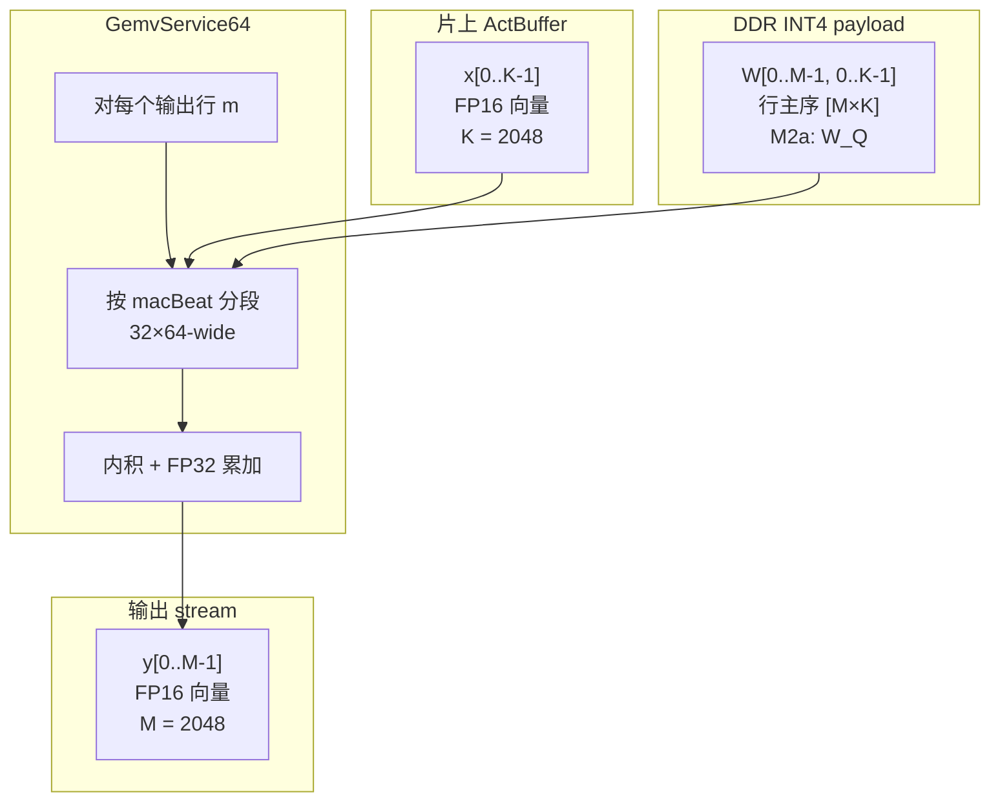
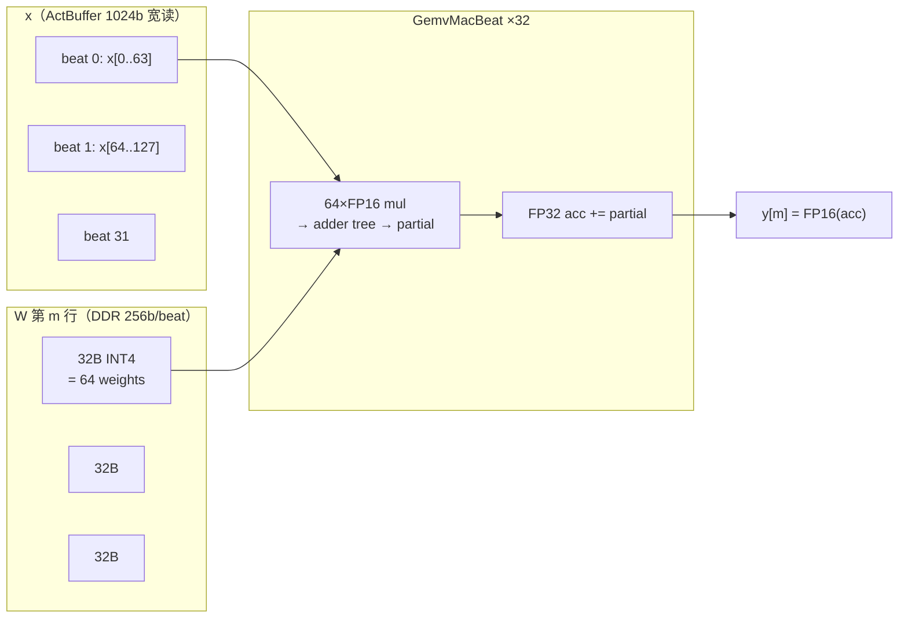

# M2a 实现设计 — GemvService64 + W_Q/K/V 投影

> **里程碑总览**：[doc/milestone-m2.md](../../../../doc/milestone-m2.md)  
> **通用 GEMV 长期规范**：[gemv-service-64-design.md](gemv-service-64-design.md)  
> **DDR 地址**：[ddr-memory-map.md](../../ddrMemoryMap/doc/ddr-memory-map.md)  
> **DdrAgent**：[ddr-agent-design.md](../../ddrAgent/doc/ddr-agent-design.md)  
> **Scheduler**：[llama-scheduler-design.md](../../llamaScheduler/doc/llama-scheduler-design.md)

**文档状态**：Review 草案 **v3.1**（2026-06-25）— 定稿 **256b AXI ↔ 64-wide MAC ↔ ActBuffer 1024b 宽读**；§4.4 互联分工  
**范围**：M2a — 在 M1 流水末端接入 **common** `GemvService64`，完成 L0 `W_Q`（毕业），并预留同引擎 `W_K` / `W_V` 扩展。

---

## 目录

1. [目标与边界](#1-目标与边界)
2. [Tile 概念与宽 beat 对齐](#2-tile-概念与宽-beat-对齐)
3. [地址职责划分](#3-地址职责划分)
4. [端到端数据流](#4-端到端数据流)
5. [数学与数据布局](#5-数学与数据布局)
6. [INT4 反量化](#6-int4-反量化)
7. [Scale 表布局与索引](#7-scale-表布局与索引)
8. [模块架构](#8-模块架构)
9. [接口规范](#9-接口规范)
10. [FSM 与握手](#10-fsm-与握手)
11. [DdrAgent M2 扩展](#11-ddragent-m2-扩展)
12. [Scheduler M2a 扩展](#12-scheduler-m2a-扩展)
13. [顶层集成 LlamaM2aTop](#13-顶层集成-llamam2atop)
14. [实现分期 a1–a4](#14-实现分期-a1a4)
15. [验证计划](#15-验证计划)
16. [资源与性能](#16-资源与性能)
17. [错误处理与调试](#17-错误处理与调试)
18. [风险、决策与开放项](#18-风险决策与开放项)
19. [附录 A：W_Q(0) 数值示例](#附录-aw_q0-数值示例)
20. [附录 B：目录与 Makefile](#附录-b目录与-makefile)

---

## 1. 目标与边界

### 1.1 M2a 要交付什么

在 **不改变 M1 行为** 的前提下，把 RMSNorm 输出接到通用 GEMV 引擎，完成 Pre-Attention 线性投影的第一段：

```text
HPS job_start
  → embed + γ DDR 读（M1，不变）
  → RmsNorm L0 norm1（M1，不变）
  → ActBuffer 锁存 normed_x[2048]
  → GemvService64: W_Q(0) · normed_x
  → qOut[2048] FP16 AXI-Stream
  → job_done
```

**毕业最小集**：L0 `W_Q` 全 2048 行数值正确（Questa + INT4_G128 golden）。  
**M2a 末期扩展**（同引擎、改 Job 参数）：`W_K(0)`、`W_V(0)`。

### 1.2 明确不做（M2b ~ M2d / 更后里程碑）

| 不做 | 归属 |
|:---|:---|
| RoPE | M2b |
| KV cache 读写、QK/AV、softmax | M2c |
| W_O、residual add | M2d |
| FFN、LM head | M3+ |
| 16 层全局 FSM | M2 后期；M2a 仅 **layer=0** |
| LM head、多 token 流水线重叠 | 更后 |

### 1.3 毕业标准（可执行）

| 级别 | 命令 | 通过条件 |
|:---|:---|:---|
| 单元 | `make -C src/scala/gemvService64 questa` | 固定 `x[2048]` + 小块 INT4 `W`；Python golden 逐元素 ≤ 相对误差阈值 |
| DdrAgent | `make -C src/scala/ddrAgent questa-m2a` | `GEMV_WEIGHT` sink 读 **256b beat**（32B/tile），与 DDR preload 一致 |
| 集成 | `make -C src/scala/top questa-m2a` | M1 路径 + L0 `W_Q`；`qOut` 与离线参考一致 |
| Smoke | `make -C src/scala/top verilator` | 控制流、`job_done`、beat 计数；**FP 数值无意义**（IP 桩） |

DDR 镜像：

- 单元 / 集成：`make -C tools/ddr_pack pack`（含 INT4 attn + metadata scales）
- M1 回归仍可用 `pack-m1`（不含 attn 区，仅 M2a 集成测需全图）

---

## 2. Tile 概念与宽 beat 对齐

> **M2a 定稿**：`bankLen = 64`，与 **256-bit AXI beat**（32 B = 64×INT4）及 **ActBuffer 1024-bit 宽读**（64×FP16）对齐。  
> 参考实现思路见 llama-fpga（`Serial2Parallel` + 512b/128-wide VPU）；本工程总线半宽，故 `bankLen=64`。

### 2.1 K 是什么（GEMV 内积维）

在 GEMV 记号里，一次矩阵–向量乘写为：

```text
y[m] = Σ_{k=0}^{K-1}  W[m, k] · x[k]        m = 0 .. M-1
```

向量 **x** 左乘权重矩阵 **W**（等价于 **y = W · x** 当 **x** 为列向量时）的完整过程如下。

#### 2.1.1 整体数据流



#### 2.1.2 矩阵 × 向量（按行求内积）

**W** 的每一行与 **同一** 个 **x** 做点积，得到 **y** 的一个分量。列下标 **k** 与 **x** 的下标对齐：

```text
              ←────────── K 列（与 x 下标 k 对齐）──────────→
            k=0    k=1    k=2    k=3   ...  k=K-2  k=K-1
          ┌──────────────────────────────────────────────────┐
  m=0     │ W[0,0] W[0,1] W[0,2] W[0,3] ... W[0,*] W[0,*] │ ──┐
          ├──────────────────────────────────────────────────┤   │
  m=1     │ W[1,0] W[1,1] W[1,2] W[1,3] ... W[1,*] W[1,*] │ ──┼──► 各自行 · x
          ├──────────────────────────────────────────────────┤   │
   ...    │                      ...                         │ ──┤
          ├──────────────────────────────────────────────────┤   │
  m=M-1   │ W[M-1,0]  ...              ...      W[M-1,K-1] │ ──┘
          └──────────────────────────────────────────────────┘
                              ×
          ┌──────────────────────────────────────────────────┐
          │ x[0]   x[1]   x[2]   x[3]  ...  x[K-2]  x[K-1]  │  （列向量视角）
          └──────────────────────────────────────────────────┘
                              ‖
                              ▼
          ┌──────────────────────────────────────────────────┐
          │ y[0]   y[1]   y[2]  ...              y[M-1]    │
          └──────────────────────────────────────────────────┘
```

单行公式（硬件对 **m** 外层循环，每次算一个 **y[m]**）：

```text
y[m] = W[m,0]·x[0] + W[m,1]·x[1] + ... + W[m,K-1]·x[K-1]
```

#### 2.1.3 一行内的宽 beat 累加（M2a 硬件视角）

对 **固定的输出行 m**，K 维切成 **32 段**，每段 **64 个元素**，与 **一拍 256-bit DDR 数据** 对齐：



```text
acc = FP32(0)
for t in 0 .. 31:                                    // K=2048, 64/beat → 32 beats
    x_wide  ← ActBuffer.read1024(t)                  // 64 × FP16
    w_raw   ← DDR 256b beat (32 B INT4)              // 64 × INT4
    w_fp16  ← dequant(unpack(w_raw), scale[t/2])
    partial ← tree64( x_wide ⊙ w_fp16 )              // 64 mul → 1 scalar
    acc     += partial
y[m] = FP16(acc)
```

**重要**：16-bit AXI-Stream **只用于灌 ActBuffer**（RMSNorm 输出）；**MAC 输入是 1024b 宽读**，不是 Stream 上每拍 1 个 FP16 直连乘法器（见 §2.6）。

#### 2.1.4 小例子（M=3，K=8，便于对照上图）

| k | 0 | 1 | 2 | 3 | 4 | 5 | 6 | 7 |
|:---:|:---:|:---:|:---:|:---:|:---:|:---:|:---:|:---:|
| **x[k]** | 1.0 | 0.5 | −1.0 | 2.0 | 0.0 | 1.0 | −0.5 | 1.5 |

| m \\ k | 0 | 1 | 2 | 3 | 4 | 5 | 6 | 7 | **y[m]** |
|:---:|:---:|:---:|:---:|:---:|:---:|:---:|:---:|:---:|:---:|
| 0 | 1 | 0 | 1 | 0 | 1 | 0 | 1 | 0 | 1·1 + 0.5·0 + (−1)·1 + … |
| 1 | 0 | 1 | 0 | 1 | 0 | 1 | 0 | 1 | 行 1 · x |
| 2 | 1 | 1 | 1 | 1 | 1 | 1 | 1 | 1 | Σ x[k] |

K=8 时 **K tile** 切法（每 tile 宽 64 的缩小版：此处每 tile 宽 **4** 仅作示意）：

| K tile t | 0 | 1 |
|:---:|:---:|:---:|
| **k 范围** | 0–3 | 4–7 |
| **x 段** | x[0..3] | x[4..7] |
| **W[m] 段** | W[m,0..3] | W[m,4..7] |
| **贡献** | 部分和₁ | 部分和₂ → 相加得 y[m] |

L0 `W_Q` 只是把上表里的 **M=3, K=8** 放大为 **M=2048, K=2048**，每 tile 宽 **64**，共 **32** 个 K tile。

---

这里的 **K** 是 **内积（求和）那一维的长度**，不是 attention 里的 **Key 向量**（二者字母相同、含义不同，见下表）。

| 符号 | 在 GEMV / M2a 里指什么 | L0 `W_Q` 典型值 |
|:---|:---|:---:|
| **x** | 输入激活向量（RMSNorm 后的 `normed_x`） | 长度 **2048** |
| **K** | **x 的维数**，也是权重矩阵的 **列数**（内积下标 `k` 的范围） | **2048** |
| **M** | 输出 **y** 的维数，权重矩阵的 **行数** | **2048** |
| **W** | 权重矩阵，shape `[M, K]` | `[2048, 2048]` |
| **k** | 求和下标，**0 .. K−1** 的某一维索引 | 例如 `k=0..63` 是第一个 K tile |
| **m** | 输出行号，**0 .. M−1** | 例如 `m=0` 是 Q 向量的第 0 维 |

与 Llama attention 符号对照（避免混淆）：

| 名称 | 含义 | 和 GEMV 的 K 是否同一回事 |
|:---|:---|:---:|
| GEMV **K** | `W_Q·x` 里 **x 有多长**（2048） | — |
| Attention **K**（Key） | 旋转后的 key 向量 / KV cache 里存的 **K 头** | **否** |
| **head_dim** | 每个 Q/K **头** 的长度 | **64**（是 K 投影 **输出** 里每一段的宽度，不是 GEMV 的 K） |

**M2a 语境**：`W_Q · normed_x` 时，**K = 2048** = `DdrMemoryMap.vectorDim`。  
`W_K` / `W_V` 同样是 **K = 2048**（输入仍是 2048 维残差流），只是 **M = 512**（8 个 KV 头 × 64）。

**「K tile（激活）」** 的含义：把内积维 **K** 按固定宽度 **64** 切成一段段，第 `t` 段是：

```text
x_tile = x[t*64 : t*64+63]     // 64 个 FP16，来自 ActBuffer
```

- 下标 `t` 也叫 **k_tile**（第几个 K 方向上的 tile），**不是** attention 的 Key。
- 对 `K=2048`，共有 **K/64 = 32** 个 macBeat，与权重侧 32 个 256b beat **逐段对齐**，做 `macBeat(x_wide, w_dequant)` 后累加到同一 `acc`（图示见 **§2.1.3**）。

```text
x[0]···x[63]   x[64]···x[127]   ...   x[1984]···x[2047]
   wide[0]          wide[1]      ...        wide[31]
      ↓ macBeat       ↓ macBeat                  ↓ macBeat
   beat[0]          beat[1]      ...        beat[31]
      └──────────── acc[m] 累加 ──────────────┘
```

### 2.2 Tile 定义

**Tile** 是本 FPGA 实现里的固定大小数据块，用于在 **片上算力（64 MAC/cycle）** 与 **DDR 容量/带宽** 之间做流式切分。  
它不是 Llama 论文里的算子名，而是硬件流水线的「读—算—丢」原子单位。

### 2.3 本项目的 Tile 尺寸（与 256b AXI 对齐）

| 名称 | 内容 | 字节 / 位宽 | 说明 |
|:---|:---|:---:|:---|
| **bankLen** | K 方向每 beat 元素数 | **64** | `LLAMA_M2A_BANK_LEN=64`；与总线 beat 对齐 |
| **K tile（激活）** | `x[t*64 : t*64+63]`，64×FP16 | **1024 bit** 宽读 | ActBuffer 窄写、宽读；不上 DDR |
| **K tile（权重）** | `W[m, t*64 : t*64+63]`，64×INT4 | **32 B** = **256 bit** | 1 AXI beat = 1 MAC beat |
| **一次 macBeat** | `tree64(x_wide, w_dequant)` | — | 64 并行 FP16×FP16 → adder tree → partial |
| **一行 W** | 32 个 K tile | **1024 B** INT4 | 32 AXI beats/row；行 ping-pong 2×1024B |
| **AXI burst 包（可选）** | 8 个权重 tile | **256 B** | a4 优化：减少 AR 次数 |

### 2.4 为何必须 Tile 化

L0 `W_Q` 形状 `[2048, 2048]`，INT4 payload 约 **2 MiB/层**。片上 ping-pong 仅 **~8 KiB** 量级，无法一次装入整矩阵。

```text
for m in 0 .. M-1:
    acc = FP32(0)
    for t in 0 .. K/64 - 1:           // K=2048 → 32 macBeats/row
        w_raw   ← DDR 256b beat (32B)   // 与 DdrAgentAxi 对齐
        x_wide  ← ActBuffer.read1024(t) // 64×FP16
        acc    += macBeat(x_wide, dequant(w_raw))
    y[m] = FP16(acc)
```

L0 `W_Q` 规模：

- 每行 **32** 个 macBeat（= 32 个 256b AXI beat）
- **2048** 行
- 合计 **65 536** 次权重 beat 读（a3 单 beat AR；a4 可 8-beat burst，见 §11.4）

### 2.5 Tile 与 group（INT4_G128）的关系

- 量化 **group_size = 128**（沿 K 维）
- 每个 K tile 宽 **64**，故 **2 个连续 K tile 共享同一 scale group**
- 因 128 整除 64，**每个 K tile 内 64 个权重必落在同一 group 内**（不会在 tile 中间切 group 边界）

| 维度 | K tile 0 | K tile 1 | K tile 2 | K tile 3 | … |
|:---|:---|:---|:---|:---|:---|
| **K 索引范围** | 0–63 | 64–127 | 128–191 | 192–255 | … |
| **INT4 group** | 0 | 0 | 1 | 1 | … |
| **scale** | scale_0 | scale_0 | scale_1 | scale_1 | … |

即 `group_col = t / 2`（`t` 为 macBeat / K tile 编号）；相邻两个 beat 共用同一 scale。

### 2.6 宽 beat 数据通路（M2a 定稿）

本节把 **256b AXI、ActBuffer、64-wide MAC** 三者绑在一起，避免「16b Stream 直连 MAC」的误解。

#### 2.6.1 对齐关系总表

| 层级 | 位宽 | 元素 | 与 bankLen=64 的关系 |
|:---|:---:|:---|:---|
| `DdrAgentAxi` R 通道 | **256 bit/beat** | 32 B | 32×8 = 256；**64×INT4** |
| `W` 一行 payload | 1024 B | 2048 INT4 | **32 beats/row** |
| `ActBuffer` 宽读 | **1024 bit** | 64×FP16 | 与 1 个权重 beat 同拍送入 MAC |
| `ActBuffer` 窄写 | **16 bit/beat** | 1×FP16 | RMSNorm 流 2048 拍/job |
| `GemvMacBeat` | — | 64 并行 mul | 1 cycle（流水后）→ adder tree → partial |
| 行内 FP32 acc | — | 1 scalar | **跨 32 macBeat** 累加得 `y[m]` |

```text
256b DDR beat  ←→  64 INT4 weights  ←→  1 macBeat
1024b ActBuf   ←→  64 FP16 activations ←→  同上 macBeat
```

#### 2.6.2 ActBuffer：窄写、宽读

RMSNorm 仍以 **16-bit AXI-Stream** 输出；Gemv 内部 **不复用** 该 Stream 作为 MAC 操作数源。

| 阶段 | 行为 |
|:---|:---|
| **写** | `actIn` 每拍 1×FP16；顺序写入 `mem[k]`，`k=0..2047` |
| **组宽字** | 逻辑上 `wide[t] = mem[t*64 : t*64+63]`，共 **32** 个 1024b 字 |
| **读** | `GemvTileEngine` 在 macBeat `t` 时 `read1024(t)`，与 DDR 权重 beat 对齐 |
| **复用** | 整向量 **x** 对所有输出行 `m` 复用；**不对每个 m 重灌 RMSNorm** |

实现可选：

- **方案 A（推荐）**：单端口 RAM 2048×16，读口组合/寄存输出 64 路拼接为 1024b。
- **方案 B**：写侧 `Serial2Parallel(64)` 攒满 1024b 再落 32 行宽 RAM（与 llama-fpga `Serial2Parallel` 同思路，写宽读宽）。

#### 2.6.3 GemvMacBeat：64-wide MAC + tree + FP32 acc

```text
                    ┌─────────────────────────────────────┐
  x[1024b] ────────►│ 64 × (FP16 mul → FP32 prod)         │
  w[64×FP16] ──────►│        ↓ adder tree (6 级)          │──► partial (FP32)
                    └─────────────────────────────────────┘
                                          │
                    acc (FP32) ◄──────────┘  += partial   （重复 32 次 / 行）
                                          │
                    y[m] = FP16(acc) ◄────┘
```

- **macBeat 内**：64 路乘法可单周期发起（Agilex FP16 DSP：约 **2 mul / DSP block**）。
- **adder tree**：64→32→16→8→4→2→1，组合或 1–2 级流水。
- **行内 acc**：独立 FP32 寄存器；32 个 macBeat 后 `EMIT_ROW`。
- 模块名实现期可用 `GemvMacBeat`（或保留 `GemvMacLane` 但语义为 **64-wide**，非 1-lane 时分）。

#### 2.6.4 权重通路：256b beat 直送 Gemv

| 方案 | 说明 | M2a |
|:---|:---|:---:|
| 8-bit 字节流 | FIFO 深、拍数多 | 不采用 |
| **256b AXI beat** | `DdrTileSink` → `Stream(Bits(256))` 或 Fragment | **a3 起采用** |

Gemv 侧 `TileBeatFifo`（深度 ≥2）与 **行 ping-pong**（2×1024B）配合：DDR 预取下一行时，MAC 消费上一行 beat。

#### 2.6.5 与 llama-fpga 对照

| 项 | llama-fpga（Pushing / KV260） | llama-agilex M2a |
|:---|:---|:---|
| DDR 数据 beat | 512b → 128 INT4 | **256b → 64 INT4** |
| 激活宽读 | `Serial2Parallel` 后宽向量 | **ActBuffer 1024b 宽读** |
| MAC | 128-wide + tree + FP32 acc | **64-wide** + tree + FP32 acc |
| 量化布局 | bus 上 zero/scale 交织 | **payload + metadata scale 表**（`ddr_pack`） |
| 参考文档 | `llama-fpga/docs/DESIGN.md` | 本文档 |

---

## 3. 地址职责划分

### 3.1 原则（回答「common 模块为何碰地址」）

`GemvService64` 是 **common 计算服务**：同一套 MAC、INT4 unpack、tile 迭代逻辑服务 W_Q / W_K / FFN / W_O 等所有 **row-major INT4 GEMV**。

**不同 layer、不同算子的 DDR 语义地址** 不应写死在 Gemv RTL 里，而由 **Scheduler + `DdrMemoryMap`** 在 Job 下发前解析完毕。

| 层次 | 谁负责 | 输入 | 输出 |
|:---|:---|:---|:---|
| **语义地址** | `LlamaScheduler` + `DdrMemoryMap` | `(layer, op)` | `wBase`, `scaleBase`, `M`, `K` |
| **机械地址** | `GemvEngine`（通用算术） | `wBase`, `m`, `k_tile`, `K` | `tile_ddr_addr` |
| **物理搬运** | `DdrAgent` | `tile_ddr_addr`, `byteLen` | AXI AR/R → 字节流 |

Gemv **不知道**「这是 layer 3 的 attention W_Q」；它只知道 Job 里的 `wBase=0x2000_0000, M=2048, K=2048`。

### 3.2 语义地址（Scheduler 侧）

```scala
// 示例：L0 W_Q Job 构建（Scala 对象，非 Gemv 内部）
GemvJob(
  op        = GemvOp.W_Q,
  layer     = 0,
  M         = 2048,
  K         = 2048,
  wBase     = DdrMemoryMap.wQ(0),           // 0x2000_0000
  scaleBase = DdrMemoryMap.attnScaleBaseFor(0, GemvOp.W_Q),  // 见 §7
  weightFmt = WeightFmt.INT4_G128_SYM,
  inputSrc  = InputSrc.ACT_BUF
)
```

`W_K` / `W_V` 仅替换：

```scala
wBase = DdrMemoryMap.wK(0)   // 0x2000_2000, M=512
wBase = DdrMemoryMap.wV(0)   // 0x2000_2800, M=512
```

### 3.3 机械地址（GemvEngine 内，与 op/layer 无关）

INT4 row-major payload，行 `m`、K tile `t`（`t = 0 .. K/64 - 1`）：

```text
rowByteStride(K) = K / 2          // 每行 INT4 字节数；K=2048 → 1024
tileByteOffset   = 32             // 64 个 INT4 权重

tile_ddr_addr(m, t) = wBase + m * rowByteStride(K) + t * tileByteOffset
```

**Scheduler 不逐 tile 发 `MemCmd`**：一层 `W_Q` 有 65 536 个 tile，若在 Scheduler 展开会导致：

- FSM 爆炸
- 无法做 DDR 与 MAC 细粒度 overlap
- 违背「Scheduler 管语义、Gemv 管迭代」的分工

### 3.4 非 GEMV 权重的地址（M2a 不涉及，预留）

| 操作 | 地址模式 | M2a |
|:---|:---|:---:|
| W_Q/K/V/O、FFN | `wBase + m*stride + t*32` | ✓ |
| QK 点积 | `kAddr(layer, pos)`，KV cache | M2c |
| AV 加权 | `vAddr(layer, pos)` | M2c |
| LM head 扫表 | `embRowBase(row)` 顺序 | M3 |

这些差异通过 `GemvJob.inputSrc` / 独立子端口处理，**不**在 `GemvEngine` 里写 `if (op==W_Q)`。

---

## 4. 端到端数据流

### 4.1 M2a 顶层互联（概念）

```text
┌──────────────┐  AXI-Lite   ┌────────────────────┐
│ HPS          │◄───────────►│ HpsJobCtrl         │
└──────────────┘             │ LlamaSchedulerM2a  │
                             └─────────┬──────────┘
                    GemvJob / jobDone   │ MemCmd (embed, γ, scale preload)
                    gemvStart           │
                             ┌──────────▼──────────┐     ┌─────────────┐
                             │ DdrAgentM2          │◄───►│ LPDDR4B     │
                             │  EMBED / GAMMA      │     └─────────────┘
                             │  GEMV_WEIGHT        │
                             │  (SCALE preload)    │
                             └──────────┬──────────┘
                    embed/gamma        │ weightBeat (256b Stream)
                    scaleBytes         │
                             ┌─────────▼──────────┐
                             │ RmsNormAxiTop      │
                             │ GemvService64      │
                             │  actIn ◄─ rms out  │
                             │  qOut ─────────────┼──► (tap / M2b)
                             └────────────────────┘
```

### 4.2 单次 token job 时序（L0，仅 W_Q）

```text
Phase 1 — M1（不变）
  Sched: MemCmd EMBED_ROW + RMS_GAMMA
  DdrAgent: 并行/流水读 → embedOut, gammaOut
  RmsNorm: 2048 beat 输出 → rmsNormOut
  Sched: WAIT_RMSNORM 直到 rmsNormOutLast

Phase 2 — Act 锁存
  actIn: 2048 拍 × 16b → ActBuffer 窄写
  末拍 fire 后向量就绪（32×1024b 宽字可随机读）
  Sched: MemCmd 读 W_Q scale 表 → GemvScaleRam（见 §7.3）

Phase 3 — GEMV W_Q
  Sched: 发 GemvJob(W_Q, layer=0)，拉高 gemvStart 一拍
  GemvEngine:
    for m in 0..2047:
      acc = 0
      for t in 0..31:
        TileFetchReq(tile_ddr_addr) → DdrAgent   // 32B = 1×256b beat
        收 256b 权重 beat + ActBuffer.read1024(t)
        → unpack → dequant → macBeat → acc += partial
      输出 y[m] 到 qOut stream
  Sched: 等 gemvDone && qOut tlast

Phase 4 — 完成
  Sched: JOB_DONE, job_done_sticky
```

### 4.3 与 M1 的衔接点

| 信号 | M1 | M2a |
|:---|:---|:---|
| `rmsNorm.io.dataOut` | 直连 `io.rmsNormOut` | 同时进 `GemvService64.actIn`（fork 或 ActBuffer 在 Gemv 内） |
| `scheduler.io.rmsNormOutLast` | `dataOut.fire && last` | 不变；触发 GEMV 阶段 |
| `io.rmsNormOut` | 顶层口 | M2a 可保留 tap（调试）；毕业比对以 `qOut` 为准 |

### 4.4 互联职责：Top vs Gemv vs Platform Designer

`GemvService64` 是 **common 计算核**：暴露标准端口，**不负责**判断「当前 beat 来自哪一层、该送去 RoPE 还是 KV」。多来源 / 多去向的 **路由在 Top + Scheduler** 完成；**不在 Quartus Platform Designer** 里手连模块间 AXI-Stream。

#### 4.4.1 端口类型（并非全是 AXI-Stream）

| 端口 | 类型 | 说明 |
|:---|:---|:---|
| `actIn` | **AXI4-Stream** 16b FP16 | 灌 `ActBuffer`；与 `RmsNormAxisCfg` 对齐 |
| `qOut`（及后期 `kOut`/`vOut`） | **AXI4-Stream** 16b FP16 | GEMV 结果向量；`tuser` 带 `gemvOp`/行号 |
| `gemvJob` / `gemvStart` / `gemvDone` | 控制（寄存器或 Req/Ack） | Scheduler 下发 Job、等完成 |
| `tileFetchReq` | Gemv ↔ DdrAgent 握手 | 非 Stream |
| `weightBeat` | **Stream 256b** | DDR 权重 beat；非 AXI4-Stream 命名空间，但属流式 |
| Scale | **MemCmd → `GemvScaleRam`** | Scheduler 经 DdrAgent 预加载；GEMV 热路径读片上 RAM |

长期多输入语义见 [gemv-service-64-design.md](gemv-service-64-design.md) 的 `input_src` / descriptor `tag`；M2a 仅使用 `act_buf` → RMSNorm 一条路径。

#### 4.4.2 谁在哪里连线

| 层次 | 职责 | 典型连线 |
|:---|:---|:---|
| **`GemvService64`** | MAC、tile 迭代、dequant；**固定** `actIn`/`qOut` master/slave | 不内嵌跨模块 mux |
| **`LlamaSchedulerM2a`** | 阶段 FSM：何时 RMSNorm 结束、何时 `SCALE_LOAD`、何时 `gemvStart`；**同一时刻一种 GEMV Job** | 不直接接 Stream，只控时序 |
| **`LlamaM2aTop`（Spinal）** | 模块间 **所有** Stream / 宽 beat / `MemCmd` 仲裁 | `rmsNorm.dataOut >> gemv.actIn` 等 |
| **Platform Designer（GHRD）** | **仅 PL↔HPS、PL↔DDR** 边界 | `io.hps`（AXI4-Lite）、`io.ddrAxi`（AXI4）；**不**接 RMSNorm↔Gemv |

导出给 Quartus 的是 **已连好的 `LlamaM2aTop` Verilog**；内部流水不在 PD 里用 AXI-Stream Component 拼装。

#### 4.4.3 M2a 最小互联（现在就要做）

```text
DdrAgent.embedOut / gammaOut ──► RmsNorm
RmsNorm.dataOut ──────────────► Gemv.actIn          // 单源，无 mux
DdrAgent.weightBeat ──────────► Gemv                // 经 TileFetch 仲裁
Scheduler ──gemvJob/gemvStart──► Gemv
Gemv.qOut ────────────────────► io.qOut               // M2a 毕业观测；M2b 改接 RoPE
```

可选调试旁路（§18.2 #4）：

```scala
// Spinal：单源双宿
val normOut = rmsNorm.io.dataOut
StreamFork(normOut, List(io.rmsNormOut, gemv.io.actIn))
```

M2a **不需要** `actIn` 多路 mux、**不需要** `qOut` demux；Scheduler 保证 GEMV 前 RMSNorm 已完成且仅一种 Job 在跑。

#### 4.4.4 后期扩展模式（M2b+，仍在 Spinal Top）

| 模式 | 场景 | Spinal 惯用法 |
|:---|:---|:---|
| 单源双宿 | RMSNorm 同时 tap + 进 Gemv | `StreamFork` |
| 多源单宿 | norm1 / residual / FFN 中间结果作 GEMV 输入 | `StreamMux(sel = sched.actSrc)` |
| 单源多宿 | `qOut` 送 RoPE + 仿真 tap | `StreamFork` 或直连 + 顶层第二观测口 |
| 多矩阵输出 | 同引擎串行 W_Q → W_K → W_V | **不换线**：同一 `actIn` 复用 ActBuffer，`qOut`/`kOut`/`vOut` 分端口或 `tuser` 区分 |

路由选择信号 `sel` / `actSrc` 由 **Scheduler FSM** 驱动，与 `GemvJob.op` 一致；Gemv 核内 **不** 解析「来自哪一层 attention」。

#### 4.4.5 与 §13 的关系

§13 给出 `LlamaM2aTop` 连接清单与 Scala 片段；本节说明 **为何** 在 Top 里连、**哪些** 留到后续里程碑。实现 `LlamaM2aTop.scala` 时以 §4.4.3 为最小集，§4.4.4 作扩展备忘。

---

## 5. 数学与数据布局

### 5.1 GEMV 定义

对输入向量 **x** ∈ ℝ^K（FP16 存储，内部 FP32 累加），权重 **W** ∈ ℝ^{M×K}（DDR 存 INT4_G128）：

```text
y[m] = Σ_{k=0}^{K-1} dequant(W[m,k]) · x[k]     , m = 0 .. M-1
```

计算过程图示见 **§2.1.1–§2.1.4**（矩阵按行与 **x** 做内积、K tile 累加、数值小例）。

Llama 3.2 1B L0 attention 投影：

| op | M | K | wBase（layer 0） | 输出 |
|:---|:---:|:---:|:---|:---|
| W_Q | 2048 | 2048 | `0x2000_0000` | q[2048] |
| W_K | 512 | 2048 | `0x2000_2000` | k[512] |
| W_V | 512 | 2048 | `0x2000_2800` | v[512] |

### 5.2 HF 权重与 DDR 行主序

HuggingFace `nn.Linear` 权重 shape `[out_features, in_features]` = `[M, K]`，与 GEMV 一致。  
`tools/ddr_pack` 按行量化、按行写入 DDR（见 `quantize_int4.py`）。

字节布局（INT4 payload，行主序）：

```text
地址递增方向:  W[m,0] W[m,1] ... W[m,K-1] | W[m+1,0] ...
               |←——  K/2 字节 ——→|
```

### 5.3 输出向量与 head 划分（供 M2b 路由）

| 投影 | 输出维 | head 语义 |
|:---|:---:|:---|
| W_Q | 2048 | 32 heads × 64 (`head_id = m / 64`) |
| W_K | 512 | 8 KV heads × 64 |
| W_V | 512 | 8 KV heads × 64 |

M2a 的 `qOut` 按 **行索引 m 顺序** 输出 2048 beat；`tuser` 携带 `head_id` 供 M2b RoPE 使用（见 §9.4）。

---

## 6. INT4 反量化

### 6.1 量化约定（与 `tools/ddr_pack` 一致）

| 项 | 值 |
|:---|:---|
| 格式 | **INT4_G128 对称** |
| group_size | 128（沿 K） |
| 存储 nibble | UINT4 0..15 |
| 有符号值 | `q_signed = nibble - 8` → [-8, 7] |
| scale | 每 group 1× **FP16**（metadata 表） |
| zero point | 固定 8（隐式，不单独存） |

量化（离线）：

```text
scale_g = max(abs(w_group)) / 7
nibble  = round(w / scale_g) + 8   // clamp 到 [0,15]
```

反量化（在线，RTL）：

```text
w_fp16 = FP16( (nibble - 8) * FP16(scale_g) )
```

### 6.2 Nibble 打包

`pack_uint4_nibbles`：**低 nibble 在前**（偶数索引 k 在低 4 bit）。

```text
byte[i] = nibble[2i] | (nibble[2i+1] << 4)
```

32 B payload → 64 nibbles → 64 个 dequant 乘数。

### 6.3 `Int4UnpackDequant` 模块职责

```text
输入:  32 B weight tile (from DDR)
       scale_fp16 (当前 group，来自 ScaleRam)
输出:  64 × FP16 w_tile[0..63]（Flow/Stream，供 MacLane 消费）
```

实现要点：

- Unpack：纯组合逻辑，无 DSP
- Dequant：`(nibble-8)` 转有符号 → × scale → FP16；**Questa 用真实 FP IP**
- Verilator：可用 `IntelFloatIPFlowIOSim` 桩（仅 smoke）

---

## 7. Scale 表布局与索引

### 7.1 Metadata 区域

```text
META_BASE              = 0x3F00_0000
META_ATTN_SCALE_BASE   = 0x3F00_1000
META_FFN_SCALE_BASE    = 0x3F20_0000   // M2a 不用
```

每个 group：**2 B** = FP16 scale（LE），与 `pack_scale_zero_table()` 一致。

### 7.2 Attention scale 表内顺序

`pack_weights.py` 按 **16 层 × 每层 4 矩阵（Q,K,V,O）** 顺序追加 scale 数组：

```text
layer 0: W_Q scales | W_K scales | W_V scales | W_O scales
layer 1: ...
...
layer 15: ...
```

每层 group 数（K=2048，group_size=128 → 16 groups/row）：

| 矩阵 | M | groups/row | 总 group 数 |
|:---|:---:|:---:|:---:|
| W_Q | 2048 | 16 | 32 768 |
| W_K | 512 | 16 | 8 192 |
| W_V | 512 | 16 | 8 192 |
| W_O | 2048 | 16 | 32 768 |
| **每层合计** | | | **81 920** |

每层 scale 字节：81 920 × 2 = **163 840 B（160 KiB）**。  
全 16 层 attention scale：约 **2.5 MiB**（在 `META_ATTN` 2 MiB 预算内，打包脚本已验证）。

### 7.3 Layer 0 W_Q 的 scale 子表

| 项 | 值 |
|:---|:---|
| 在 attn scale 表内偏移 | **0**（layer 0 第一个矩阵） |
| group 数 | 32 768 |
| 字节数 | **65 536 B（64 KiB）** |
| DDR 地址 | `0x3F00_1000` .. `0x3F00_FFFF` |

### 7.4 运行时 group 索引（机械公式）

对当前 Job（已知 `scaleBase`, `M`, `K`），行 `m`、K tile `t`：

```text
groups_per_row = K / 128                    // 2048 → 16
group_col      = t / 2                      // 每 2 个 K tile 共用一个 group
group_index    = m * groups_per_row + group_col
scale_addr     = scaleBase + group_index * 2
```

**M2a 推荐**：Scheduler 在 GEMV 前发 **一条** `MemCmd` 读 `64 KiB` scale 到 `GemvScaleRam`；GEMV 热路径 **只读片上 RAM**，不再为每个 tile 打 DDR。

### 7.5 建议在 `DdrMemoryMap.scala` 增加的辅助函数（实现期）

```scala
/** Byte offset of W_Q scale sub-table for (layer) within META_ATTN_SCALE_BASE. */
def attnWqScaleBase(layer: Int): Long

/** groups_per_row for K=2048, group_size=128 */
val int4GroupsPerRowK2048: Int = 16
```

具体闭式公式：

```text
attnWqScaleBase(l) = META_ATTN_SCALE_BASE
                   + l * (81920 * 2)   // 每层 160 KiB scale

attnWkScaleBase(l) = attnWqScaleBase(l) + 32768 * 2
attnWvScaleBase(l) = attnWkScaleBase(l) + 8192 * 2
attnWoScaleBase(l) = attnWvScaleBase(l) + 8192 * 2
```

---

## 8. 模块架构

### 8.1 目录树

```text
gemvService64/
├── doc/
│   ├── gemv-service-64-design.md   # 长期 common 规范
│   └── gemv-m2a-design.md          # 本文档
├── scala/
│   ├── GemvBundles.scala           # GemvJob, GemvOp, TileFetchReq, GemvDone
│   ├── GemvAxisCfg.scala           # AXI-Stream 配置（对齐 RmsNorm）
│   ├── GemvActBuffer.scala         # 2048×FP16 窄写 + 1024b 宽读
│   ├── GemvScaleRam.scala          # scale 预加载 / 端口读
│   ├── Int4Unpack.scala            # 256b beat → 64 nibbles
│   ├── Int4Dequant.scala           # nibble + scale → FP16
│   ├── GemvMacBeat.scala           # 64-wide mul + adder tree → partial
│   ├── GemvTileEngine.scala        # 行/列迭代，机械地址，TileFetch
│   ├── GemvOutputSer.scala         # y[m] → AXI-Stream qOut
│   └── GemvService64.scala         # 顶层粘合
├── test/
│   ├── GemvMacBeatSim.scala        # Verilator / Questa
│   └── questa/
│       ├── tb_gemv_mac_beat.sv
│       ├── tb_gemv_service64.sv
│       └── run_gemv_m2a.do
└── Makefile

ddrAgent/
├── scala/
│   ├── DdrAgentM2.scala            # M1 + GEMV_WEIGHT TileSink + scale sink
│   └── DdrTileSink.scala           # 变长读 → 字节流 master
└── test/questa/ ... m2a cases

llamaScheduler/
└── scala/
    └── LlamaSchedulerM2a.scala     # M1 FSM + GEMV 阶段

top/
├── scala/
│   └── LlamaM2aTop.scala
└── test/questa/ ... questa-m2a
```

### 8.2 GemvService64 内部结构

```text
                    ┌─────────────────────────────────────────────┐
  gemvJob ─────────►│ JobRegs: wBase, scaleBase, M, K, op, layer │
  gemvStart         │                                             │
                    │  ┌─────────────┐    ┌──────────────────┐   │
  actIn (Axi4S 16b) ►│  │ ActBuffer   │    │ GemvScaleRam     │   │
                    │  │ 窄写/1024b读 │    │ [64KiB for W_Q]  │   │
                    │  └──────┬──────┘    └────────┬─────────┘   │
                    │         │ read1024(t)          │             │
                    │         ▼                      ▼             │
                    │  ┌─────────────────────────────────────┐   │
                    │  │ GemvTileEngine                       │   │
                    │  │  for m, t: addr, TileFetch, macBeat │   │
                    │  └──────┬──────────────────┬──────────┘   │
                    │         │                  │                 │
                    │         ▼                  ▼                 │
                    │  Int4Unpack → Int4Dequant  GemvMacBeat       │
                    │         ▲                  ▲                 │
  weightBeat ◄──────┤  TileBeatFifo(256b) ◄── tileFetchReq ──► DdrAgent
                    │                                             │
                    │  GemvOutputSer ──► qOut (Axi4Stream)        │
                    │  gemvDone, gemvError                          │
                    └─────────────────────────────────────────────┘
```

### 8.3 模块职责表

| 模块 | 职责 | 不职责 |
|:---|:---|:---|
| `GemvActBuffer` | 2048×16b 窄写锁存；`read1024(t)` 宽读 64×FP16 | DDR |
| `GemvScaleRam` | 存当前 Job 的 scale 子表；按 `group_index` 读 FP16 | 地址语义 |
| `GemvTileEngine` | `(m,t)` 迭代；`tile_ddr_addr`；握手 TileFetch | `DdrMemoryMap.wQ` |
| `Int4Unpack` / `Int4Dequant` | 256b beat → 64 FP16 权重 | MAC |
| `GemvMacBeat` | 64-wide mul + tree → partial；行内 FP32 acc | 地址 |
| `GemvOutputSer` | `y[m]` 串行输出 + `tuser` | |
| `GemvService64` | Job 启动/完成；子模块互联 | Scheduler FSM |
| `DdrTileSink` | AXI 256b burst 读 → **256b beat** 流 | MAC / dequant |
| `LlamaSchedulerM2a` | `wBase`/`scaleBase`；阶段 FSM | tile 迭代 |

---

## 9. 接口规范

### 9.1 `GemvJob`（Scheduler → GemvService64，Stream 或 Req/Ack）

| 字段 | 位宽 | 说明 |
|:---|:---:|:---|
| `op` | 4 | `W_Q=0, W_K=1, W_V=2`（M2a）；后续扩展 `W_O`, `GATE`, … |
| `layer` | 4 | 0..15 |
| `M` | 17 | 输出行数 |
| `K` | 17 | 内积长度 |
| `wBase` | 32 | 权重 payload 起始字节地址（**已含 ATTN_BASE 等**） |
| `scaleBase` | 32 | 本矩阵 scale 子表起始地址（metadata） |
| `weightFmt` | 3 | `0=INT4_G128_SYM`（M2a 仅此） |
| `inputSrc` | 2 | `0=ACT_BUF`（M2a 仅此） |

伴随信号：

| 信号 | 方向 | 说明 |
|:---|:---|:---|
| `gemvStart` | Sched → Gemv | 单拍脉冲，锁存 `GemvJob` 并启动 |
| `gemvDone` | Gemv → Sched | 单拍脉冲，全部 M 行输出完成 |
| `gemvError` | Gemv → Sched | 可选，超时 / tile 错误 |
| `gemvBusy` | Gemv → Sched | 高电平期间拒绝新 Job |

### 9.2 `TileFetchReq`（GemvService64 → DdrAgent）

| 字段 | 位宽 | 说明 |
|:---|:---:|:---|
| `ddrAddr` | 32 | `tile_ddr_addr(m,t)` |
| `byteLen` | 16 | **默认 32**（1×256b beat）；burst 模式 256 |
| `reqTag` | 8 | 与返回字节流对齐 |

| 字段 | 位宽 | 说明 |
|:---|:---:|:---|
| `ready` | | Gemv 可收下一 tile |
| `valid` | | 新请求 |

**反压**：`ready` 不得依赖 DdrAgent 返回；`valid` 不得依赖 `ready`（遵守 stream-ready-valid 规则）。

### 9.3 `weightBeat`（DdrAgent → GemvService64）

| 项 | 说明 |
|:---|:---|
| 类型 | `Stream(Fragment Bits(256 bits))` 或等价宽 beat |
| 粒度 | **1 beat = 32 B = 64×INT4** = 1 macBeat 权重侧 |
| `last` | 每个 tile / burst 末 beat 拉高（与 `byteLen` 一致） |
| 反压 | Gemv `TileBeatFifo` 满则 DdrAgent 暂停 R 通道 |

> **已定**：M2a 采用 **256b beat 直送**，不用 8-bit 字节流作为主路径（见 §2.6.4、§18.1）。

### 9.4 `qOut` AXI4-Stream（Gemv → 下游 / M2b）

与 `RmsNormAxisCfg` 对齐：

```scala
Axi4StreamConfig(
  dataWidth = 2,    // 16-bit FP16
  useKeep   = true,
  useLast   = true,
  useUser   = true,
  userWidth = 16
)
```

**`tuser` 编码（M2a 提案，与 scheduler `axis_ctx` 风格一致）**：

```text
[15]     busy（末 beat 为 0，与 RmsNorm 相同）
[14:11]  layerId      (M2a 固定 0)
[10:8]   gemvOp       (W_Q=0, W_K=1, W_V=2)
[7:0]    outRowLow    (行号低 8 位；或 headId<<2 | lane  — Review 时可改)
```

**`tlast`**：每个输出向量末 beat 拉高（W_Q：beat 2047）。

### 9.5 `actIn`（RmsNorm → Gemv）

- 直接复用 `rmsNorm.io.dataOut` 的 **16-bit** `Axi4Stream`。
- `GemvActBuffer`：**窄写** 2048 拍；在 **`actIn.fire && actIn.last`** 后向量可宽读。
- MAC **不** 直接消费 `actIn`；仅 `read1024(t)` 供 `GemvMacBeat`（§2.6.2）。
- M2a：**同一向量只服务当前 Job**；新 Job 前 Scheduler 保证 RMSNorm 已完成。

### 9.6 Scale 预加载 `MemCmd`（Scheduler → DdrAgent）

M2a 新增 sink 或复用 `GEMV_WEIGHT` 到不同 FIFO：

| 方案 | 说明 |
|:---|:---|
| **A（推荐）** | 新 sink `SCALE_PRELOAD` → `scaleBytes` → `GemvScaleRam` 写入端口 |
| B | Scheduler 直写 Gemv 的 `scaleLoad` AXI-Stream |

`MemCmd` 示例（L0 W_Q）：

```text
sink_id  = SCALE_PRELOAD (待定 id=6)
ddr_addr = 0x3F00_1000
byte_len = 65536
```

---

## 10. FSM 与握手

### 10.1 `GemvTileEngine` 状态机

```text
IDLE ──(gemvStart)──► LOAD_JOB ──► ROW_LOOP ──► TILE_LOOP ──► DOT64 ──► EMIT_ROW ──► DONE
                         │              ▲            │           │
                         │              └────────────┘           │
                         │         (t < K/64-1)                   │
                         └──────────────────────────────── (m < M-1)
```

| 状态 | 行为 |
|:---|:---|
| `IDLE` | 等待 `gemvStart` |
| `LOAD_JOB` | 锁存 Job；`m=0, t=0, acc=0` |
| `TILE_LOOP` | 发 `TileFetchReq`；等 `weightBeat` 收满 1×256b |
| `MAC_BEAT` | unpack → dequant → `GemvMacBeat` → `acc += partial` |
| `EMIT_ROW` | `acc` → FP16 → `GemvOutputSer`；`m++` |
| `DONE` | `gemvDone` 一拍；回 `IDLE` |

计数器 **仅在 `fire` 时推进**（与 `.cursor/rules/stream-ready-valid.mdc` 一致）。

### 10.2 `GemvActBuffer` 读时序

- **写**：RMSNorm **16b** 流式写入，2048 拍；按 `k` 顺序落 `mem[k]`。
- **读**：GEMV 在 `MAC_BEAT` 阶段 `read1024(t)`，一次取 64×FP16；与 `weightBeat` 同拍对齐。
- **冲突**：M2a 规定写完成后才 `gemvStart`，无读写冲突。

### 10.3 `LlamaSchedulerM2a` 状态机

```text
IDLE → DDR_REQ → WAIT_DDR → WAIT_RMSNORM → SCALE_LOAD → WAIT_SCALE
     → GEMV_Q → WAIT_GEMV_Q → JOB_DONE
```

| 状态 | 说明 |
|:---|:---|
| `SCALE_LOAD` | 发 scale `MemCmd`（W_Q 64 KiB） |
| `WAIT_SCALE` | 等 `MemDone` + scale RAM 写满 |
| `GEMV_Q` | 发 `GemvJob` + `gemvStart` |
| `WAIT_GEMV_Q` | 等 `gemvDone`（可选检查 `qOut` last） |

**M2a 末期**（W_K/W_V）：`GEMV_Q` 后接 `GEMV_K → WAIT → GEMV_V → WAIT`，scale 子表分别预加载 16 KiB。

### 10.4 Job 与 M1 并行约束

- M2a **不** 在 RMSNorm 完成前发 GEMV。
- embed/γ 读与 M1 相同；scale 读在 RMSNorm 之后、GEMV 之前（可与 RmsNorm 尾拍流水重叠需 Review）。
- 同一时刻 DdrAgent **仅服务一个 sink 命令**（M1 行为）；M2 可扩展 cmd FIFO 仲裁（见 §11）。

---

## 11. DdrAgent M2 扩展

### 11.1 新增 sink

| sink_id | 名称 | 下游 | byte_len |
|:---:|:---|:---|:---|
| 2 | `GEMV_WEIGHT` | `GemvService64.weightBeat` | **32**（1×256b beat）；burst **256** |
| 6（提案） | `SCALE_PRELOAD` | `GemvScaleRam` 加载 | 65536（W_Q）等 |

### 11.2 `DdrTileSink` 行为

与 M1 `AxisSink`（整行 4096B）不同：

```text
MemCmd / TileFetchReq
    → AXI AR (256b beat；可选 8-beat burst = 256B)
    → TileBeatFifo（256b 宽，深度 ≥ 2）
    → Stream master 256b + last
    → MemDone / fetchDone
```

要点：

- `ddr_addr` **不要求** 4096 对齐；tile 地址 `wBase + m*1024 + t*32` 自然 **32B 对齐**（满足 256b beat）
- 支持 **32B 单 beat 读**（M2a 默认）；a4 可合并为 256B burst
- `outstanding`：M2a 可先 **单 outstanding**；行 ping-pong 下可增至 2–8

### 11.3 TileFetch 与 MemCmd 仲裁

**提案（Top 内 `DdrCmdArb`）**：

```text
优先级:  EMBED_ROW, RMS_GAMMA  >  SCALE_PRELOAD  >  GEMV_WEIGHT (tile)
```

- Scheduler 独占 embed/γ/scale 的 `MemCmd`
- Gemv 的 `TileFetchReq` 经 arbiter 转成 `MemCmd(sink=GEMV_WEIGHT)` 入 DdrAgent cmd FIFO
- **Gemv 不经过 Scheduler FSM 逐条转发**，仅共享 DdrAgent 物理端口

### 11.4 Burst 合并策略

| 模式 | 说明 | M2a |
|:---|:---|:---:|
| **单 beat 32B** | 1 AR = 1 macBeat；实现简单 | **a3 首选** |
| **8 beat / 256B** | 1 AR 覆盖整行 1/4；Gemv 侧按 beat 消费 | a4 优化 |

256-bit AXI：单 beat = **32 B**；`burstBytes=256` → **8 beats/burst**（与 `DdrAgentAxi` 一致）。

---

## 12. Scheduler M2a 扩展

### 12.1 新增职责

| 职责 | 说明 |
|:---|:---|
| `DdrMemoryMap.wQ(l)` 等 | 语义地址 → `GemvJob` |
| `attnWqScaleBase(l)` | scale 预加载地址 |
| GEMV 阶段 FSM | `gemvStart` / 等 `gemvDone` |
| 错误码 | 见 §17 |

### 12.2 仍不负责

- `tile_ddr_addr(m,t)` 迭代
- INT4 unpack / MAC
- AXI burst 切分

### 12.3 `GemvJob` 构建示例（L0 W_Q）

```scala
val job = GemvJob()
job.op        := U(GemvOp.W_Q, 4 bits)
job.layer     := U(0, 4 bits)
job.M         := U(2048, 17 bits)
job.K         := U(2048, 17 bits)
job.wBase     := U(DdrMemoryMap.wQ(0), 32 bits)
job.scaleBase := U(DdrMemoryMap.attnWqScaleBase(0), 32 bits)  // 待实现
job.weightFmt := U(WeightFmt.INT4_G128_SYM, 3 bits)
job.inputSrc  := U(InputSrc.ACT_BUF, 2 bits)
```

---

## 13. 顶层集成 LlamaM2aTop

### 13.1 相对 M1 的变更

| 组件 | 变更 |
|:---|:---|
| `LlamaSchedulerM1` | → `LlamaSchedulerM2a` |
| `DdrAgentM1` | → `DdrAgentM2` |
| 新增 | `GemvService64` |
| `io.rmsNormOut` | 保留（调试） |
| 新增 `io.qOut` | M2a 毕业观测口 |

### 13.2 连接清单

```scala
// 数据
ddrAgent.io.embedOut  >> rmsNorm.io.dataIn
ddrAgent.io.gammaOut  >> rmsNorm.io.weightIn
rmsNorm.io.dataOut    >> gemv.io.actIn
ddrAgent.io.weightBeat >> gemv.io.weightBeat
gemv.io.tileFetch     <> ddrCmdArb.io.gemvTile  // 经仲裁

// 控制
scheduler.io.gemv       <> gemv.io.ctrl
scheduler.io.rmsNormOutLast := rmsNorm.io.dataOut.fire && rmsNorm.io.dataOut.last

// 观测
io.qOut               << gemv.io.qOut
io.rmsNormOut         << rmsNorm.io.dataOut   // fork 或 duplicate ser
```

**注意**：`rmsNormOut` 与 `actIn` 若同源，见 **§4.4**（`StreamFork` 或 M2a 仅保留 `qOut` 观测）。

### 13.3 参数与环境变量

| 变量 | 默认 | 说明 |
|:---|:---|:---|
| `LLAMA_M2A_DIM` | 2048 | 与 M1 一致 |
| `DDR_IMAGE` | `tools/ddr_pack/out/ddr_image.bin` | 全图 |
| `LLAMA_M2A_BANK_LEN` | 64 | K 方向每 beat / bankLen；与 256b AXI 对齐 |
| `LLAMA_M2A_MAC_WIDTH` | 64 | `GemvMacBeat` 并行乘法路数（M2a 定稿全宽） |

---

## 14. 实现分期 a1–a4

### a1 — MAC 核 + ActBuffer（无 DDR、无 INT4）

**交付**：

- `GemvActBuffer`：**16b 窄写** 2048 + **`read1024(t)` 宽读**
- `GemvMacBeat`：**64-wide** FP16 mul + adder tree + 行内 FP32 acc（**自 a1 即全宽**）
- TB：权重 **FP16 常数**（BRAM 按 1024b beat 供给），单 row / 全 2048 row

**验证**：`gemvService64/make questa` 子目标 `mac-beat`；golden = NumPy FP32 acc → FP16。

### a2 — INT4 unpack + dequant + ScaleRam

**交付**：

- `Int4Unpack` / `Int4Dequant`
- `GemvScaleRam`：仿真时 $readmemh 加载
- 与 `tools/ddr_pack` 同一权重片段 round-trip

**验证**：Python 脚本导出 1 row 的 32 个 K tile payload + scale → Questa 比对 dequant 输出。

### a3 — DdrAgent TileSink

**交付**：

- `DdrTileSink` + `GEMV_WEIGHT`（**256b `weightBeat`**）
- `TileFetchReq` 仲裁
- 小 DDR fixture：W_Q 前几行 payload

**验证**：`ddrAgent/make questa-m2a` 读 `wQ(0)+0` 起 256B 与 bin 一致。

### a4 — 端到端 L0 W_Q

**交付**：

- `GemvTileEngine` 完整 2048 行 × 32 macBeat/行
- `LlamaSchedulerM2a` + `LlamaM2aTop`
- `tools/ddr_pack` 全图 + Python 端到端 golden

**验证**：`top/make questa-m2a`。

### a4+ — W_K / W_V（M2a 扩展，非阻塞毕业）

- 追加 `GEMV_K` / `GEMV_V` 状态
- `M=512`，scale 16 KiB
- `kOut` / `vOut` 观测口

---

## 15. 验证计划

### 15.1 Golden 参考（Python）

在 `tools/ddr_pack/` 或 `gemvService64/test/` 增加：

```python
def reference_gemv_int4(x_fp16, payload, scales, M, K):
    """Row-major INT4_G128 symmetric GEMV, FP32 acc, FP16 out."""
```

集成测流程：

1. `pack` 生成 `ddr_image.bin`
2. 给定 `token_id`，从 bin 取 embed → RMSNorm 参考 → `x`
3. 取 `w_q(0)` payload + scales → `q_ref`
4. Questa 跑 `LlamaM2aTop`，dump `qOut` 比对

### 15.2 容差

| 阶段 | 准则 |
|:---|:---|
| dequant 单元素 | vs FP32 参考；FP16 舍入 |
| macBeat | FP32 acc |
| 端到端 | 建议 **bit-exact FP16** 若全流程一致；否则 ≤ 1 ULP |

### 15.3 仿真分工

| 工具 | 用途 |
|:---|:---|
| **Questa** | FP 毕业；真实 Quartus IP |
| **Verilator** | Scheduler/GEMV 握手、beat 计数、`job_done` |

---

## 16. 资源与性能

### 16.1 片上 RAM（M2a 增量）

| 块 | 大小 | 说明 |
|:---|:---:|:---|
| ActBuffer | 4 KiB | 2048×FP16；逻辑 32×1024b 宽字 |
| ScaleRam（W_Q） | 64 KiB | 可裁剪为按需 cache（实现期） |
| 行 ping-pong | **2×1024 B** | 整行 INT4 payload 双缓冲 |
| TileBeatFifo | ~64–128 B | 256b 宽，DdrAgent ↔ Gemv |
| **合计** | **~70 KiB** | 在 M20K 预算内 |

### 16.2 DSP（M2a 定稿：64-wide macBeat）

| 组件 | DSP block（估） | 说明 |
|:---|:---:|:---|
| `GemvMacBeat` 64×FP16 mul | **~32** | Agilex：约 2 FP16 mul / DSP block |
| adder tree 64→1 | 0–4 | 多为 LUT；可部分流水 |
| 行内 FP32 acc | 0–1 | 与 tree 末级或独立 |
| `Int4Dequant` | 1–2 | scale 广播 + 组合扩展 |
| **规划合计** | **~35–40** | M2a 综合预算 |
| 理论上界（16 链×4 + 全树 DSP 化） | ~79 | **不作为 M2a 承诺**；仅架构讨论上界 |

### 16.3 吞吐（量级，非 M2a 验收项）

| 配置 | L0 W_Q 粗算 |
|:---|:---|
| 64-wide，~1–8 cycle/macBeat（含 tree 流水） | 2048 行 × 32 beat ≈ **65k macBeat** |
| @200MHz，假设 4 cycle/macBeat | 65k × 4 ≈ **260k cycle ≈ 1.3 ms**（仅 MAC） |
| DDR 2 MiB @ 8.5 GB/s 理论 | ~0.2 ms；**行 ping-pong 下常与 MAC 重叠** |

M2a **不考核吞吐**；a4 后 profiling 再优化 burst/outstanding/流水级数。

---

## 17. 错误处理与调试

### 17.1 错误码（`HpsJobCtrl`，提案扩展）

| code | 含义 |
|:---:|:---|
| 1 | `token_id_oob`（M1） |
| 3 | `gemv_timeout` |
| 4 | `scale_load_fail` |
| 5 | `tile_fetch_error` |

### 17.2 调试信号

| 信号 | 说明 |
|:---|:---|
| `schedStateDbg` | 扩展 GEMV 状态编码 |
| `gemvStateDbg` | `m`, `t`, engine state |
| `tileFetchAddrDbg` | 最近 tile_ddr_addr |

### 17.3 `job_abort`

- M2a：GEMV 中途 abort → Gemv 回 `IDLE`，Scheduler 回 `IDLE`，**不** 保证部分 `qOut` 有效。

---

## 18. 风险、决策与开放项

### 18.1 已决

| 话题 | 决策 |
|:---|:---|
| W_Q vs Q+K+V 范围 | **先 W_Q 毕业** |
| 语义 vs 机械地址 | Scheduler / Gemv 分工见 §3 |
| Tile 谁迭代 | GemvEngine |
| Scale 热路径 | **预加载 ScaleRam** |
| **bankLen / tile 宽度** | **64**，与 256b AXI beat 对齐 |
| **ActBuffer** | **16b 窄写，1024b 宽读**；MAC 不直连 Stream |
| **权重通路** | **256b `weightBeat` 直送 Gemv**（非 8-bit 流） |
| **MAC 并行度** | **64-wide `GemvMacBeat`**（a1 起全宽） |
| DSP 预算 | 规划 **~35–40** blocks；79 仅为理论上界 |
| 仿真毕业 | **Questa only** for FP |

### 18.2 开放（请 Review 拍板）

| # | 问题 | 选项 |
|:---:|:---|:---|
| 1 | `SCALE_PRELOAD` 独立 sink vs 复用 `GEMV_WEIGHT` | A / B |
| 3 | `qOut.tuser` 编码：行号 vs headId | §9.4 提案 |
| 4 | `rmsNormOut` 顶层是否保留 fork | 建议保留调试 |
| 5 | `DdrMemoryMap.attnWqScaleBase` 是否本 PR 加入 | 建议加入 |
| 7 | ActBuffer 宽读：组合拼接 vs 32 行 1024b RAM | §2.6.2 方案 A / B |

---

## 附录 A：W_Q(0) 数值示例

**已知**：`m=0, t=0`（第一行权重，第一个 K tile）

```text
wBase     = 0x2000_0000
rowStride = 1024
tile_addr = 0x2000_0000 + 0 + 0 = 0x2000_0000

scaleBase = 0x3F00_1000
group_index = 0 * 16 + 0/2 = 0
scale_addr  = 0x3F00_1000

x_wide = ActBuffer.read1024(0)    // RMSNorm 输出 x[0..63]，1024b 宽读
```

读 DDR `[0x2000_0000, +32)` → 1×256b beat → unpack → dequant with `scale[0]` → macBeat with `read1024(0)` → 累加到 `acc` for row 0。

重复 `t=1..31` 后，`y[0] = FP16(acc)` → `qOut` beat 0。

---

## 附录 B：目录与 Makefile

### B.1 `gemvService64/Makefile` 目标（提案）

```makefile
verilog          # Spinal → gen/verilog/GemvService64.v
verilator        # 控制流 smoke
questa           # a2/a4 单元 golden
questa-mac-beat  # a1 only
```

### B.2 `top/Makefile` 新增

```makefile
questa-m2a       # LlamaM2aTop 集成毕业
verilator-m2a    # M2a smoke
```

### B.3 依赖关系

```text
a1 (gemv mac) ──► a2 (int4) ──► a4 (top)
                      ▲
a3 (ddr tile) ────────┘
```

---

## 修订记录

| 版本 | 日期 | 说明 |
|:---|:---|:---|
| v1 | 2026-06-25 | 初稿 |
| v2 | 2026-06-25 | 扩充：Tile 概念、地址分工、scale 索引、FSM、接口、验证、开放项 |
| v3 | 2026-06-25 | 定稿 **256b AXI ↔ bankLen=64 ↔ ActBuffer 1024b 宽读 ↔ GemvMacBeat**；DSP/吞吐修正；关闭 weightBytes/1-lane 开放项 |
| v3.1 | 2026-06-25 | 新增 **§4.4 互联职责**（Top / Scheduler / Platform Designer 分工） |
